# 背景介绍

《互联网计算》是南京大学软件学院的一门传统课程，是一门讲解计算机网络的专业课程。该课程很有特色地包含了上机实操部分，并提供专门的机房（南京大学仙林校区基础实验楼丙区513，内含10小组设备，每小组3交换机1路由器3台式机，每两小组组成一大组）供学生使用。上机实验部分在总评中有一定占比，旨在希望学生切实掌握一定的网络配置能力。


## 修订说明

本版本的计网实验手册脱胎于2018-2021年Word版本的计网实验手册。本版本首次真正以目前仙林机房2020年的真实设备情况为基础重新修订了实验手册的全部内容，并力图在易用性和知识性上超越此前的版本。2022年秋季学期的修订工作由南京大学软件学院2019级的 [YDJSIR-NJU](https://github.com/YDJSIR-NJU) 和2021级的 [lyc8503](https://github.com/lyc8503) 共同完成。也期待有更多的批评和建议。

<div STYLE="page-break-after: always;"></div>
## 目录

[toc]


# 快速开始

> 这是所有实验的通用部分内容。这里的内容是共通的。


## 机房环境

### 硬件部分

机房分为5大组设备，每个大组里面有两小组设备。每小组设备1机柜（内含3路由器1交换机）和3台台式机与对应的3张桌子。每个大组的布置如下。

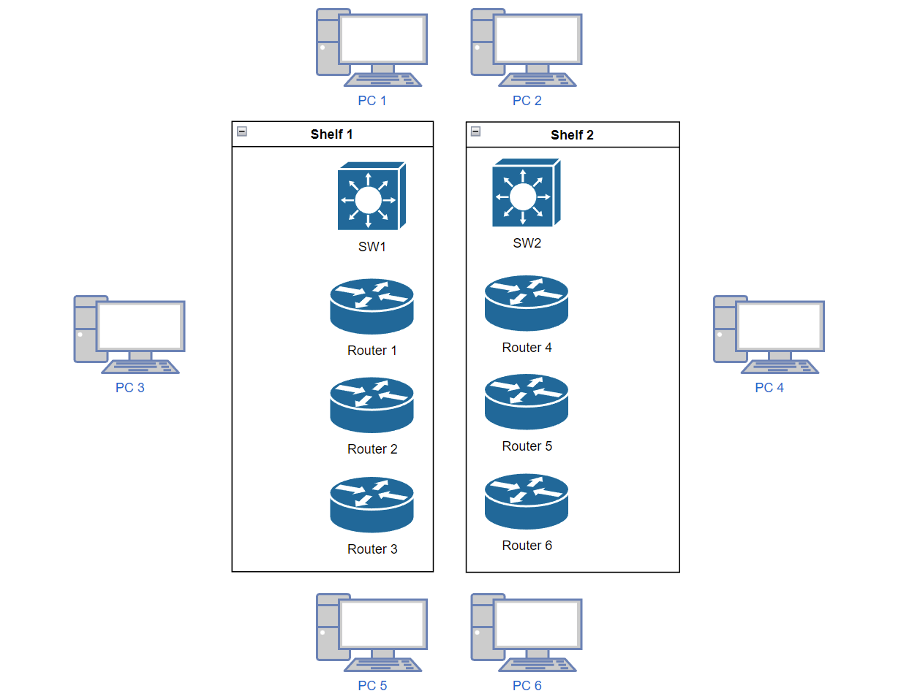

后期很可能会给每个设备按照规则统一编号，方便实验进行。

配置如下（2022年秋季）。

|  项目  |        型号         |
| :----: | :-----------------: |
| 交换机 | Cisco Catalyst 3850 |
| 路由器 |  Cisco 4300 Series  |
| 台式机 |   Acer i5-6300 8G   |


下面放几张图说明一下。

|                           机柜前面                           |                           机柜背面                           |
| :----------------------------------------------------------: | :----------------------------------------------------------: |
|  |  |

最上面的是交换机，接口排列的顺序如下所示（左视角）。

| g1/0/0 | g1/0/2 | ……   | g1/0/20 | g1/0/22 |
| ------ | ------ | ---- | ------- | ------- |
| g1/0/1 | g1/0/3 | ……   | g1/0/21 | g1/0/23 |

下面闪烁的灯从左到右依次是`g1/0/0`到`  g1/0/23`。可以靠灯来确定接口状态。

深蓝色的是`串口线`。这玩意可以拧螺丝固定，最好拧一下降低接口的压力。这个线损坏率比较高，请小心使用。

黄色的是`RJ45 直通线`。不够的话可以去教室角落拿。

紫色的是`RJ45 交叉线`。不够的话可以去教室角落拿。

浅蓝色的是`RS232-RJ45 翻转串口线`。台式机接在RS232上，RJ45端接在路由器/交换机后面的那两两个写明了`Console`的口上。

开机的时候注意，交换机和路由器开机都需要时间，而且风扇噪音有点大，不要急。严禁短时间内反复关闭开启设备，这样很可能导致损坏。路由器有开关，但交换机没有。可以考虑拔线也可以考虑关闭总闸。

地面上有连接校园网的网线，颜色是灰色的，位置在台式机桌子下方。

串口实际上可以用自己买的USB转RJ45翻转的串口线也是可以的。可以搭配`XShell`、`Putty`这样的工具使用。考虑到驱动安装问题，建议选择CH340芯片的版本。因为事实上一边机柜有四个设备，可能需要额外插拔才能兼顾。

::: tip TIP

严禁频繁开关路由器和交换机！

路由器有自己的开关，可以使用开关。交换机只能直接拔电源线。

路由器和交换器风扇非常吵，只能忍耐。

路由器和交换机开机需要时间，请耐心等待。给它的上限大概在三分钟。

:::

### 软件部分

台式机启动的时候，选择`网络实验`系统进入。

这个系统里面安装的360貌似不影响实验。系统防火墙请确保是关闭状态。


实测关掉本机防火墙之后，360不会禁止ping。

实验室的电脑使用 Windows 10 系统，本实验手册主要介绍思科网络设备的配置，PC 的网络设置方式与操作系统有关，不做重点介绍，在此给出 Windows 下配置网口 IP 的方式供参考。

打开 `控制面板\网络和 Internet\网络连接`，双击打开当前活动的网卡，点击`属性`，选择 `Internet 协议版本 4 (TCP/IPv4)`，选择`使用下面的 IP 地址`，填写 `IP 地址`、`子网掩码`、和`默认网关`，`DNS`相关设置可留空，点击确定。

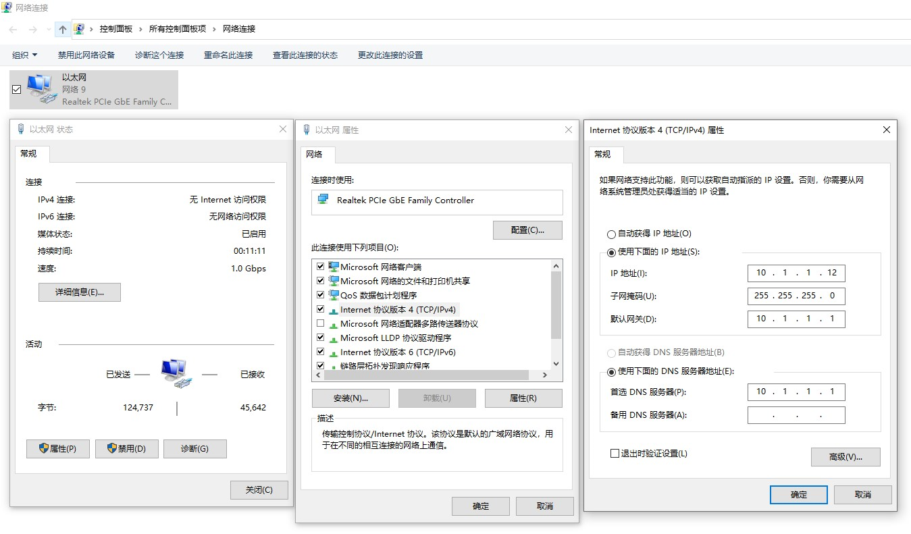

如果是DHCP相关实验，请选择`自动获得IP地址`和`使用下面的DNS服务器地址`。

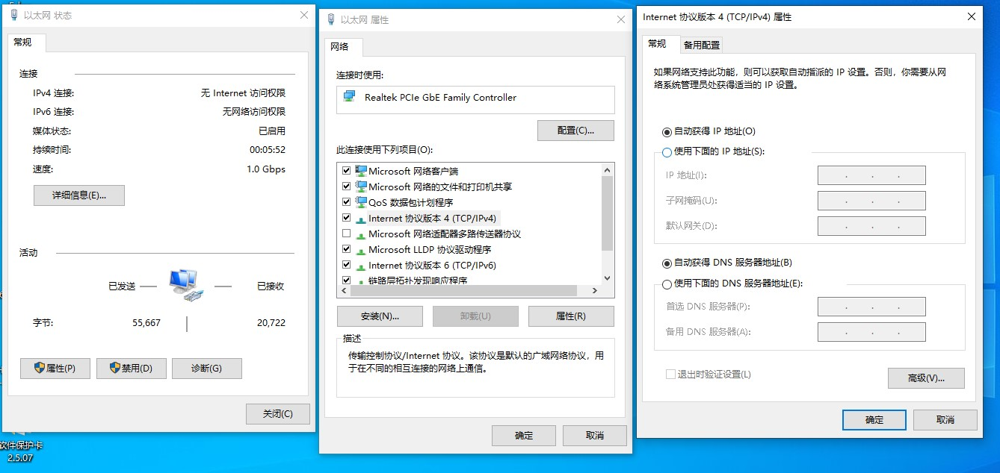

如果要查看电脑的IP状态，可以在以太网状态里面点击`详细信息`。


也可以在`cmd`或者`Powershell`里面输入`ipconfig`以获取。

实验手册中的`ipconfig`输出格式仅供示意，关键还是看那几个值是否符合期望。

实验中会涉及ping命令。请仔细看文档，

**看清楚到底是要求在电脑上ping还是在路由器上ping！**

**看清楚到底是要求在电脑上ping还是在路由器上ping！**

**看清楚到底是要求在电脑上ping还是在路由器上ping！**

这两种ping的回显区别挺大的！

在Windows中对着左下角开始菜单图标右键，打开 `Windows Powershell` ，可以在其中执行 ping 指令。在`命令提示符`中也同样可以执行ping命令。


## 凭据相关

如有可能，不要给交换机和路由器设置密码。

如果要设置，请保证密码是`cisco`、`ccna`、`ccnp` 三个中的任意一字符串。

交换机开机时问要不要初始化设置时，请选择否（输入no），不然会被要求输入密码。

如果有其他的密码，可以试着按如下教程重置密码。

路由器/交换机断电，然后上电，连续按`Ctrl+Break`打断系统引导，输入`confreg 0x2142`跳过启动配置,键入`reset`重启，重启后默认设置输入`no`，`enable`进入特权模式。

```bash
Router>   
Initializing Hardware ...

Checking for PCIe device presence...done
System integrity status: 0x610
Rom image verified correctly


System Bootstrap, Version 16.2(2r), RELEASE SOFTWARE
Copyright (c) 1994-2016  by cisco Systems, Inc.


Current image running: Boot ROM0

Last reset cause: PowerOn
ISR4331/K9 platform with 4194304 Kbytes of main memory


.

rommon 1 > 
rommon 1 > 
rommon 1 > 
rommon 1 > 
rommon 1 > 
rommon 1 > 
rommon 1 > 
rommon 1 > 
rommon 1 > confreg 0x2142

You must reset or power cycle for new config to take effect
rommon 2 > 

Initializing Hardware ...

Checking for PCIe device presence...done
System integrity status: 0x610
Rom image verified correctly


System Bootstrap, Version 16.2(2r), RELEASE SOFTWARE
Copyright (c) 1994-2016  by cisco Systems, Inc.


Current image running: Boot ROM0

Last reset cause: PowerOn
ISR4331/K9 platform with 4194304 Kbytes of main memory


........

no valid BOOT image found
Final autoboot attempt from default boot device...
Located isr4300-universalk9.03.16.04b.S.155-3.S4b-ext.SPA.bin
#################################################################################################################################################################################################################################################################################################################################################################################################################################################################################################################################################################################################################################################################################################################################################################################################################################################################################################################################################################################################################################################################################################################################################################################################################################################################################################################################################################################################################################################################################################################################################################################################################################################################################################################################################################################################################################################################################################################################################################################################################################################################################################################################################################################################################################################################################################################################################################################################################################################################################################################################################################################################################################################################################################################################################################################################################################################################################################################################################################################################################################################################################################################################################################################################################################################################################################################################################################################################################################################################################################################################################################################################################################################################################################################################################################################################################################################################################################################################################################################################################################################################################################################################################################################################################################################################################################################################################################################################################################################################################################################################################################################################################################################################################################################################################################################################################################################################################################################################################

Package header rev 1 structure detected
IsoSize = 471482368
Calculating SHA-1 hash...Validate package: SHA-1 hash:
        calculated 92A40F6F:F8586BC3:F00F114B:EFB43257:B9728643
        expected   92A40F6F:F8586BC3:F00F114B:EFB43257:B9728643

RSA Signed RELEASE Image Signature Verification Successful.
Image validated
%IOSXEBOOT-4-FILESYS_ERRORS_CORRECTED: (rp/0): bootflash 1 contained errors which were auto-corrected.
%IOSXEBOOT-4-FILESYS_ERRORS_CORRECTED: (rp/0): bootflash 5 contained errors which were auto-corrected.
%IOSXEBOOT-4-FILESYS_ERRORS_CORRECTED: (rp/0): bootflash 6 contained errors which were auto-corrected.
%IOSXEBOOT-4-FILESYS_ERRORS_CORRECTED: (rp/0): bootflash 7 contained errors which were auto-corrected.
%IOSXEBOOT-4-FILESYS_ERRORS_CORRECTED: (rp/0): bootflash 8 contained errors which were auto-corrected.
%IOSXEBOOT-4-FILESYS_ERRORS_CORRECTED: (rp/0): bootflash 9 contained errors which were auto-corrected.
%IOSXEBOOT-4-FILESYS_ERRORS_CORRECTED: (rp/0): bootflash 10 contained errors which were auto-corrected.
%IOSXEBOOT-4-BOOT_SRC: (rp/0): mounting /boot/super.iso to /tmp/sw/isos

              Restricted Rights Legend

Use, duplication, or disclosure by the Government is
subject to restrictions as set forth in subparagraph
(c) of the Commercial Computer Software - Restricted
Rights clause at FAR sec. 52.227-19 and subparagraph
(c) (1) (ii) of the Rights in Technical Data and Computer
Software clause at DFARS sec. 252.227-7013.

           cisco Systems, Inc.
           170 West Tasman Drive
           San Jose, California 95134-1706


Cisco IOS Software, ISR Software (X86_64_LINUX_IOSD-UNIVERSALK9-M), Version 15.5(3)S4b, RELEASE SOFTWARE (fc1)
Technical Support: http://www.cisco.com/techsupport
Copyright (c) 1986-2016 by Cisco Systems, Inc.
Compiled Mon 17-Oct-16 20:23 by mcpre


Cisco IOS-XE software, Copyright (c) 2005-2016 by cisco Systems, Inc.
All rights reserved.  Certain components of Cisco IOS-XE software are
licensed under the GNU General Public License ("GPL") Version 2.0.  The
software code licensed under GPL Version 2.0 is free software that comes
with ABSOLUTELY NO WARRANTY.  You can redistribute and/or modify such
GPL code under the terms of GPL Version 2.0.  For more details, see the
documentation or "License Notice" file accompanying the IOS-XE software,
or the applicable URL provided on the flyer accompanying the IOS-XE
software.


This product contains cryptographic features and is subject to United
States and local country laws governing import, export, transfer and
use. Delivery of Cisco cryptographic products does not imply
third-party authority to import, export, distribute or use encryption.
Importers, exporters, distributors and users are responsible for
compliance with U.S. and local country laws. By using this product you
agree to comply with applicable laws and regulations. If you are unable
to comply with U.S. and local laws, return this product immediately.

A summary of U.S. laws governing Cisco cryptographic products may be found at:
http://www.cisco.com/wwl/export/crypto/tool/stqrg.html

If you require further assistance please contact us by sending email to
export@cisco.com.

cisco ISR4331/K9 (1RU) processor with 1648789K/6147K bytes of memory.
Processor board ID FDO2136A04T
3 Gigabit Ethernet interfaces
2 Serial interfaces
32768K bytes of non-volatile configuration memory.
4194304K bytes of physical memory.
3207167K bytes of flash memory at bootflash:.


Press RETURN to get started!


*Nov 16 19:12:58.259: %SMART_LIC-6-AGENT_READY: Smart Agent for Licensing is initialized
*Nov 16 19:13:00.007: %IOS_LICENSE_IMAGE_APPLICATION-6-LICENSE_LEVEL: Module name = esg Next reboot level = ipbasek9 and License = ipbasek9
*Nov 16 19:13:01.192: %ISR_THROUGHPUT-6-LEVEL: Throughput level has been set to 100000 kbps
*Nov 16 19:13:05.781: dev_pluggable_optics_selftest attribute table internally inconsistent @ 0x144

*Nov 16 19:13:09.741: %SPANTREE-5-EXTENDED_SYSID: Extended SysId enabled for type vlan
*Nov 16 19:13:10.755: %LINK-3-UPDOWN: Interface Lsmpi0, changed s
Router>
Router>tate to up
*Nov 16 19:13:10.755: %LINK-3-UPDOWN: Interface EOBC0, changed state to up
*Nov 16 19:13:10.755: %LINK-3-UPDOWN: Interface GigabitEthernet0, changed state to down
*Nov 16 19:13:10.764: %LINK-3-UPDOWN: Interface LIIN0, changed state to up
*Nov 16 19:13:12.091: %IOSXE_MGMTVRF-6-CREATE_SUCCESS_INFO: Management vrf Mgmt-intf created with ID 1, ipv4 table-id 0x1, ipv6 table-id 0x1E000001
*Nov 16 19:13:12.142: %LINEPROTO-5-UPDOWN: Line protocol on Interface Vlan1, changed state to down
*Nov 16 19:13:12.142: %LINEPROTO-5-UPDOWN: Line protocol on Interface Lsmpi0, changed state to up
*Nov 16 19:13:12.143: %LINEPROTO-5-UPDOWN: Line protocol on Interface EOBC0, changed state to up
*Nov 16 19:13:12.143: %LINEPROTO-5-UPDOWN: Line protocol on Interface GigabitEthernet0, changed state to down
*Nov 16 19:13:12.143: %LINEPROTO-5-UPDOWN: Line protocol on Interface LIIN0, changed state to up
*Nov 16 19:13:13.424: %SYS-6-STARTUP_CONFIG_IGNORED: System startup configuration is ignored based on the configuration register setting.
*Nov 16 19:13:13.466: %IOSXE_OIR-6-REMSPA: SPA removed from subslot 0/0, interfaces disabled
*Nov 16 19:13:13.467: %IOSXE_OIR-6-REMSPA: SPA removed from subslot 0/1, interfaces disabled
*Nov 16 19:13:13.472: %SPA_OIR-6-OFFLINECARD: SPA (ISR4331-3x1GE) offline in subslot 0/0
*Nov 16 19:13:13.474: %SPA_OIR-6-OFFLINECARD: SPA (NIM-2T) offline in subslot 0/1
*Nov 16 19:13:13.479: %IOSXE_OIR-6-INSCARD: Card (fp) inserted in slot F0
*Nov 16 19:13:13.479: %IOSXE_OIR-6-ONLINECARD: Card (fp) online in slot F0
*Nov 16 19:13:13.480: %IOSXE_OIR-6-INSCARD: Card (cc) inserted in slot 0
*Nov 16 19:13:13.480: %IOSXE_OIR-6-ONLINECARD: Card (cc) online in slot 0
*Nov 16 19:13:13.484: %IOSXE_OIR-6-INSCARD: Card (cc) inserted in slot 1
*Nov 16 19:13:13.484: %IOSXE_OIR-6-ONLINECARD: Card (cc) online in slot 1
*Nov 16 19:13:13.531: %SPA-3-ENVMON_NOT_MONITORED: SIP0: iomd:  Environmental monitoring is not enabled for ISR4331-3x1GE[0/0]
*Nov 16 19:13:18.918: %SPA_OIR-6-ONLINECARD: SPA (ISR4331-3x1GE) online in subslot 0/0
*Nov 16 19:13:20.894: %LINK-3-UPDOWN: Interface GigabitEthernet0/0/0, changed state to down
*Nov 16 19:13:20.912: %LINK-3-UPDOWN: Interface GigabitEthernet0/0/1, changed state to down
*Nov 16 19:13:20.914: %LINK-3-UPDOWN: Interface GigabitEthernet0/0/2, changed state to down
Router>
Router#
```

其实做到这一步可以了。之后的步骤可以不做。

`show start` 查看密码，`copy start run`，将`nvram`中配置复制到内存，修改密码，然后`copy run start`保存配置到启动文件，输入`conf t`进入配置模式，输入`confreg 0x2102`，输入`exit`返回，输入`reset`重启即可。

<div STYLE="page-break-after: always;"></div>
# 交换机

## 1 概述

### 1.1 功能

交换机是一种基于MAC（网卡的硬件地址）识别，能完成封装转发数据包功能的网络设备，交换机正如它的名字一样采用的是交换的工作模式，它可以“学习”网络中各个终端的MAC 地址，并把其存放在内部的MAC 地址表中，通过在数据帧的始发者和目标接收者之间建立临时的交换路径，使数据帧直接由源地址到达目的地址。

### 1.2 任务

交换机拥有一条高性能的背部总线和内部交换矩阵。交换机的所有端口均挂接在这条背部总线上，当控制电路接收到数据包后，处理端口会查找内存中的MAC 地址对照表以确定目的MAC 地址的网卡接在哪个端口上，通过内部交换矩阵直接将数据包传送到目的端口，而不是所有端口，交换机的这种工作方式较于集线器来说效率高，不浪费网络资源，因为它只是对目的地址传输数据，发送数据是其他节点很难侦听到所发送的信息。这也是交换机能很快取代集线器的重要原因之一。

交换机的另一个重要特点是它不像集线器一样每个端口共享带宽，它的每一个端口都是共享一部分交换机的总带宽，这样在速率上就对每个端口有个根本的保障。这样交换机就可以在同一时刻进行多个端口之间数据传输，每个端口都视为独立的网段，享有独立固定的带宽。无需同其他设备竞争使用。

交换机的目的是使得传输效率更高，它根据MAC 地址来进行判断，决定数据帧该送到目的地址的连接端口，而不打扰其他不相干的连接端口，如果内存中的地址表中不包含目的MAC 地址，交换机则会向所有端口广播这个数据包，找到后再将这个MAC地址加入到自己的MAC 地址表中，这样下次发送到这个地址时便不会发错。

## 2 交换机内部结构

### 2.1 构造及主要功能

交换机是一种基于MAC地址识别，能完成封装转发数据包功能的网络设备。交换机可以“学习”MAC地址，并把其存放在内部地址表中，通过在数据帧的始发者和目标接收者之间建立临时的交换路径，使数据帧直接由源地址到达目的地址。

传统的交换机工作在OSI 模型中的第二层，可以将其看作为一台专用的特殊计算机，主要包括中央处理器(CPU)、随机存储器(RAM)和操作系统。它利用专门设计的芯片ASIC(Application Specific Integrated Circuits)使交换机以线路速率在所有的端口并行进行转发，因此，它比同在二层利用软件进行转发的网桥速度快的多。

交换机使用一种虚拟连接技术来连接通信的双方。所谓虚拟连接，就是指通信时通信双方建立一个逻辑上的专用连接，这个连接直到数据传送至目的节点后结束。虚拟连接是通过交换机的端口-地址表来实现的：交换机在工作过程中不断地建立和维护它本身的一个地址表，这个地址表标明了节点的MAC地址和交换机端口的对应关系。当交换机收到一个数据包，它便会去查看自身的地址表以验明数据包中的目的MAC地址究竟对应于哪个端口。一旦验证完毕，就将发送节点与该端口建立一个专用连接，发送方的数据仅发送到目的MAC 地址所对应的交换机端口。

### 2.2 内部结构

局域网交换机卓越的性能表现，来源于其内部独特的技术结构。而不同的交换模式或不同的交换类型，也跟局域网交换机内部结构密不可分。目前局域网交换机采用的内部技术结构主要有以下几种。

##### **1.**    **共享内存式结构**

该结构依赖于中心局域网交换机引擎所提供的全端口的高性能连接，并由核心引擎完成检查每个输入包来决定连接路由。这种方式需要很大的内存带宽和很高的管理费用，尤其是随着局域网交换机端口的增加，需要内存容量更大，速度也更快，中央内存的价格就变得很高，从而使得局域网交换机内存成为性能实现的主要瓶颈。

##### **2.**    **交叉总线式结构**

交叉总线式结构可在端口间建立直接的点对点连接，这种结构对于简单的单点式（Unicast）信息传输来讲性能很好，但并不适合点对多点的广播式传输。由于实际网络应用环境中，广播和多播传输方式很常见，所以这种标准的交叉总线方式会带来一些传输问题。例如，当端口A向端口D传输数据时，端口B和端口C就只能等待。而当端口A向所有端口广播消息时，就可能会引起目标端口的排队等候。这样将会消耗掉系统大量带宽，从而影响局域网交换机传输性能。而且要连接N个端口，就需要N×（N+1）条交叉总线，因而实现成本也会随着端口数量的增加而急剧上升。

##### **3.**    **混合交叉总线式结构**

鉴于标准交叉总线存在的缺陷，一种混合交叉总线实现方式被提了出来。该方式的设计思路是将一体的交叉总线矩阵划分成小的交叉矩阵，中间通过一条高性能总线连接。该结构的优点是减少了交叉总线数，降低了成本，还减少了总线争用。但连接交叉矩阵的总线成为新的性能瓶颈。

##### **4.**    **环形总线式结构**

这种结构方式在一个环内最多可支持四个交换引擎，并且允许不同速度的交换矩阵互连，以及环与环间通过交换引擎连接。由于采用环形结构，所以很容易聚集带宽。当端口数增加的时候，带宽就相应增加了。与前述几种结构不同的是，该结构方式有独立的一条控制总线，用于搜集总线状态、处理路由、流量控制和清理数据总线。另外，在环形总线上可以加入管理模块，提供完整的SNMP管理特性。同时还可以根据需要选用第三层交换功能。这种结构的最大优点就是扩展能力强，实现成本低，而且有效地避免了系统扩展时造成的总线瓶颈。

## 3 工作原理

交换机的主要工作原理有以下几条：

1. 地址表：端口地址表记录了端口下包含主机的MAC地址。端口地址表是交换机上电后自动建立的，保存在RAM中，并且自动维护。交换机隔离冲突域的原理是根据其端口地址表和转发决策决定的。

2. 转发决策：交换机的转发决策有三种操作：丢弃、转发和扩散。丢弃：当本端口下的主机访问已知本端口下的主机时丢弃。转发：当某端口下的主机访问已知某端口下的主机时转发。扩散：当某端口下的主机访问未知端口下的主机时要扩散。每个操作都要记录下发包端的MAC地址，以备其它主机的访问。

3. 生存期：生存期是端口地址列表中表项的寿命。每个表项在建立后开始进行倒计时，每次发送数据都要刷新计时。对于长期不发送数据主机，其MAC地址的表项在生存期结束时删除。所以端口地址表记录的总是最活动的主机的MAC地址。

4. 三层路由：通常，普通的交换机只工作在数据链路层上，路由器则工作在网络层。而功能强大的三层交换机可同时工作在数据链路层和网络层，并根据 MAC地址或IP地址转发数据包。但是要注意到三层交换机并不能完全取代路由器，因为它主要是为了实现处于两个不同子网的VLAN进行通讯，而不是用来作数据传输的复杂路径选择。

5. 网管功能：一台交换机所支持的管理程度反映了该设备的可管理性与可操作性。带网管功能的交换机可对每个端口的流量进行监测，设置每个端口的速率，关闭/打开端口连接。通过对交换机端口进行监测，便于对网络业务流量的区分和迅速进行网络故障定义，提高了网络的可管理性。

6. 端口聚合：这是一种封装技术，它是一条点到点的链路，链路的两端可以都是交换机，也可以是交换机和路由器，还可以是主机和交换机或路由器。基于端口汇聚（Trunk）功能，允许交换机与交换机、交换机与路由器、主机与交换机或路由器之间通过两个或多个端口并行连接同时传输以提供更高带宽、更大吞吐量，大幅度提高整个网络能力。

## 4 第二层交换技术

### 4.1 地址学习

以太网交换机通过学习地址来进行数据的转发操作。交换机开机启动后，会自动生成一张表，即MAC地址表，交换机关机后，MAC地址表中的内容会自动清空。

交换机MAC地址表用于记录连到交换机的所有设备的位置。交换机的目标是分割网上通信量，使发送到给定冲突域中主机的数据包不至于传播到另一个网段。这是由交换机的“学习”功能完成的，“学习”功能使交换机了解到主机位于哪里。交换机的学习和转发过程如下：

- 当一个交换机首次初始化时，交换机地址表是空的。

- 用一个空MAC地址表，基于地址的源过滤或转发决策是不可能的，因此交换机将每一帧转发给所有连接的端口，而不只是接受的端口。

- 转发一个帧到所有连接端口，称为“泛洪”。泛洪是一种通过交换机传输数据的低效方法，因为它将数据帧传输到了不需要的网段，浪费了带宽。

- 因为交换机能同时处理多个网段的通信量，交换机执行内存缓冲以致能独立接受、传输每个端口或网n段的数据帧。

MAC地址表中的内容主要包括交换机端口、与交换机端口相连的主机MAC地址、VLAN标识。图1.1显示了不同网段间两个工作站之间的事务。MAC地址为`0260.8c01.1111`的站点A准备发送数据到MAC地址为`0260.8c01.2222`的站点C，交换机接受该帧，执行以下几个动作：

1. 从物理以太网接收该帧并且存储到临时缓冲区。

2. 因为交换机不知道哪个接口连到目的站点，它将帧泛洪给所有端口。

3. 当站点A泛洪该帧时，交换机在MAC地址表中记录发送数据包站点的源地址及与之相连的端口F0/1。

4. 如果该记录在一定时间内没有新的帧传到交换机来刷新，这个记录被废弃。

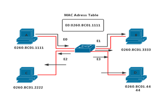

​       

> 图1 泛洪数据包

当站点继续发送帧到另一个站点时，学习过程继续。MAC地址为`0260.8c01.4444`的站点D给MAC地址为`0260.8c01.2222`的站点C发送数据包，交换机采取以下几个动作：

1. 源地址`0260.8c01.4444`被加到MAC地址表中。

2. 将传输帧的目的MAC地址站点C与MAC地址表记录进行比较。

3. 当软件决定对这个目的地来说至此未见端口到MAC地址映射时，该帧被泛洪到交换机中所有的端口。

当站点A发送一帧到站点C时，交换机查询到站点C的MAC地址和端口F0/2，这里交换机将站点A发送的数据包直接转发给站点C，而不发送给B和D站点，如图1.2所示。只要在MAC地址表中记录生命周期内所有站点发送数据帧，就可以建立起完整的MAC地址表。

 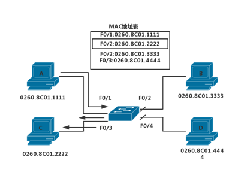

> 图2 站点应答

### 4.2 转发和过滤数据包

当一个帧带有一个已知目的地址到达时，它被转发到连接该站点而不是所有站点的端口。在图1.3中，站点A给站点C发送一帧。当目的MAC地址（站点C的MAC地址）已在MAC地址表中时，交换机只将帧传输到表中所列的这个端口。

 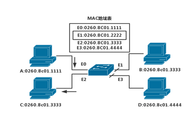

> 图3 交换机过滤决策

站点A发送帧给站点C的步骤如下：

1. 传输帧的目的MAC地址`0260.8c01.2222`与MAC地址表中项进行比较。

2. 当交换机决定目的地址经由E2端口可到达时，它将该帧传到该端口。

3. 交换机为了保护链路上的带宽没有将帧传到E1和E3口，这个动作称为“帧过滤”。

广播和组播是一个特殊情况。因为广播帧和组播帧可能所有站点都关心，交换机通常将广播帧和组播帧泛洪给发起端口外的所有端口。交换机从来不学习广播或组播地址，因为广播地址和组播地址不出现在帧的源地址中。所有站点接受广播帧的事实意味着所有交换网络中网段是在同一广播域中。


 ## 5 交换机配置

> 以机房的Cisco交换机为例

本实验手册不介绍使用Web UI连接配置交换机的教程，对于Telnet连接也是点到即止。

> 详细内容请看本文档的 `实验指南/快速开始`。

1)   用console线（反转线，注意与网线的比较）把计算机的串口（com1， RS232形态）与交换机的console口（RJ45形态）直接相连。

> 你自己有USB转RJ45串口的话，那就是USB连电脑，RJ45连路由器。

2)   打开`超级终端`建立连接，在连接设置的波特率选择`9600`，其余为默认选项。

### 5.1 切换命令行界面模式

作为一项安全功能，Cisco IOS软件将EXEC（执行）会话分成以下两种访问级别。

用户执行：只允许用户访问有限量的基本监视命令。用户执行模式是在从CLI登录到Cisco交换机后所进入的默认模式。用户执行模式由">"提示符标识。

特权执行：允许用户访问所有设备命令，如用于配置和管理的命令，特权执行模式可采用口令加以保护，使得只有获得授权的用户才能访问设备。特权执行模式由#提示符标识。

要从用户执行模式切换到特权执行模式，输入enable命令。要从特权执行模式切换到用户执行模式，输入disable命令。在实际网络中，交换机将提示输入口令。默认情况下未配置口令。表1.1中显示了用于在用户执行模式和特权执行模式之间来回切换的Cisco IOS命令。

| 说  明                                                   | CLI               |
| -------------------------------------------------------- | ----------------- |
| 从用户执行模式切换到特权执行模式                         | Switch>enable     |
| 如果已为特权执行模式设置口令，则系统将提示您现在输入口令 | Password:password |
| #提示符表示已处于特权执行模式                            | Switch#           |
| 从特权执行模式切换到用户执行模式                         | Switch#disable    |
| >提示符表示已处于用户执行模式                            | Switch>           |

 在Cisco交换机上进入特权执行模式之后，就可以访问其他配置模式。Cisco IOS软件的命令模式结构采用分层的命令结构。

### 5.2 基本交换机配置

局域网中的第2层交换机的一些关键配置序列通常是在实施过程中进行的。这些配置序列包括配置交换机管理界面，默认网关，全双工和活动接口上的网速设置，对HTTP访问的支持和对MAC地址表的管理。

**1.**    **管理接口**

接入层交换机需要配置IP地址、子网掩码和默认网关。要使用TCP/IP来远程管理交换机，就需要为交换机分配IP地址。此IP地址将分配给称为虚拟LAN（VLAN）的虚拟接口，然后必须确保VLAN分配到计算机上的一个或多个特定端口。

要在交换机的管理VLAN上配置IP地址和子网掩码，必须处在VLAN接口配置模式下。先使用命令`interface vlan 99`，再输入`ip address`配置命令。必须使用`no shutdown`接口配置命令来使此第3层接口正常工作。当看到`interface VLAN x`时，这是指与VLAN x 关联的第3层接口。只有管理VLAN才有与之关联的`interface VLAN`。表1.2列出了Catalyst 2960交换机上的管理接口配置。

| 说  明                         | 命  令                                               |
| ------------------------------ | ---------------------------------------------------- |
| 进入全局配置模式               | S1#configure terminal                                |
| 进入VLAN99接口的接口配置模式   | S1(config)#interface  vlan 99                        |
| 配置接口IP地址                 | S1(config-if)#ip  address 172.11.99.11 255.255.255.0 |
| 启动接口                       | S1(config-if)#no  shutdown                           |
| 返回特权执行模式               | S1(config-if)#end                                    |
| 进入全局配置模式               | S1#configure terminal                                |
| 输入要分配VLAN的接口           | S1(config)#interface  fastethernet 0/18              |
| 定义端口的VLAN成员模式         | S1(config-if)#switchport  mode access                |
| 将端口分配给VLAN               | S1(config-if)#switchport  access vlan 99             |
| 返回特权执行模式               | S1(config-if)#end                                    |
| 将运行配置保存为交换机启动配置 | S1#copy running-config  startup-config               |

 **2.**    **默认网关**

默认网关是用于将IP数据包转发到远程网络的机制。交换机将目的IP地址位于本地网络之外的IP数据包转发到默认网关。

使用ip default-gateway命令，为交换机配置默认网关。输入与需要配置默认网关的交换机直接相连的下一跳路由器接口的IP地址。

**3.**  **双工和速度**

可以使用duplex接口配置命令指定交换机端口的双工操作模式。可以手动设置交换机端口的双工模式和速度，以避免厂商间的自动协商问题。在将交换机端口双工设置配置为auto时可能出现问题，在图1.5中，S1和S2交换机有着相同的双工设置和速度。

 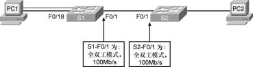

> 图4 双工和速度


在交换机S1上配置端口F0/1的具体步骤描述如下所示。

```bash
   S1# configure terminal
   S1(config)# interface fastethernet 0/1
   S1(config-if)# duplex auto
   S1(config-if)# speed auto
   S1(config-if)# end       
```

**4.**    **HTTP** **访问**

下面是启用HTTP访问的基本配置，`ip http authentication enable` 是全局配置命令模式。

```bash
S1# configure terminal
S1(config)# ip http authentication enable
S1(config)# ip http server          
```

**5.**    **管理** **MAC** **地址表**

交换机使用MAC地址表来确定如何在端口间转发流量。这些MAC表包含动态地址和静态地址。用`show mac-address-table`命令显示MAC地址表，其输出包含静态和动态MAC地址。

使用`mac-address-table static MAC-address vlan vlan-id interface interface-id`命令可在MAC地址表中创建静态映射。使用`no mac-address-table static MAC-address vlan vlan-id interface interface-id`命令可移除MAC地址表中的静态映射。

### 5.3 验证交换机配置

执行初始交换机配置之后，可使用不同的`show`命令来验证交换机是否已正确配置。

show命令从特权执行模式下执行。下面列出了`show`命令的一些关键选项，它们可用于验证几乎所有可配置的交换机功能。

| 说明                                                         | 命令                               |
| ------------------------------------------------------------ | ---------------------------------- |
| 显示交换机上单个或全部可用接口的接口状态和配置               | show interface  {interface-id ¦cr} |
| 显示启动配置的内容                                           | show startup-config                |
| 显示当前运行配置                                             | show running-config                |
| 显示关于flash：文件系统的信息                                | show flash:                        |
| 显示系统硬件和软件状态                                       | show version                       |
| 显示会话命令历史记录                                         | show history                       |
| 显示IP信息   Interface选项显示IP接口状态和配置   arp选项显示IP  ARP表 | show ip {interface \| arp }        |
| 显示MAC转发表                                                | show mac-address-table             |

### 5.4 基本交换机管理

交换机启动并运行之后，网络技术人员必须对交换机进行维护，这就包括备份和恢复交换机的配置文件，清除配置信息和删除配置文件。

**1.**    **备份和恢复交换机配置文件**

使用`copy running-config startup-config`特权执行命令备份了目前创建的配置。如果想在设备上保留多个不同的`startup-config`文件，则可以使用`copy startup-config flash:filename`命令将配置复制到不同文件名的多个文件中。存储多个`startup-config`版本可用于在配置出现问题时回滚到某个时间点。

恢复配置是一个简单的过程。只需用已存配置覆盖当前配置即可。例如，如果有名为config.bak1的已存配置，则输入Cisco IOS命令`copy flash:config.bak1 startup-config`即可覆盖现有start-config并恢复config.bak1的配置。当配置恢复到startup-config中后，可在特权执行模式下使用reload命令重新启动交换机，如表1.4所示，使计算机重新加载新的启动配置。reload命令将使系统停止。应在配置信息已输入到文件并保存到启动配置之后再使用reload命令。

| 说  明                                                       | CLI                                                          |
| ------------------------------------------------------------ | ------------------------------------------------------------ |
| 将存储在闪存中的config.bak1文件复制到存储在闪存中的启动配置中。按Enter键接受，使用Ctrl+C组合键取消 | S1#copy  flash:config.bak1 startup-config   Destination filename [startup-config]? |
| 使Cisco IOS执行重新启动交换机。如果修改了运行配置文件，系统将询问是否保存。请按“y”或“n”确认。要确认重新装入，请按Enter键接受，使用Ctrl+C组合键取消 | S1#reload   System configuration has been modified.   Save?[yes/no]:n   Proceed with reload?[confirm] |

**2.**    **清除配置信息**

交换机配置的清除使用`erase nvram`或`erase startup-config`特权执行命令实现。当网络技术人员可能执行了一项很复杂的配置任务，并在闪存中存储了文件的很多备份副本，此时要从闪存中删除文件，要使用`delete flash:filename`特权执行命令。根据file prompt全局配置命令的设置，系统可能在技术人员删除文件之前提示确认。默认情况下，在删除文件时，交换机都会提示确认。抹除或删除配置之后，即可重新加载交换机以启动交换机的新配置。

<div STYLE="page-break-after: always;"></div>
# 路由器

## 1 概述

### 1.1 功能

路由器是在网络层实现互联的设备。路由器实现网络层上数据包的存储转发，它具有路径选择功能，可依据网络当前的拓扑结构，选择“最佳”路径，把接收的数据包转发出去，从而实现网络负载平衡，减少网络拥塞路由器工作在网络层，用于连接不同的局域网和广域网，故称为“LAN网间互联设备”。一个路由器可以连接两个局域网、一个局域网和一个广域网，或两个广域网。

路由器的具体功能如下：

1. 路由功能（寻径功能）——寻找并记录到达目的网段的最佳路径，体现在路由器上则包括路由表的建立、维护和查找

2. 交换功能——路由器的交换功能与以太网交换机执行的交换功能不同，路由器的交换功能是指在网络之间转发分组数据的过程，涉及到从接收接口收到数据帧，解封装，对数据包做相应处理，根据目的网络查找路由表，决定转发接口，做新的数据链路层封装等过程

3. 隔离广播、指定访问规则——路由器阻止广播的通过，并且可以设置访问控制列表(ACL)对流量进行控制

4. 异种网络互连——支持不同的数据链路层协议，可以连接异种网络

5. 子网间的速率匹配——路由器有多个接口，不同接口具有不同的速率，路由器需要利用缓存及流控协议进行速率适配

### 1.2 任务

路由器的主要任务是把通信引导到目的地网络，然后到达特定的节点站地址。后一个功能是通过网络地址分解完成的。例如，把网络地址部分的分配指定成网络、子网和区域的一组节点，其余的用来指明子网中的特别站。分层寻址允许路由器对有很多个节站的网络存储寻址信息。在广域网范围内的路由器按其转发报文的性能可以分为两种类型，即中间节点路由器和边界路由器。尽管在不断改进的各种路由协议中，对这两类路由器所使用的名称可能有很大的差别，但所发挥的作用却是一样的。中间节点路由器在网络中传输时，提供报文的存储和转发。同时根据当前的路由表所保持的路由信息情况，选择最好的路径传送报文。由多个互连的LAN组成的公司或企业网络一侧和外界广域网相连接的路由器，就是这个企业网络的连界路由器。它从外部广域网收集向本企业网络寻址的信息，转发到企业网络中有关的网络段；另一方面集中企业网络中各个LAN段向外部广域网发送的报文，对相关的报文确定最好的传输路径。

## 2 路由器内部结构

### 2.1 路由器的功能结构

路由器结构从功能上可以分成两个部分：分组转发部分和路由选择部分。分组转发主要由三个部分组成：输入端口，输出端口，交换结构。路由选择部分也可以称作控制部分，其核心是路由选择处理机。

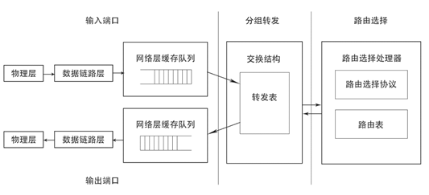

> 图1 路由器的功能结构示意图

##### 2.1.1 输入端口

输入端口是物理链路和输入包的进口处。端口通常由线卡提供，一块线卡一般支持4、8或16个端口，一个输入端口具有许多功能。第一个功能是进行数据链路层的封装和解封装。第二个功能是在转发表中查找输入包目的地址从而决定目的端口（称为路由查找），路由查找可以使用一般的硬件来实现，或者通过在每块线卡上嵌入一个微处理器来完成。第三，为了提供QoS（服务质量），端口要对收到的包分成几个预定义的服务级别。第四，端口可能需要运行诸如SLIP（串行线网际协议）和PPP（点对点协议）这样的数据链路级协议或者诸如PPTP（点对点隧道协议）这样的网络级协议。一旦路由查找完成，必须用交换开关将包送到其输出端口。如果路由器是输入端加队列的，则有几个输入端共享同一个交换开关。这样输入端口的最后一项功能是参加对公共资源（如交换开关）的仲裁协议。

##### 2.1.2 交换结构

交换结构可以使用多种不同的技术来实现。迄今为止使用最多的交换结构技术是总线、交叉开关和共享存贮器。最简单的开关使用一条总线来连接所有输入和输出端口，交换结构的缺点是其交换容量受限于总线的容量以及为共享总线仲裁所带来的额外开销。交叉开关通过开关提供多条数据通路，具有N×N个交叉点的交叉开关可以被认为具有2N条总线。如果一个交叉是闭合，输入总线上的数据在输出总线上可用，否则不可用。交叉点的闭合与打开由调度器来控制，因此，调度器限制了交换开关的速度。在共享存贮器路由器中，进来的包被存贮在共享存贮器中，所交换的仅是包的指针，这提高了交换容量，但是，开关的速度受限于存贮器的存取速度。尽管存贮器容量每18个月能够翻一番，但存贮器的存取时间每年仅降低5%，这是共享存贮器交换开关的一个固有限制。 

##### 2.1.3 输出端口

输出端口在包被发送到输出链路之前对包存贮，可以实现复杂的调度算法以支持优先级等要求。与输入端口一样，输出端口同样要能支持数据链路层的封装和解封装，以及许多较高级协议。

##### 2.1.4 路由处理器

路由处理器计算转发表实现路由协议，并运行对路由器进行配置和管理的软件。同时，它还处理那些目的地址不在线卡转发表中的包。

### 2.2 路由器的系统组成

以cisco路由器系统组成为例。


#### **1.**   **CPU**

与计算机一样，路由器也包含了一个中央处理器（CPU）。不同系列和型号的路由器，其中的CPU也不尽相同。Cisco路由器一般采用Motorola 68030和Orion/R4600两种处理器。

路由器的CPU负责路由器的配置管理和数据包的转发工作，如维护路由器所需的各种表格以及路由运算等。路由器对数据包的处理速度很大程度上取决于CPU的类型和性能。

#### **2.**   **存储器**

ROM:存储开机诊断程序，用于引导操作系统，类似于计算机的BIOS

RAM:路由器的主存储器，存放Running-config，路由器，ARP表，类似于计算机的内存。

FLASH:路由器的快闪存储器，用于存放路由器的IOS，类似于计算机硬盘。

NVRAM:非易失存储器，用于放置启动配置文件Startup-Config文件

#### **3.**   **接口**


 所有路由器都有接口（Interface），每个接口都有自己的名字和编号。一个接口的全名称由它的类型标志与数字编号构成，编号自0开始。

对于接口固定的路由器（如Cisco 2500系列）或采用模块化接口的路由器（如Cisco 4700系列），在接口的全名称中，只采用一个数字，并根据它们在路由器的物理顺序进行编号，例如Ethernet0表示第1个以太网接口，Serial1表示第2个串口。

对于支持“在线插拔和删除”或具有动态更改物理接口配置的路由器，其接口全名称中至少包含两个数字，中间用斜杠“/”分割。其中，第1个数字代表插槽编号，第2个数字代表接口卡内的端口编号。如Cisco 3600路由器中，serial3/0代表位于3号插槽上的第1个串口。

对于支持“万用接口处理器（VIP）”的路由器，其接口编号形式为“插槽/端口适配器/端口号”，如Cisco 7500系列路由器中，Ethernet4/0/1是指4号插槽上第1个端口适配器的第2个以太网接口。

##### 1)   控制台端口

几乎所有路由器都在路由器背后安装了一个控制台端口。控制台端口提供了一个EIA/TIA—232(以前叫作RS—232)异步串行接口、使能与路由器通信。至于同控制台端口建立哪种形式的物理连接，则取决于路由器的型号。有些路由器采用一个DB25母连接(DB25F)，有些则用RJ45连接器。通常，较小的路由器采用RJ45控制台连接器，而较大路由器采用DB25控制台连接器。

##### 2)   辅助端口

大多数Cisco路由器都配备了一个“辅助端口”(Auxiliary Port)。它和控制台端口类似，提供了一个EIA／TIA—232异步串行连接，能与路由器通信。辅助端口通常用来连接Modem，以实现对路由器的远程管理。远程通信链路通常并不用来传输平时的路由数据包，它的主要的作用是在网络路径或回路失效后访问一个路由器。

#### **4.**   **IOS**

IOS为CISCO的专有操作系统，功能有连接多种网络，用于不同协议的路由和转换，实现流量控制、QoS服务质量控制、网络安全服务，网络拨号及VPN等。

 

有两种类型的IOS配置。

##### 1) 运行配置

有时也称作“活动配置”，驻留于RAM，包含了目前在路由器中“活动”的IOS配置命令。配置IOS时，就相当于更改路由器的运行配置。

##### 2)启动配置

启动配置驻留在NVRAM中，包含了希望在路由器启动时执行的配置命令。有时也把启动配置称作“备份配置”。这是由于修改并认可了运行配置后，通常应将运行配置复制到NVRAM里，将作出的改动“备份”下来，以便路由器下次启动时调用。启动完成后，启动配置中的命令就变成了“运行配置”。

两者均以ASCII文本格式显示。所以，能够很方便地阅读与操作。一个路由器只能从这两种类型中选择一种。

## 3 路由器配置

### 3.1 路由器配置途径

#### **1.** **控制台**

将PC机的串口直接通过Rollover线与路由器控制台端口Console相连，在PC计算机上运行终端仿真软件，与路由器进行通信，完成路由器的配置。也可将PC与路由器辅助端口AUX直接相连，进行路由器的配置。

#### **2.** **虚拟终端** **(Telnet)**

如果路由器已有一些基本配置，至少有一个端口有效(如Ethernet口)，就可通过运行Telnet程序的计算机作为路由器的虚拟终端与路由器建立通信，完成路由器的配置。

#### **3.** **网络管理工作站**

路由器可通过运行网络管理软件的工作站配置，如Cisco的CiscoWorks、HP的OpenView等。

#### **4. CISCO ConfigMaker**

ConfigMaker是一个由CISCO开发的免费的路由器配置工具。ConfigMaker采用图形化的方式对路由器进行配置，然后将所做的配置通过网络下载到路由器上。ConfigMaker要求路由器运行在IOS 11.2以上版本，可用Show Version命令查看路由器的版本信息。

#### **5. TFTP (Trivial File Transfer Protocol)** **服务器**

TFTP是一个TCP/IP简单文件传输协议，可将配置文件从路由器传送到TFTP服务器上，也可将配置文件从TFTP服务器传送到路由器上。TFTP不需要用户名和口令，使用非常简单。

注意：路由器的第一次设置必须通过第一种方式进行；这时终端的硬件设置为波特率：9600，数据位：8，停止位：1，无校验。

### 3.2 路由器状态以及配置模式

路由器的配置模式是通过控制台连接路由器进入的模式，该模式下路由器有以下几个状态。

#### **1.**   **用户命令状态**

前置符类似“Router>”，此时路由器处于用户命令状态，这时用户可以看路由器的连接状态，访问其它网络和主机，但不能看到和更改路由器的设置内容。

#### **2.**   **特权命令状态**

前置符类似“Router#”，用户命令状态下输入“enable”即可进入，此时路由器处于特权命令状态，这时不但可以执行所有的用户命令，还可以看到和更改路由器的设置内容。

#### **3.**   **全局设置状态**

前置符类似“Router(config)#”，特权命令状态下输入“configure terminal”即可进入，此时路由器处于全局设置状态，这时可以进行路由器端口以外的一些设置，如：路由协议，nat等。

#### **4.**   **局部设置状态**

从全局设置状态进入，对某个功能的详细设置，这时可以设置路由器某个局部的参数。

#### **5.**   **RXBOOT** **状态**

前置符为“>”，在开机后60秒内按ctrl-break可进入此状态，这时路由器不能完成正常的功能，只能进行软件升级和手工引导。

#### **6.**   **设置对话状态**

  这是一台新路由器开机时自动进入的状态，在特权命令状态使用SETUP命令也可进入此状态。这时可通过对话方式对路由器进行设置。

### 3.3 路由器常用配置

> 以机房的Cisco路由器为例

**[** **路由器使用注意事项** **]**

**1.**   须确认线路连接正确后才能打开路由器电源。

**2.**   绝对不允许热插拔flash卡（用于装载IOS），否则易造成flash卡烧毁。

**3.**   不允许频繁开关路由器。

首先你需要连接到路由器。

本实验手册不介绍使用Web UI连接配置路由器的教程，对于Telnet连接也是点到即止。

> 详细内容请看 `实验指南/快速开始`。

1)   用console线（反转线，注意与网线的比较）把计算机的串口（com1， RS232形态）与路由器的console口（RJ45形态）直接相连。

> 你自己有USB转RJ45串口的话，那就是USB连电脑，RJ45连路由器。

2)   打开`超级终端`建立连接，在连接设置的波特率选择`9600`，其余为默认选项。

#### **2.**   **状态命令**

| show version                  | 这个命令可以查看IOS版本号，已启动时间，flash中的IOS的文件名，router里面共有什么的端口，寄存器的值等等。 |
| ----------------------------- | ------------------------------------------------------------ |
| show protocol                 | 显示与IP有关的路由协议信息。各个端口的情况。                 |
| show flash                    | 查看flash中的内容，IOS的长度，文件名，剩余空间，总共空间。   |
| show running-config           | 查看路由器当前的配置信息。                                   |
| show startup-config           | 查看nvram中的路由器配置信息。                                |
| show interface                | 查看路由器上的各个端口的状态信息。（很多重要信息）。         |
| show controller               | 查看接口控制器的状态，可看到连接的是DTE还是DCE。             |
| show history                  | 查看history buffer 里面的命令列表。                          |
| show controller s0            | 查看s0是DCE口还是DTE口。                                     |
| show ip route                 | 查看路由器的路由配置情况。                                   |
| show hosts                    | 查看IP host 表。                                             |
| terminal history size \<size> | 设置history buffer 里面保存命令的个数，最大允许为256。       |

#### **3.**   **修改系统时钟**

> **可以按步骤体验一下？的作用。并顺带提一提** **tab** **键的功能**。

1)   `clock`

2)  ` clock ?`

3)  `clock set ?`

4)  `clock set 10:30:30 ?`

5)   `clock set 10:30:30 20 oct ?`

6)   `clock set 10:30:30 20 oct 2001 ?`

7)   `enter`

8)   `show clock`

#### **4.**   **使用组合键编辑**

输入一行命令（不执行它），然后操作下列组合键。

| Ctrl+A | 光标回到命令行的最开头 |
| :----: | :--------------------: |
| Ctrl+E |  光标回到命令行的最后  |
| Ctrl+B |  光标向左移一字符位置  |
| Ctrl+F |  光标向右移一字符位置  |

执行刚刚输入的命令，然后操作下列组合键。

| Ctrl+P / ↑ |           使用上一条用过的命令           |
| :--------: | :--------------------------------------: |
| Ctrl+N / ↓ |           使用下一条用过的命令           |
|   Ctrl+Z   | （非特权模式下）保存设置并退出到特权模式 |

可以使用`terminal no editing` 命令来使组合键失效，要使组合键重新生效，可用`terminal editing` 命令。

#### **5.**   **路由器中各种配置模式的转换**

路由器有如下的几种配置模式。可以看命令开头的提示符进行判断。

|                    模式                     |       提示符       |                             说明                             |
| :-----------------------------------------: | :----------------: | :----------------------------------------------------------: |
|           用户模式（`User Mode`）           |     `router>`      | 该模式下只能查看路由器基本状态和普通命令，不能更改路由器配置。 |
|        特权模式（`Privileged Mode`）        |     `router#`      | 该模式下可查看各种路由器信息及修改路由器配置。在用户模式下以enable命令登陆，此时“>”将变成“#”，表明是在privileged mode。 |
| 全局配置模式（`Global Configuration Mode`） | `router (config)#` | 该模式下可进行更高级的配置，并可由此模式进入各种配置子模式。例如，调整接口设置时，进入接口设置模式， `router(config-if)#` |
|         `Setup`模式（`Setup Mode`）         |                    | 该模式通常是在配置文件（configuration file）丢失或者初始化的情况下进入的，以进行手动配置。在此模式下只保存着配置文件的最小子集，再以问答的形式由管理员选择配置。 |
|  `ROM Monitor` 模式（`ROM Monitor Mode`）   |  `>` 或`rommon>`   |        当路由器启动时没有找到IOS时，自动进入该模式。         |
|        `RXBoot`模式（`RXBoot Mode`）        |  `Router <boot>`   |         该模式通常用于密码丢失时，要进行破密时进入。         |

> 本实验基本上只需要用到前三种。

下面给一组转换的实例。

```bash
Router>
Router>enable
Router#
Router#configure terminal
Router(config)#
Router(config)#int f0/0
Router(config-if)#
// 输入Ctrl+Z
Router#
```

#### **6.**   **给路由器命名**

进入全局配置模式，用hostname  \<name>命令来设定路由器的名称。

#### **7.**   **编辑路由器登录信息**

```bash
banner motd  <message>
```

#### **8.**   **给端口配** **IP** **地址**

在全局配置模式下，进入各端口配置模式配置IP地址。

##### 以太网口的配置

```bash
Router(config) # int g0/0/0
Router（config-if）# ip address  \<ipaddress> \<subnet marsk>
Router(config-if) # no shutdown
```

##### 串行线

根据串口是DTE还是DCE选择下面的配置。（其实只是哪边来管理的区别，用起来都一样。

```bash
Router(config)# int s0/1/1
Router(config-if) # ip address  \<ip address> \<subnet mask>
Router(config-if)# no shutdown
```

#### **9.**   **Ping** **命令**

```bash
ping  <ip address>
```

可以用`?`获得更多提示。

#### **10.**  **配置文件的复制与保存**

1)   `copy running-config startup-config`

2)  `copy startup-config running-config`

3)  `erase startup-config`

4)   `show startup-config`

#### **11.**  **设置** **Telnet** **登陆用密码**

能进行telnet的前提：

1）主机能ping通路由器；

2）路由器设置了telnet密码；

3）路由器允许通过telnet登录；

4）如果需要进入特权模式，还需要配置enable密码。

配置配置命令如下。

```bash
Router# telnet  <ip address>
Router# telnet  <hostname>
```

启动telnet命令如下。

```bash
Router# config t
Router(config)# line vty 0 4     // 同时允许0-4共5个连接
Router(config-line)# login      //登录
Router(config-line)# password cisco  // 设置登录密码为cisco
Router(config)#enable password cisco // 设定enable密码
Router(config-line)#password cisco
```

接下来就可以用主机使用telnet连接到路由器了。

`Windows键` + `X键`，选择`Windows Powershell`，`telnet 192.168.1.1`，接着按照下面给出的命令来验证。

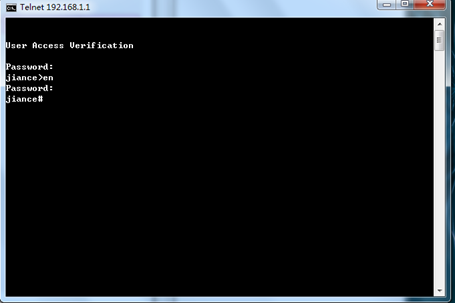

telnet 登陆后，分别输入相应的 `vty` 密码和特权密码，即可管理路由器。

<div STYLE="page-break-after: always;"></div>
# 01：路由器基本命令

## 实验要求

本次实验，主要完成以下几个基本命令的操作：

**1.** **设置路由器系统时间**

系统时间是一个非常重要的参数，设备在运行过程中产生的每个日志信息都会有产生的时间作为参考，如果系统时间设置不正确，对于判断网络设备在某个时刻的状态是非常不利的。因此，设备在加电运行的时候，都会设置一个特定的时间，便于随时掌握设备的运行情况。

**2.** **启动光标跟随服务**

网络管理员在对设备进行配置的时候，设备会不断的弹出控制台信息，告诉网络管理员设备的运行状态，但频繁的控制台信息会打断网络管理员正在输入的命令，给配置带来很大的不便。因此，可以打开光标跟随的功能。这样，即使弹出控制台信息，命令也不会被打断，该服务默认是关闭的。

**3.** **设置路由器登陆界面**

对于一些商业机构，或者公众网络来说，部分网络设备必须暴露在互联网上，这样一来，除了合法的网络管理员，任何能接入互联网的用户都可以登陆到设备上来。因此，必须设置一个登陆界面，告知用户设备的归属方，该设备所起到的作用以及非法用户登陆所应该承担的法律责任，切忌在登陆界面上出现欢迎字样(内网设备除外)，以防止给入侵的黑客找到入侵的借口。

**4.** **配置端口描述**

网络管理员在部署大规模的复杂网络时必须规划清楚各个端口连到对端的什么设备，什么端口，以及端口的作用。所以，在初始化配置的时候，端口描述成为必不可少的配置，尤其对于运营商来说，端口描述已经成为配置规范中不可缺少的一部分。

## 实验拓扑

一台PC通过Console线接入设备，本次实验的所有配置都在这样的拓扑下完成。


## 实验过程

### 1 设置路由器时间

将设备的系统时间设置为2016年1月1日8点整。

```bash
Router#clock set 08:00:00 1 jan 2016
```

### 2 启动光标跟随功能

```bash
Router(config)#line con 0
Router(config-line)#logging synchronous
```

### 3 设置路由器登陆界面

```bash
R1(config)#banner motd “Welcome to NJU”
```

测试结果如下所示。

```bash
Welcome to NJU
User Access Verification
Password:  
Router>  
```

### 4 配置端口描述

```bash
R1(config)#int g0/0/0
R1(config-if)#description To ISP
```

###  5 关闭思科设备的域名解析功能

对于思科的设备，如果在特权模式下，网络管理员不小心输入了错误的命令，那么思科设备会认为这条错误的命令是一个域名，它会做域名解析。

```bash
Router#fsdafasdf  
Translation  "fsdafasdf"...domain server (255.255.255.255)  (255.255.255.255)
Translating  "fsdafasdf"...domain server (255.255.255.255)  Translating  "fsdafasdf"...domain server (255.255.255.255)  
% Unknown  command or computer name, or unable to find computer address  
Router#  
```

在这个情况下，设备会卡在这里一段时间，这里千万不要按回车键，多按一次回车，域名就多解析一次。这里正确的做法是按 Ctrl+Shift+6(**注: 在学校电脑的终端上可能无效只能等待一下**)，打断设备的域名解析，等设备退回到正常的情况下后，再输入下面的命令，关闭设备的域名解析。

```bash
R1(config)#no ip domain-lookup
```

测试结果如下所示。

```bash
Router#configure  terminal
Enter  configuration commands, one per line.  End with CNTL/Z  
Router(config)#no ip domain-lookup  
Router(config)#fsdafkjs  
% Invalid input  detected at ‘^’ marker  
```

### 6 将实验端口恢复到默认设置

对端口进行错误的设置之后，需要将其恢复为默认设置，这步操作会清空所有端口下做的配置。所以，在实际工作中，将端口恢复默认设置是一个风险操作，一定要小心谨慎。

```bash
Router(config)#default interface g0/0/0
```

## 实验命令列表

| 指令             | 用法                          |
| ---------------- | ----------------------------- |
| 设置系统时间     | clock set 时间 日期 月份 年份 |
| 设置登陆界面     | banner motd 欢迎语            |
| 配置端口描述     | description 描述信息          |
| 关闭域名解析     | no ip  domain-lookup          |
| 端口恢复默认设置 | default  interface 端口       |

## 实验问题

<div STYLE="page-break-after: always;"></div>
# 02：交换机基本命令

## 实验要求

本次实验主要完成以下几个基本命令的操作:

- 将一台交换机的 hostname 改成nju。

- 将交换机的特权密码设置为 ccna。网管人员连接进入网络设备之后，首先进入的是用户模式，在这个模式下，能使用的命令很少，也无法对网络设备进行配置操作，因此，需要在用户模式下，输入 enable 命令，进入特权模式，在这步操作时，可以设置密码，验证用户身份。增加设备的安全性。

- 将交换机的 vty 线路密码设置为 ccnp。大多数情况下，网络设备并不在网络管理人员可以接触的地方，因此，有时需要远程登陆到网络设备上进行操作，远程登陆使用的是 VTY 线路，因此，对 VTY 线路设置密码，使得网络管理人员在远程登陆网络设备时需要被验证身份。增加设备的安全性。

- 给交换机设置管理 IP 地址和网关。路由器属于三层设备，可以通过接口设置 IP 地址，进行远程登录管理设备。交换机需要通过设置管理 IP 地址，使得网络管理人员通过这个地址远程登录管理交换机。

- 给交换机静态绑定 MAC 地址。交换机在转发数据帧时，通过查找 MAC 地址表进行转发，通过静态绑定 MAC 地址，减少交换机的泛洪的反应时间。

## 实验拓扑


## 实验过程

### 1 将hostname改为nju

```bash
SW1>enable  
SW1#conf t  
Enter configuration commands, one per  line. End with CNTL/Z.  
SW1(config)#hostname nju  
nju(config)#  
```

### 2 设置特权密码和vty线路密码

```bash
nju(config)#enable password ccna
nju(config)#line vty 0 4
nju(config-line)#password ccnp  
```

### 3 设置管理ip地址

```bash
nju(config)#inter vlan1
nju(config-if)#ip add 192.168.1.1 255.255.255.0 
nju(config-if)#no shutdown
nju(config-if)#exit  
nju(config)#ip default-gateway 192.168.1.100  
```

### 4 验证实验

vlan1 默认关闭，需要手动打开，设置了管理ip 地址后，就可以通过远程登录来管理这台IP地址了，将 PC 机的 IP 地址设置为192.168.1.2，然后与交换机的 g1/0/1 相连，`Windows键` + `X键`，选择`Windows Powershell`，`telnet 192.168.1.1`，接着按照下面给出的命令来验证。


telnet 登陆后，分别输入相应的vty 密码和特权密码，即可管理交换机。

## 实验命令列表

| 指令           | 用法                          |
| -------------- | ----------------------------- |
| 进入特权模式   | enable                        |
| 配置主机名     | hostname [hostname]           |
| 设置登陆台密码 | password [password]           |
| 配置IP地址     | ip address [address]          |
| 配置交换机网关 | ip default-gateway  [address] |

## 实验问题

<div STYLE="page-break-after: always;"></div>
# 03：交换机端口安全

现实生活中，交换机的使用数量远远多于路由器的使用，交换机因为接口数目多，可以连接多个节点，为了保护交换机的安全性，实行了交换机的端口安全，将MAC地址进行绑定，提高安全性。

## 实验要求

本次实验主要完成以下几项操作:

1. 启用端口安全措施

   必须先开启端口安全功能，才能开始制定端口安全策略。 

2. 限制 `g1/0/23` 口最大允许访问量为1

   通过限制访问量来保护设备安全。

3. 采用的安全措施为保护，限制或关闭

   端口安全侦测到问题使用三种惩罚措施。

## 实验拓扑

​       

## 实验过程

### 1 惩罚措施为关闭

```bash
SW1(config)#interface g1/0/23
SW1(config-if)#switchport mode access
SW1(config-if)#switchport port-security
SW1(config-if)#switchport port-security mac-address aaaa.aaaa.aaaa
SW1(config-if)#switchport port-security maximum 1
SW1(config-if)#switchport port-security violation shutdown
```

注：惩罚措施有保护、限制和关闭。关闭：当新的计算机接入时，如果该接口的MAC地址条目超过了最大数目，则该接口将会被关闭，则这个新的计算机和原来的计算机都无法接入。

验证：用一根**直通线**将pc和交换机的`g1/0/23`口相连，查看`g1/0/23`接口的指示灯的变化情况。如果有橙色经过大约50秒的时间变为绿色再关闭，说明试验成功。在交换机上显示如下：

```
GigabitEthernet 1/0/23 isdown,line protocol is down(err-disabled)   Hardware is Fast Ethernet,address is  ec44.767a.d519(bia ec44.767a.d519)  
```

### 2 另外两种惩罚措施的现象

```bash
SW1(config)#interface g1/0/22
SW1(config-if)#switchport mode access
SW1(config-if)#switchport port-security
SW1(config-if)#switchport port-security mac-address aaaa.aaaa.aaab
SW1(config-if)#switchport port-security maximum 1
SW1(config-if)#switchport port-security violation protect
```

当新的计算机接入时，如果该接口的 MAC 地址条目超过了最大数目，则该端口将允许已知MAC地址发送的数据流但将抛弃未知MAC地址发送的数据流；

验证：用一根直通线将 pc 和交换机的 g1/0/22 口相连，使用cmd发送ping命令发送报文至交换机端口ip：192.168.1.1，若mac地址不是之前设置的aaaa.aaaa.aaab，则无法成功。结果如图：

```bash
C：\Users\Administrator>ping 192.168.1.1  
正在Ping 192.168.1.1具有32字节的数据：  
请求超时。  
请求超时。  
请求超时。  
请求超时。  
192.168.1.1的Ping统计信息： 
	数据包：已发送=4，已接收=0，丢失=4（100%丢失）  
```

当新的计算机接入时，如果该接口的 MAC 地址条目超过了最大数目，则该端口将允许已知MAC地址发送的数据流但将抛弃未知MAC地址发送的数据流，但同时会发送一条讯息通知违规发生，大致过程与保护类似，不再赘述。

## 实验命令列表

| 指令                     | 用法                                        |
| ------------------------ | ------------------------------------------- |
| 选择交换机端口           | interface  fastEthernet [端口号]            |
| 将端口定义为主机端口     | switchport mode  access                     |
| 开启交换机端口安全功能   | switchport port-security                    |
| 绑定mac地址到端口上      | switchport port-security mac-address [地址] |
| 设置安全访问的最大用户数 | switchport port-security maximum [数目]     |
| 设置端口安全惩罚措施     | switchport port-security violation [措施]   |

## 实验问题

<div STYLE="page-break-after: always;"></div>
# 04：静态路由和简单组网

> [点此下载本次实验的 Cisco Packet Tracer 文件](https://pub.ydjsir.com.cn/document/router_static.pkt)

## 实验要求

本次实验主要完成以下几项操作:

1. 在路由器上进行静态路由配置，通过使用静态路由将三台路由器连接起来，组成一个小网络；

2. 练习在简单网络中查看网络和设备状态的各种指令。

## 实验拓扑

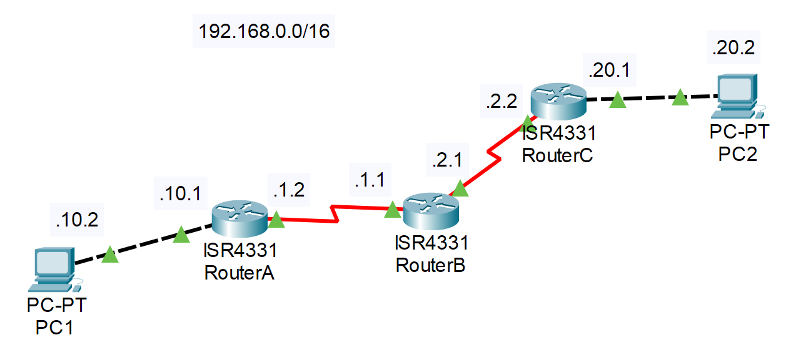

## 实验过程

1. **端口配置**

   Tip: 可以先修改各台路由器的 Hostname, 便于辨认.

   **配置 RouterA**

   ```bash
   // 切换到 g0/0/0(与 PC 相连) 的端口设置
   RouterA(config)#int g0/0/0
   // 配置 IP
   RouterA(config-if)#ip address 192.168.10.1 255.255.255.0
   // 启动端口
   RouterA(config-if)#no shut
   
   // 切换到 s0/1/0(与 RouterB 相连) 的端口设置
   RouterA(config-if)#int s0/1/0
   RouterA(config-if)#ip address 192.168.1.2 255.255.255.0
   RouterA(config-if)#no shut
   ```

   **配置 RouterB**

   ```bash
   // s0/1/0 与 RouterA 相连
   RouterB(config)#int s0/1/0
   RouterB(config-if)#ip address 192.168.1.1 255.255.255.0
   RouterB(config-if)#no shut
   
   // s0/1/1 与 RouterC 相连
   RouterB(config-if)#int s0/1/1
   RouterB(config-if)#ip address 192.168.2.1 255.255.255.0
   RouterB(config-if)#no shut
   ```

   **配置 RouterC**

   ```bash
   // s0/1/0 与 RouterB 相连
   RouterC(config)#int s0/1/0
   RouterC(config-if)#ip address 192.168.2.2 255.255.255.0
   RouterC(config-if)#no shut
   
   // g0/0/0 与 PC2 相连
   RouterC(config-if)#int g0/0/0
   RouterC(config-if)#ip address 192.168.20.1 255.255.255.0
   RouterC(config-if)#no shut
   ```

   **配置 PC1 和 PC2的 IP 地址和默认网关**

   参考实验指南快速开始的软件部分

   **用Ping命令测试各网段的连通性**

   `PC1` 能连接 `RouterA`

   ```
   C:\>ping 192.168.10.1
   
   Pinging 192.168.10.1 with 32 bytes of data:
   
   Reply from 192.168.10.1: bytes=32 time<1ms TTL=255
   Reply from 192.168.10.1: bytes=32 time<1ms TTL=255
   Reply from 192.168.10.1: bytes=32 time<1ms TTL=255
   Reply from 192.168.10.1: bytes=32 time<1ms TTL=255
   
   Ping statistics for 192.168.10.1:
       Packets: Sent = 4, Received = 4, Lost = 0 (0% loss),
   Approximate round trip times in milli-seconds:
       Minimum = 0ms, Maximum = 0ms, Average = 0ms
   ```

   同理，`PC2` 可以连接 `RouterC`

   但 `PC1` 无法连接 `PC2`

   ```
   C:\>ping 192.168.20.2
   
   Pinging 192.168.20.2 with 32 bytes of data:
   
   Request timed out.
   Request timed out.
   Request timed out.
   Request timed out.
   
   Ping statistics for 192.168.20.2:
       Packets: Sent = 4, Received = 0, Lost = 4 (100% loss),
   ```

2. **路由表配置**

   建议对照上方拓扑图理解指令含义

   指令：`ip route <目标网段> <子网掩码> <下一跳路由器地址(IP地址)>`

   ```bash
   // 从 A 到 .20.0/24 要先经过 B (.1.1)
   RouterA(config)#ip route 192.168.20.0 255.255.255.0 192.168.1.1
   
   // 从 C 到 .10.0/24 要先经过 B (.2.1)
   RouterC(config)#ip route 192.168.10.0 255.255.255.0 192.168.2.1
   
   RouterB(config)#ip route 192.168.20.0 255.255.255.0 192.168.2.2
   RouterB(config)#ip route 192.168.10.0 255.255.255.0 192.168.1.2
   ```

   完成路由表的配置后`PC1` 可以连接 `PC2`

   ```
   C:\>ping 192.168.20.2
   
   Pinging 192.168.20.2 with 32 bytes of data:
   
   Reply from 192.168.20.2: bytes=32 time=22ms TTL=125
   Reply from 192.168.20.2: bytes=32 time=2ms TTL=125
   Reply from 192.168.20.2: bytes=32 time=2ms TTL=125
   Reply from 192.168.20.2: bytes=32 time=21ms TTL=125
   
   Ping statistics for 192.168.20.2:
       Packets: Sent = 4, Received = 4, Lost = 0 (0% loss),
   Approximate round trip times in milli-seconds:
       Minimum = 2ms, Maximum = 22ms, Average = 11ms
   ```

3. **尝试默认路由的配置**

   对于该实验的拓扑结构来说，只有 RouterA 和 RouterC 允许配置默认路由。

   首先应该删除静态路由的配置，才配置默认路由。

   以 RouterA 为例：

   ```bash
   RouterA(config)#no ip route 192.168.20.0 255.255.255.0 192.168.1.1
   RouterA(config)#ip route 0.0.0.0 0.0.0.0 192.168.1.1
   ```

   查看当前路由表`show ip route`

   注：有*号表示默认路由

## 实验命令列表

| 指令               | 用法                                                         |
| ------------------ | ------------------------------------------------------------ |
| 路由表配置         | ip route [目标网段] [子网掩码] [下一跳路由器地址(IP地址)]    |
| 删除静态路由的配置 | no ip route [目标网段] [子网掩码] [下一跳路由器地址(IP地址)] |
| 配置默认路由       | ip route 0.0.0.0 0.0.0.0 192.168.x.x                         |
| 查看路由表         | show ip route                                                |
| 停止查看路由表     | no debug all                                                 |

## 实验问题

假如只分配了一个网段：192.168.10.0/24，你该如何搭建上述拓扑？请设计并加以实现。

<div STYLE="page-break-after: always;"></div>
# 05：动态RIP

> [点此下载本次实验的 Cisco Packet Tracer 文件](https://pub.ydjsir.com.cn/document/router_rip.pkt)

## 实验要求

本次实验主要完成以下操作

在路由器上，通过使用动态RIP路由协议将三台路由器组成一个小网络

## 实验拓扑

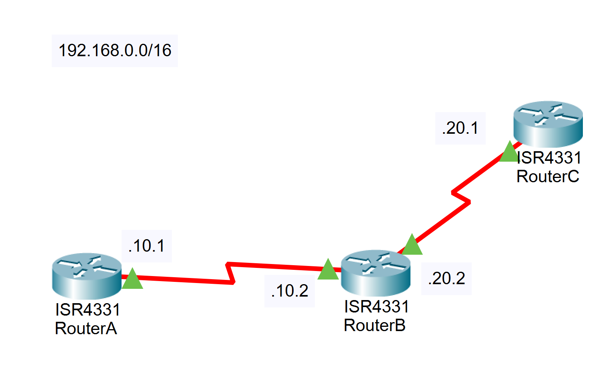

## 实验过程

1. **按照网络拓扑图配置各端口 ip， 并启动端口。**

2. **检查连通性**

   使用 `show ip route` 指令查看现在的路由表。

   在路由器 A 上尝试 ping `192.168.10.2` `192.168.20.2` `192.168.20.1`，能否连通？为什么？

3. **配置 RIP 协议动态路由**

   ```bash
   RouterA(config)#router rip
   RouterA(config-router)#network 192.168.10.0
   
   RouterB(config)#router rip
   RouterB(config-router)#network 192.168.10.0
   RouterB(config-router)#network 192.168.20.0
   
   RouterC(config)#router rip
   RouterC(config-router)#network 192.168.20.0
   ```

4. **再次检查连通性**

   使用 `show ip route` 指令查看现在的路由表，有何不同？

   在路由器 A 上尝试 ping  `192.168.20.1`，连通则实验成功。

   ```bash
   RouterA#ping 192.168.20.1
   Type escape sequence to abort.
   Sending 5, 100-byte ICMP Echos to 192.168.20.1, timeout is 2 seconds:
   !!!!!
   Success rate is 100 percent (5/5), round-trip min/avg/max = 22/36/44 ms
   ```

注：使用如下指令可以查看路由表更新(每30秒更新一次)

```bash
debug ip rip #开始查看
no debug all #停止查看
```

## 实验命令列表

| 指令           | 用法          |
| -------------- | ------------- |
| 查看路由表     | show ip route |
| 查看路由表更新 | debug ip rip  |
| 停止查看路由表 | no debug all  |

## 实验问题

1. 在配置结束后用什么命令来查看具体的设置,请显示具体内容。

2. 在路由器的全局模式下用“show ip protocol”检查当前时间参数设置，所显示的时间值分别代表什么？

3. 观察网络路由路径的选择

4. 在路由器的全局模式下，“traceroute”命令可用来追踪数据包在网络上所经过的路由。可选择若干条有代表性的路径进行路由选择的跟踪，并将由源到目标的各路径的结果记录下来。下表可作为参考格式：

| 路径编号 | 源IP | 中间节点1 | 中间节点2 | 中间节点3 | 中间节点4 | 目的IP |
| -------- | ---- | --------- | --------- | --------- | --------- | ------ |
|          |      |           |           |           |           |        |
|          |      |           |           |           |           |        |

<div STYLE="page-break-after: always;"></div>
# 06：配置单域OSPF

> [点此下载本次实验的 Cisco Packet Tracer 文件](https://pub.ydjsir.com.cn/document/router_ospf.pkt)

## 实验要求

本次实验主要完成以下几个基本命令的操作：

1. 根据拓扑组建和配置网络。配置好网络后，先不要配置OSPF，先用"ping"命令来核验工作，并测试以太网接口之间的连通性。

2. 为每台路由器配置一个环回接口。将环回接口（而不是物理接口）的地址用作路由器ID时，OSPF将更稳定，因为不同于物理接口，这种接口总是处于活动状态，为不会出现故障，因此再所有重要路由上，都应使用环回接口。

3. 配置OSPF。可结合使用命令`router ospf`和`network area`命令。

4. 查看OSPF运行情况。使用`show ip protocols`命令显示IP路由协议参数，包括定时器、过滤器、度量值、网络及路由器的其他信息。使用`show ip ospf interface`命令查看接口是否被加入到正确的区域中；该命令还显示各种定时器和邻接关系。

5. 调节OSPF的计时器。调节OSPF的计时器，以使这些核心路由器能更快地检测出失效的情况，但这会导致额外的数据流量增加。

6. 设置OSPF认证。使用接口配置命令`ip ospf message-digest-key key-id md5 key`给采用OSPF MD5身份验证的路由器指定要使用的密钥ID和密钥。

## 实验拓扑

拓扑如图所示，此外需要为各台路由器配置环回地址。以此为基础配置单区域的 OSPF 网络，即 Area 0 里 OSPF 的配置。

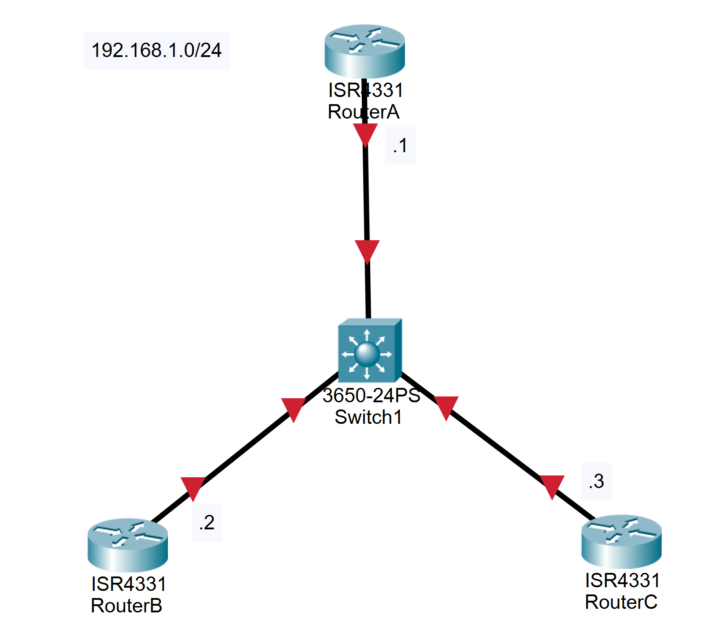

## 实验过程

1. **请按照前面几次实验练习的配置方法，根据给出的图示组建和配置网络。**

2. **在每台路由器上，用一个唯一的IP地址配置一个环回接口。**

```bash
RouterA(config)#int lo0
RouterA(config-if)#ip address 10.0.0.1 255.255.255.255
RouterB(config)#int lo0
RouterB(config-if)#ip address 10.0.0.2 255.255.255.255
RouterC(config)#int lo0
RouterC(config-if)#ip address 10.0.0.3 255.255.255.255
```

3. **配置OSPF**

```bash
RouterA(config)#router ospf 1
RouterA(config-router)#network 192.168.1.0 0.0.0.255 area 0
RouterB(config)#router ospf 1
RouterB(config-router)#network 192.168.1.0 0.0.0.255 area 0
RouterC(config)#router ospf 1
RouterC(config-router)#network 192.168.1.0 0.0.0.255 area 0
```

4. **用 `show` 命令来检查它的操作运行。**

```bash
RouterB#show ip protocols

Routing Protocol is "ospf 1"
  Outgoing update filter list for all interfaces is not set 
  Incoming update filter list for all interfaces is not set 
  Router ID 10.0.0.2
  Number of areas in this router is 1. 1 normal 0 stub 0 nssa
  Maximum path: 4
  Routing for Networks:
    192.168.1.0 0.0.0.255 area 0
  Routing Information Sources:  
    Gateway         Distance      Last Update 
    10.0.0.2             110      00:09:51
  Distance: (default is 110)
```

注意，更新计时器被设置为0。路由更新不是在固定时间间隔上被发送的，它们是事件驱动的。下一步，用 `show ip ospf` 命令来获得有关OSPF进程的消息信息。

```bash
RouterB#show ip ospf
 Routing Process "ospf 1" with ID 10.0.0.2
 Supports only single TOS(TOS0) routes
 Supports opaque LSA
 SPF schedule delay 5 secs, Hold time between two SPFs 10 secs
 Minimum LSA interval 5 secs. Minimum LSA arrival 1 secs
 Number of external LSA 0. Checksum Sum 0x000000
 Number of opaque AS LSA 0. Checksum Sum 0x000000
 Number of DCbitless external and opaque AS LSA 0
 Number of DoNotAge external and opaque AS LSA 0
 Number of areas in this router is 1. 1 normal 0 stub 0 nssa
 External flood list length 0
    Area BACKBONE(0)
        Number of interfaces in this area is 1
        Area has no authentication
        SPF algorithm executed 1 times
        Area ranges are
        Number of LSA 1. Checksum Sum 0x009140
        Number of opaque link LSA 0. Checksum Sum 0x000000
        Number of DCbitless LSA 0
        Number of indication LSA 0
        Number of DoNotAge LSA 0
        Flood list length 0

```

查看DR/BDR：

```
RouterB#show ip ospf interface

GigabitEthernet0/0/0 is up, line protocol is up
  Internet address is 192.168.1.1/24, Area 0
  Process ID 1, Router ID 10.0.0.2, Network Type BROADCAST, Cost: 1
  Transmit Delay is 1 sec, State DR, Priority 1
  Designated Router (ID) 10.0.0.2, Interface address 192.168.1.1
  No backup designated router on this network
  Timer intervals configured, Hello 10, Dead 40, Wait 40, Retransmit 5
    Hello due in 00:00:07
  Index 1/1, flood queue length 0
  Next 0x0(0)/0x0(0)
  Last flood scan length is 1, maximum is 1
  Last flood scan time is 0 msec, maximum is 0 msec
  Neighbor Count is 1, Adjacent neighbor count is 1
    Adjacent with neighbor 10.0.0.2  (Designated Router)
  Suppress hello for 0 neighbor(s)
```

可以看到DR为RouterC，BDR为RouterB

```bash
RouterA(config)#interface g0/0/0
RouterA(config-if)#ip ospf hello-interval 5
```

5. 调节OSPF的计时器

```bash
RouterA(config-if)#ip ospf dead-interval 20
```

6. 设置OSPF认证

```bash
RouterA(config-if)#ip ospf message-digest-key 1 md5 7 itsasecret
RouterA(config-if)#router ospf 1
RouterA(config-router)#area 0 authentication message-digest
```

## 实验命令列表

| 指令               | 用法                                                |
| ------------------ | --------------------------------------------------- |
| 全局配置命令       | router ospf [router-id]                             |
| 接口配置命令       | network [ipaddress] [wildcard-mask]  area [area-id] |
| 显示ip路由协议参数 | show ip protocols                                   |
| 显示接口的ospf状态 | show ip ospf interface                              |
| 修改hello间隔      | ip ospf hello-interval [time]                       |
| 修改dead时间       | ip ospf dead-interval [time]                        |
| 配置ospf MD5身份   | ip ospf message-digest-key [key-id]  md5 [key]      |

## 实验问题

哪个路由器成为了DR？哪个路由器成为了BDR？为什么？

<div STYLE="page-break-after: always;"></div>
# 07：VLAN间路由

> [点此下载本次实验的 Cisco Packet Tracer 文件](https://pub.ydjsir.com.cn/document/router_vlan.pkt)

## 实验要求 

首先需要明确一点，不同的 Vlan 相互隔离广播域，因此，传统的以太网 ARP 方式的通信机制在这里是不可用的，需要在网络中添加三层设备，这里的三层设备可以是路由器，也可以是 Cisco 三层交换机（例如 Cisco 3550，Cisco3560）。

本次实验的目的，是让处于不同 Vlan 下的主机能够通信，因此用路由器充当上述的三层设备，需要用到的知识点有： 

1. Vlan 的划分

2. VTP 同步

3. 将接口划分进 Vlan

4. Trunk 链路的封装类型

5. 子接口的配置

## 实验拓扑

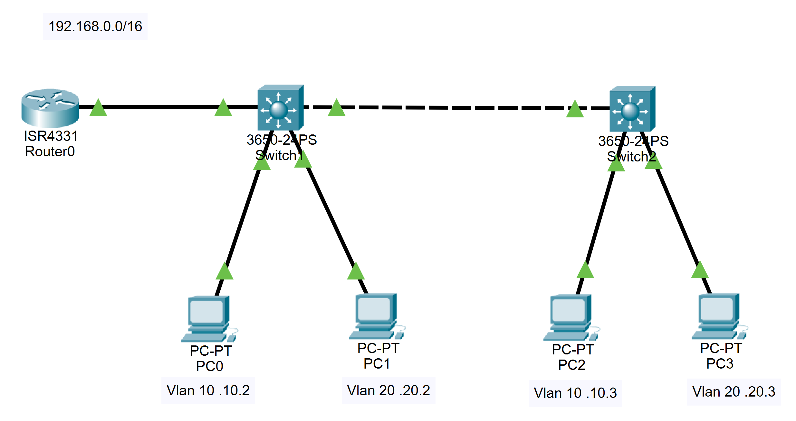

PC0 和 PC2 属于 Vlan 10，PC1 和 PC3 属于 Vlan 20，如果上述 Vlan 间路由配置正确，PC1、PC3 能与 PC2、PC4 相互 ping 通。

## 实验过程 

1. **根据网络拓扑图连接好设备**

   可以先配置各台 PC 的 IP 地址和默认网关，配置方法见实验手册快速开始部分。

2. **将 Switch1 和 Switch2 之间的链路设置为Trunk链路**

```bash
Switch1(config)#interface g1/0/23 
Switch1(config-if)#switchport mode trunk
// Switch 2 同理
```

3. **划分两个Vlan，Vlan 10和Vlan 20** 

```bash
Switch1(config)#vlan 10
Switch2(config)#vlan 20
```

3. **将 PC 划分到对应的 Vlan**

```bash
Switch1(config)#interface g1/0/1
Switch1(config-if)#switchport mode access 
Switch1(config-if)#switchport access vlan 10  
Switch1(config-if)#interface g1/0/2
Switch1(config-if)#switchport mode access 
Switch1(config-if)#switchport access vlan 20
// Switch2 同理
```

操作完成后，在 Switch1 和 Switch2 上分别使用 `show vlan brief` 命令，可以查看对应接口是否在正确的vlan中。

此时使用 PC0 可以 ping 通 PC2, PC1 可以 ping 通 PC3，但不能跨 Vlan 访问。

```
// 以下是 PC0 上的操作
C:\>ping 192.168.10.3

Pinging 192.168.10.3 with 32 bytes of data:

Reply from 192.168.10.3: bytes=32 time<1ms TTL=128
Reply from 192.168.10.3: bytes=32 time<1ms TTL=128
Reply from 192.168.10.3: bytes=32 time<1ms TTL=128
Reply from 192.168.10.3: bytes=32 time<1ms TTL=128

Ping statistics for 192.168.10.3:
    Packets: Sent = 4, Received = 4, Lost = 0 (0% loss),
Approximate round trip times in milli-seconds:
    Minimum = 0ms, Maximum = 0ms, Average = 0ms

C:\>ping 192.168.20.3

Pinging 192.168.20.3 with 32 bytes of data:

Request timed out.
Request timed out.
Request timed out.
Request timed out.

Ping statistics for 192.168.20.3:
    Packets: Sent = 4, Received = 0, Lost = 4 (100% loss),
```

4. **将 Switch1 与 Router 连接的接口设置为 Trunk 接口**

```bash
sw1(config)#interface g1/0/24
sw1(config-if)#switchport mode trunk
```

5. **Router 划分两个子接口，分别作为 Vlan10 和 Vlan20的网关**

```bash
Router(config)#interface g0/0/0
Router(config-if)#no ip address
Router(config-if)#no shutdown
Router(config)#int g0/0/0.10
Router(config-if)#encapsulation dot1q 10
Router(config-if)#ip address 192.168.10.1 255.255.255.0
Router(config)#int g0/0/0.20
Router(config-if)#encapsulation dot1q 20
Router(config-if)#ip address 192.168.20.1 255.255.255.0
```

6. **测试**

   PC 0 能 ping 到  PC1，实际上现在任意两台 PC 都可以互相访问。

   ```
   C:\>ping 192.168.20.2
   
   Pinging 192.168.20.2 with 32 bytes of data:
   
   Reply from 192.168.20.2: bytes=32 time<1ms TTL=127
   Reply from 192.168.20.2: bytes=32 time<1ms TTL=127
   Reply from 192.168.20.2: bytes=32 time<1ms TTL=127
   Reply from 192.168.20.2: bytes=32 time<1ms TTL=127
   
   Ping statistics for 192.168.20.2:
       Packets: Sent = 4, Received = 4, Lost = 0 (0% loss),
   Approximate round trip times in milli-seconds:
       Minimum = 0ms, Maximum = 0ms, Average = 0ms
   ```

## 实验命令列表

| 指令              | 用法                                  |
| ----------------- | ------------------------------------- |
| 设置Trunk封装类型 | switchport trunk encapsulation [type] |
| 设置Trunk链路     | switchport mode trunk                 |
| 划分vlan          | vlan [vlan name]                      |
| 将接口划分入vlan  | swichport access vlan [vlan name]     |
| 显示vlan简要信息  | show vlan brief                       |

## 实验问题

<div STYLE="page-break-after: always;"></div>
# 08：NAT网络地址转换

> [点此下载本次实验的 Cisco Packet Tracer 文件](https://pub.ydjsir.com.cn/document/router_nat.pkt)

## 实验要求

本次实验，希望通过地址转换，使拓扑图中左边内部网络中的内部本地地址分别通过三种方式转换成外部全局地址并成功的访问右边网络中的RouterC。

## 实验拓扑

实验拓扑如图所示，RouterA和RouterB之间是 `192.168.1.0/24` 网段，RouterB 和 RouterC 之间是 `200.1.1.0/24` 网段。

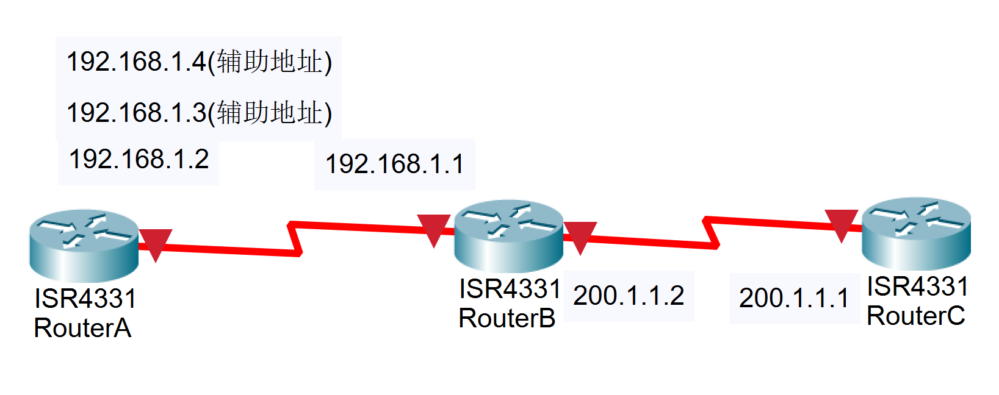

## 实验过程 

1. **配置每个设备的名称和接口 ip 地址，确保彼此之间的三层连通性。** 

```bash
RouterA(config)#interface s0/1/0
RouterA(config-if)#ip address 192.168.1.2 255.255.255.0
RouterA(config-if)#no shutdown

RouterB(config)#interface s0/1/0
RouterB(config-if)#ip address 192.168.1.1 255.255.255.0
RouterB(config-if)#no shutdown
RouterB(config)#interface s0/1/1
RouterB(config-if)#ip address 200.1.1.2 255.255.255.0
RouterB(config-if)#no shutdown

RouterC(config)#interface s0/1/0
RouterC(config-if)#ip address 200.1.1.1 255.255.255.0
RouterC(config-if)#no shutdown
```

2. **在 RouterB 上完成静态 NAT 的配置。** 

```bash
RouterB(config)#ip nat inside source static 192.168.1.1 200.1.1.254 
RouterB(config)#interface s0/1/0
RouterB(config-if)#ip nat inside 
RouterB(config)#interface s0/1/1
RouterB(config-if)#ip nat outside
RouterB#debug ip nat 
IP NAT debugging is on
```

3. **此时在 RouterA 上用本地地址 192.168.1.1 Ping 200.1.1.2,结果没有ping通，为什么?**

```bash
RouterA#ping 200.1.1.2 
Type escape sequence to abort. 
Sending 5, 100-byte ICMP Echos to 200.1.1.2, timeout is 2 seconds: 
..... 
Success rate is 0 percent (0/5)
```

4. 查看 RouterA 上是否有地址转换的NAT表，转换表为空，说明没有发生地址转换，分析原因： **RouterA 去往200.1.1.0 网段，需要一条静态路由。**

```bash
RouterA#show ip nat translations
// 无输出
```

**为 RouterA 加上去往 RouterC 的静态路由，现在 RouterA 可以 ping 通 RouterC。**

```bash
RouterA(config)#ip route 200.1.1.0 255.255.255.0 s0/1/0
RouterA#ping 200.1.1.2 
Type escape sequence to abort. 
Sending 5, 100-byte ICMP Echos to 200.1.1.2, timeout is 2 seconds: 
!!!!! 
Success rate is 100 percent (5/5), round-trip min/avg/max = 40/42/44 ms
```

在 RouterB 上可以看到具体的转换过程。

```bash
*Oct 27 09:11:34.791: NAT*: s=192.168.1.1->200.1.1.254, d=200.1.1.2 [5] 
*Oct 27 09:11:34.819: NAT*: s=200.1.1.2, d=200.1.1.254->192.168.1.1 [5]
```

查看RouterB的NAT转换表，RouterB建立NAT表，当有流量符合这个匹配规则时就会两个地址进行转换。

```bash
RouterB#show ip nat translations
Pro Inside global      Inside local      Outside local      Outside global
--- 200.1.1.254        192.168.1.1     ---               ---
```

5. **在RouterB上完成动态NAT的配置。**

将原来的静态NAT的条目删除，通过使用用户访问控制列表来定义本地地址池。

```bash
RouterB(config)#no ip nat inside source static 192.168.1.1 200.1.1.254 
RouterB(config)#access-list 1 permit 192.168.1.0  0.0.0.255 
RouterB(config)#ip nat pool nju 200.1.1.253 200.1.1.254 netmask 255.255.255.0
RouterB(config)#ip nat inside source list 1 pool nju
```

**在 RouterA 上 ping RouterC，成功连通。**

```bash
Router#ping 200.1.1.1

Type escape sequence to abort.
Sending 5, 100-byte ICMP Echos to 200.1.1.1, timeout is 2 seconds:
!!!!!
Success rate is 100 percent (5/5), round-trip min/avg/max = 26/31/35 ms
```

**Ping通说明路由添加正确，查看 RouterB 的终端信息。**

```bash
NAT: s=192.168.1.2->200.1.1.200, d=200.1.1.1 [37]
NAT*: s=200.1.1.1, d=200.1.1.200->192.168.1.2 [16]
NAT: s=192.168.1.2->200.1.1.200, d=200.1.1.1 [38]
NAT*: s=200.1.1.1, d=200.1.1.200->192.168.1.2 [17]
NAT: s=192.168.1.2->200.1.1.200, d=200.1.1.1 [39]
NAT*: s=200.1.1.1, d=200.1.1.200->192.168.1.2 [18]
NAT: s=192.168.1.2->200.1.1.200, d=200.1.1.1 [40]
NAT*: s=200.1.1.1, d=200.1.1.200->192.168.1.2 [19]
NAT: s=192.168.1.2->200.1.1.200, d=200.1.1.1 [41]
NAT*: s=200.1.1.1, d=200.1.1.200->192.168.1.2 [20]
```

### 5 在RouterA上用 192.168.1.3 ping 200.1.1.2

```bash
RouterA#ping 
Protocol [ip]: 
Target IP address: 200.1.1.2 
Repeat count [5]: 20 
Datagram size [100]: 
Timeout in seconds [2]: 
Extended commands [n]: y
Source address or interface: 192.168.1.3
Type of service [0]:
Set DF bit in IP header? [no]:
Validate reply data? [no]:
Data pattern [0xABCD]:
Loose, Strict, Record, Timestamp, Verbose[none]:
Sweep range of sizes [n]: 
Type escape sequence to abort. 
Sending 20, 100-byte ICMP Echos to 200.1.1.2, timeout is 2 seconds: 
Packet sent with a source address of 192.168.1.3
!!!!!!!!!!!!!!!!!!!!!!!!!!!!!!!!!!!!!!!!!!!!!!!
Success rate is 100 percent (20/20), round-trip min/avg/max = 40/43/44 ms
RouterA#_
```

查看RouterB的终端信息以及NAT转换表，源地址192.168.1.2转换成200.1.1.254，很明显调用了第2公有地址。 

```bash
*Oct 27 09:26:10.339: NAT*: s=192.168.1.3->200.1.1.254, d=200.1.1.2 [139]
*Oct 27 09:26:10.367: NAT*: s=200.1.1.2, d=200.1.1.254->192.168.1.3 [139]
```

查看RouterB的NAT转换表

```bash
RouterB#show ip nat translations
Pro Inside global      Inside local      Outside local      Outside global
--- 200.1.1.253        192.168.1.1     ---               ---
--- 200.1.1.254        192.168.1.3     ---               ---
RouterB#_
```

### 6 在RouterA上用 192.168.1.4 ping 200.1.1.2

```bash
RouterA#ping 
Protocol [ip]: 
Target IP address: 200.1.1.2 
Repeat count [5]: 20 
Datagram size [100]: 
Timeout in seconds [2]: 
Extended commands [n]: y
Source address or interface: 192.168.1.4
Type of service [0]:
Set DF bit in IP header? [no]:
Validate reply data? [no]:
Data pattern [0xABCD]:
Loose, Strict, Record, Timestamp, Verbose[none]:
Sweep range of sizes [n]: 
Type escape sequence to abort. 
Sending 20, 100-byte ICMP Echos to 200.1.1.2, timeout is 2 seconds: 
Packet sent with a source address of 192.168.1.4
……………………………...
Success rate is 0 percent (0/20)
RouterA#_
```

结果发现不能ping通到目的。查看RouterB的NAT转换表，发现没有192.168.1.4的条目。

```bash
RouterB#show ip nat translations
Pro Inside global      Inside local      Outside local      Outside global
--- 200.1.1.253        192.168.1.1     ---               ---
--- 200.1.1.254        192.168.1.3     ---               ---
RouterB#_
```

解决的方法：清除RouterB的NAT表中的条目，将公有地址池中的公有地址释放出来。

```bash
RouterB#clear ip nat translation * 
RouterB#show ip nat translations
RouterB#_
```

在RouterA上重试。

```bash
RouterA#ping 
Protocol [ip]: 
Target IP address: 200.1.1.2 
Repeat count [5]: 
Datagram size [100]: 
Timeout in seconds [2]: 
Extended commands [n]: y
Source address or interface: 192.168.1.4
Type of service [0]:
Set DF bit in IP header? [no]:
Validate reply data? [no]:
Data pattern [0xABCD]:
Loose, Strict, Record, Timestamp, Verbose[none]:
Sweep range of sizes [n]: 
Type escape sequence to abort. 
Sending 20, 100-byte ICMP Echos to 200.1.1.2, timeout is 2 seconds: 
Packet sent with a source address of 192.168.1.4
!!!!!!!!!!!
Success rate is 100 percent (5/5), round-trip min/avg/max = 44/44/44 ms
RouterA#_
```

RouterB终端上所显示的转换过程。

```bash
*Oct 27 09:37:24.699: NAT*: s=192.168.1.4->200.1.1.253, d=200.1.1.2 [170]
*Oct 27 09:37:24.727: NAT*: s=200.1.1.2, d=200.1.1.253->192.168.1.4 [170]
```

再查看RouterB的NAT转换表。

```bash
RouterB#show ip nat translations
Pro Inside global      Inside local      Outside local      Outside global
icmp 200.1.1.253:7    192.168.1.4:7    200.1.1.2:7       200.1.1.2:7
--- 200.1.1.253        192.168.1.4     ---               ---
RouterB#_
```

### 7 配置 PAT

先删除转换语句，再删除之前建立的 pool，注意删除的顺序。

```bash
RouterB(config)#no ip nat inside source list 1 pool nju

Dynamic mapping in use, do you want to delete all entires? [no]: yes
RouterB(config)#no ip nat pool nju 200.1.1.253 200.1.1.254 prefix-length 24 
RouterB(config)#ip nat pool nju 200.1.1.253 200.1.1.253 prefix-length 24    
RouterB(config)#ip nat inside source list 1 pool nju overload  

RouterB(config)#
*Oct 27 09:42:38.571: ipnat_add_dynamic_cfg_common: id 2,flag 5, range 1
*Oct 27 09:42:38.571: id 2, flags 0, domain 0, lookup 0, aclnum 1, aclname 1, map
name idb 0x00000000
*Oct 27 09:42:38.571: poolstart 200.1.1.253 poolend 200.1.1.253 _    
```

### 8 在 RouterA 用 192.168.1.1 上 ping 200.1.1.2

```bash
RouterA#ping 200.1.1.2 

Type escape sequence to abort. 
Sending 5,  100-byte ICMP Echos to 200.1.1.2,  timeout is 2 seconds: 
!!!!! 
Success rate is 100 percent (5/5), round-trip min/avg/max =44/44/44 ms
RouterA#_
```

查看RouterB的终端信息以及NAT转换表，随机产生端口号6。

```bash
*Oct 27 09:44:05.283: NAT*: s=192.168.1.1->200.1.1.253, d=200.1.1.2 [175]
*Oct 27 09:44:05.311: NAT*: s=200.1.1.2, d=200.1.1.253->192.168.1.1 [175]
```

```bash
RouterB#show ip nat translations
Pro    Inside global     Inside local      Outside local   Outside global 
icmp   200.1.1.253:6    192.168.1.1:6    200.1.1.2:6    200.1.1.2:6
RouterB#_
```

RouterB约1分钟的时间释放地址转换的空间，此时查找NAT表中没有任何的转换条目。

```bash
RouterB#show ip nat translations

RouterB#_
```


### 9 在 RouterA用 192.168.1.3 ping 200.1.1.2

```bash
RouterA#ping 
Protocol [ip]: 
Target IP address: 200.1.1.2 
Repeat count [5]: 
Datagram size [100]: 
Timeout in seconds [2]: 
Extended commands [n]: y
Source address or interface: 192.168.1.3
Type of service [0]:
Set DF bit in IP header? [no]:
Validate reply data? [no]:
Data pattern [0xABCD]:
Loose, Strict, Record, Timestamp, Verbose[none]:
Sweep range of sizes [n]: 
Type escape sequence to abort. 
Sending 20, 100-byte ICMP Echos to 200.1.1.2, timeout is 2 seconds: 
Packet sent with a source address of 192.168.1.3
……………………………...
Success rate is 0 percent (5/5), round-trip min/avg/max = 40/43/44 ms
RouterA#_
```

查看RouterB的终端信息。

```bash
*Oct 27 09:47:40.827: NAT*: s=192.168.1.1->200.1.1.253, d=200.1.1.2 [180]
*Oct 27 09:47:40.855: NAT*: s=200.1.1.2, d=200.1.1.253->192.168.1.3 [180]
```

端口号已改为9。

```bash
RouterB#show ip nat translations
Pro    Inside global     Inside local      Outside local   Outside global 
icmp   200.1.1.253:9    192.168.1.1:9    200.1.1.2:9    200.1.1.2:9
RouterB#
*Oct 27 09:48:41.467:  NAT: expiring 200.1.1.253(192.168.1.3) icmp 9 (9)
RouterB#
```

## 实验命令列表

| 指令               | 用法                                                         |
| ------------------ | ------------------------------------------------------------ |
| 配置静态NAT        | ip nat inside source static [inside  local ip address] [inside global ip address] |
| 删除静态 NAT条目   | no ip nat inside source static  [inside local ip address] [inside global ip address] |
| 指定内部ip地址接口 | ip nat inside                                                |
| 指定外部ip地址接口 | ip nat outside                                               |
| 查看NAT转换表      | show ip nat translations                                     |
| 清空NAT转换表      | clear ip nat translation *                                   |

## 实验问题

<div STYLE="page-break-after: always;"></div>
# 09：ACL实验

> [点此下载本次实验的 Cisco Packet Tracer 文件](https://pub.ydjsir.com.cn/document/router_acl.pkt)

## 实验要求

本次试验，两设备实现标准 ACL 和扩展 ACL 的实验，并对两种ACL进行比较。

## 实验拓扑


## 实验过程

1. **搭建网络拓扑，保证三层连通性**

```bash
RouterA(config)#interface serial 0/1/0
RouterA(config-if)#ip address 192.168.1.1 255.255.255.0
RouterA(config-if)#no shutdown

RouterB(config)#interface serial 0/1/0
RouterB(config-if)#ip address 192.168.1.2 255.255.255.0
RouterB(config-if)#no shutdown
```


### 2 使用扩展的ACL封杀RouterA到RouterB的PING命令

####  2.1 验证3层连通性

```bash
RouterB#ping 192.168.1.1

Type escape sequence to abort.
Sending 5,100-byte ICMP Echos to 192.168.1.1, timeout is 2 seconds:
!!!!!
Success rate is 100 percent(5/5), round-trip min/avg/max = 28/28/28 ms
```

#### 2.2 创建 ACL

```bash
RouterA(config)#access-list 100 deny icmp 192.168.1.1 0.0.0.0 192.168.1.2 0.0.0.0
RouterA(config)#access-list 100 permit ip any any
RouterA#show ip access-lists
Extended IP access list 100
    10 deny icmp host 192.168.1.1 host 192.168.1.2
    20 permit ip any any
```

#### 2.3 应用ACL到接口

```bash
RouterA(config)#interface serial 0/0/0
RouterA(config-if)#ip access-group 100 out
```

#### 2.4 验证效果

发现配置的 ACL 没有生效。

```bash
RouterA(config)#interface s0/1/0
RouterA(config-if)#ip access-group 100 out
RouterA#ping 192.168.1.2

Type escape sequence to abort.
Sending 5, 100-byte ICMP Echos to 192.168.1.2, timeout is 2 seconds:
!!!!!
Success rate is 100 percent (5/5), round-trip min/avg/max = 6/13/17 ms
```

对于ACL的放置位置，有以下的原则：扩展ACL放置在靠近源的位置，标准ACL 放置在靠近目的位置。那按照上述的原则，创建一个扩展的ACL，并放置在源端，并没有错误。

#### 2.5 排错

```bash
RouterA#show ip access-lists
Extended IP access list 100
deny icmp host 192.168.1.1 host 192.168.1.2
permit ip any any (15 matches)
```

问题分析：最后一条语句匹配到15个数据包。对于 ACL，有个非常重要的特性，他不能过滤本地数据流！也就是说，对于 RouterA 上发送的数据，设置在 RouterA 接口上的 ACL 并不能对它进行过滤。为了能对数据流进行过滤，需要把ACL 设置在对端的 RouterB 上 。

#### 2.6 在RouterB上设置并应用ACL

```bash
RouterB(config)#access-l 100 deny icmp host 192.168.1.1 host 192.168.1.2
RouterB(config)#access-l 100 permit icmp any any
RouterB(config)#interface serial 0/1/0
RouterB(config-if)#ip access-group 100 in
```

#### 2.7 检测效果

```bash
RouterA#ping 192.168.1.2

Type escape sequence to abort.
Sending 5, 100-byte ICMP Echos to 192.168.1.2, timeout is 2 seconds:
UUUUU
Success rate is 0 percent (0/5)
```

实验成功，ICMP包被拒绝。

### 3 使用 ACL禁止RouterA到RouterB的TELNET应用

注意：在进行第二部分实验前请将第一部分配置清除

```bash
RouterB(config)#int s0/1/0
RouterB(config-if)#no ip access-group 100 in
```

在RouterB上设置特权密码为nju，线路密码为cisco。从RouterA使用 PING命令测试到RouterB的连通性，结果可达，但却不可以TELNET到RouterB 。

有两种方法可以实现这样的操作。

#### 3.1 方法一：使用扩展 ACL

##### 3.1.1 检测基本配置

```bash
RouterB(config)#enable secret nju
RouterB(config)#line vty 0 4
RouterB(config-line)#password cisco
RouterB(config-line)#login
```

```bash
RouterA#ping 192.168.1.2
Type escape sequence to abort.
Sending 5, 100-byte ICMP Echos to 192.168.1.2, timeout is 2 seconds:
!!!!!
Success rate is 100 percent (5/5), round-trip min/avg/max = 8/13/18 ms

RouterA#telnet 192.168.1.2
Trying 192.168.1.2 ...Open
User Access Verification
Password: 
RouterB>
// 这里从 RouterA 上通过 telnet 连接到了 RouterB 的控制台
```

##### 3.1.2 创建 ACL

```bash
RouterB(config)#access-list 101 deny tcp host 192.168.1.1 any eq 23
RouterB(config)#access-list 101 permit ip any any
RouterB(config)#int s0/1/0
RouterB(config-if)#ip access-group 101 in
```

```bash
RouterA#telnet 192.168.1.2
Trying 192.168.1.2 ...
% Connection timed out; remote host not responding

RouterA#ping 192.168.1.2
Type escape sequence to abort.
Sending 5, 100-byte ICMP Echos to 192.168.1.2, timeout is 2 seconds:
!!!!!
Success rate is 100 percent (5/5), round-trip min/avg/max = 11/15/19 ms
```

telnet 被拒绝但 ping 成功，实验成功。

#### 3.2 方法二：使用标准 ACL

##### 3.2.1 删除先前的配置

```bash
RouterB(config)#int s0/1/0
RouterB(config-if)#no ip access-group 101 in
```

##### 3.2.2 创建 ACL

```bash
RouterB(config)#access-list 1 deny host 192.168.1.1
RouterB(config)#access-list 1 permit any
```

##### 3.2.3 应用 ACL

```bash
RouterB(config)#line vty 0 4
RouterB(config-line)# access-class 1 in
```

此时尝试从 RouterA telnet 连接 RouterB

```bash
RouterA#telnet 192.168.1.2
Trying 192.168.1.2 ...
% Connection refused by remote host
```

问题分析：设置了2种ACL，但是得到的效果却不一样。如果是使用了扩展的ACL，那么它的提示是“% Destination unreachable; gateway or host down”,说明23号端口根本不可达。如果是使用了标准的 ACL 放置在VTY线路中，则提示“% Connection refused by remote host”，说明的确是到达了23号端口，只不过被拒绝了。在实际使用中最好使用扩展的ACL，减少23号端口的负担。

## 实验命令列表

| 指令                                              | 用法                                                         |
| ------------------------------------------------- | ------------------------------------------------------------ |
| 配置access list                                   | access-list  [list number] [permit\|deny] [source address] [address] [wildcard mask] [log] |
| 将指定访问列表应用到相关接口，并指定ACL作用的方向 | ip access-group  {[access-list-number]\|[name]} [int\|out]   |
| 显示已设置的访问控制列表内容                      | show ip  access-lists                                        |

## 实验问题

<div STYLE="page-break-after: always;"></div>
# 10：PPP 验证实验

> [点此下载本次实验的 Cisco Packet Tracer 文件](https://pub.ydjsir.com.cn/document/router_ppp.pkt)

## 实验要求

本次实验主要完成以下两项操作:

PAP验证

1. 为路由器指定唯一主机名，为了辨别设备，需要设置不同的主机名。

2. 列出认证路由器时所使用的远程主机名称和口令，PAP为单项验证，所以被验证方需要正确的主机名和口令，方能使链路通畅。
3. WAN接口上完成PPP协议的封装。PAP验证基于PPP协议，必须封装后才能启用。
4. RouterA为服务端，RouterB为客户端，客户端主动向服务端发出认证请求，密码设置为ccna。

CHAP 验证

1. 为路由器指定唯一主机名，为了辨别设备，需要设置不同的主机名

2. 列出认证路由器时所使用的远端主机名称和口令，密码为ccna。CHAP 为双向验证，通过将对方发送的用户名和口令与本地的用户列表来对比确认。一致通过，不一致链路阻塞。WAN接口上完成PPP 协议的封装和CHAP 认证的配置PAP 验证基于PPP 协议，必须封装后才能启用。

## 实验拓扑

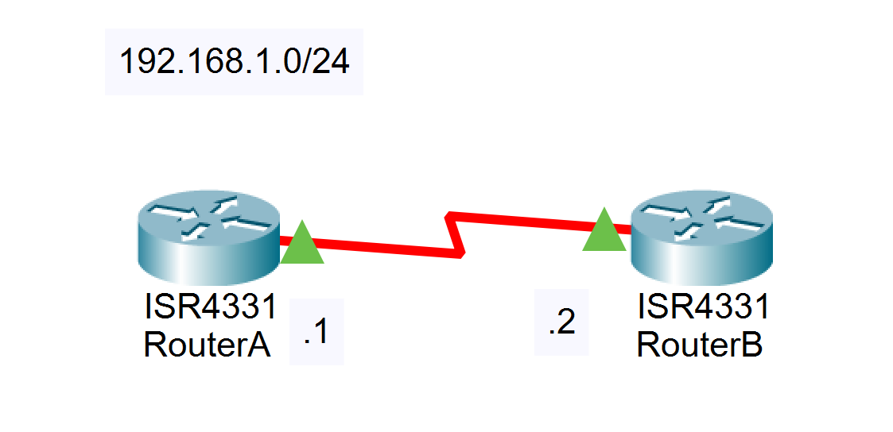

## 实验过程

### PAP验证

#### 1  配置RouterA的服务端设置

```bash
RouterA(config)#username nju password ccna
RouterA(config)#interface s0/1/0
RouterA(config-if)#ip address 192.168.1.1 255.255.255.0
RouterA(config-if)#encapsulation ppp
RouterA(config-if)#ppp authentication pap
RouterA(config-if)#no shutdown
```

#### 2 配置RouterB的客户端设置

```bash
RouterB(config)#interface s0/1/0
RouterB(config-if)#ip address 192.168.1.2 255.255.255.0
RouterB(config-if)#encapsulation ppp
RouterB(config-if)#no shutdown
```

#### 3 client 端发送用户名和密码

```bash
RouterB(config-if)#ppp pap sent-username adsf password adsf
```

注：当用户名和口令中的任意一个和验证方的本地用户列表不同时，无法通信。

```bash
RouterB#ping 192.168.1.1
Type escape sequence to abort.
Sending 5, 100-byte ICMP Echos to 192.168.1.1, timeout is 2 seconds:
.....
Success rate is 0 percent (0/5)
```

#### 4 设置正确的用户名和密码

```bash
RouterB(config-if)#ppp pap sent-username nju password ccna
RouterB(config-if)#end
RouterB#ping 192.168.1.1
```

测试结果如下。

```bash
Type escape sequence to abort.
Sending 5, 100-byte ICMP Echos to 192.168.1.1, timeout is 2 seconds:
!!!!!
Success rate is 100 percent (5/5), round-trip min/avg/max = 28/28/32 ms
```

### CHAP 验证

#### 1 配置RouterA

```bash
RouterA(config)#username nju2 password ccna
RouterA(config)#interface s0/1/0
RouterA(config-if)#ip address 192.168.1.1 255.255.255.0
RouterA(config-if)#encapsulation ppp
RouterA(config-if)#ppp authentication chap
RouterA(config-if)#no shutdown
```

#### 2 配置RouterB

```bash
RouterB(config)#int s0/1/0
RouterB(config-if)#ip address 192.168.1.2 255.255.255.0
RouterB(config-if)#encapsulation ppp
RouterB(config-if)#ppp authentication chap
RouterB(config-if)#no shutdown
```

注：对端需要配置相同，因为chap 是双向认证，由于一端没有发送本地用户名和列表，导致链路不通。

#### 3 设置RouterB 上的用户名和密码

```bash
RouterB(config)#username nju1 password ccnp
RouterB#ping 192.168.1.1
```

测试结果如下。

```bash
Type escape sequence to abort.
Sending 5, 100-byte ICMP Echos to 192.168.1.1, timeout is 2 seconds:
.....
Success rate is 0 percent (0/5)
```

#### 4 设置正确的用户名和密码

```bash
RouterB(config)#username nju1 password ccna
RouterB#ping 192.168.1.1
```

测试结果如下。

```bash
Type escape sequence to abort.
Sending 5, 100-byte ICMP Echos to 192.168.1.1, timeout is 2 seconds:
!!!!!
Success rate is 100 percent (5/5), round-trip min/avg/max = 28/28/32 ms
```

在验证通过的情况下，将任意一边的口令随意设置成一个非ccna 的口令，再测试连通性。

```bash
RouterB(config)#username RouterA password ccnp
RouterB#ping 192.168.1.1
```

测试结果如下。

```bash
Type escape sequence to abort.
Sending 5, 100-byte ICMP Echos to 192.168.1.1, timeout is 2 seconds:
!!!!!
Success rate is 100 percent (5/5), round-trip min/avg/max = 28/28/32 ms
```

注：因为当验证通过后会一直保存已经建立好的连接，解决方法是将接口关闭在启动。

## 实验命令列表

| 启用PPP封装协议              | encapsulation  ppp                              |
| ---------------------------- | ----------------------------------------------- |
| 启用PAP身份验证              | ppp  authentication pap                         |
| 设置被验证发送的用户名和口令 | ppp pap  sent-username [用户名] password [密码] |
| 启用CHAP认证协议             | ppp  authentication chap                        |

## 实验问题

<div STYLE="page-break-after: always;"></div>
# 11：帧中继实验

> 因实验室机器指令与模拟器不同, 本实验暂未在Packet Tracer中复现.
>
> 以下实验过程已在实验室复现.

## 实验前准备

帧中继是由ITU-T标准化的高性能WAN协议，并在美国广泛应用。帧中继是一种面向连接的数据链路层技术，它定义了路由器与服务提供商的本地接入交换设备之间的互联过程。

连接到帧中继WAN的设备分为以下两类：

DTE：DTE设备通常位于客户所在地并且可能为客户所有，帧中继接入设备、路由器、网桥都属于 DTE设备。

DCE：运营商所拥有的网间设备，DCE设备的作用是在网络中提供时钟服务和交换服务，并通过WAN传输数据。

## 实验要求

本次实验主要完成以下几个要求：

1．  配置帧中继交换机。帧中继是一种面向连接的数据链路层技术，它定义了路由器与服务提供商的本地接入交换设备之间的互联过程。

2．  按照拓扑组建和配置路由器。

3．  进行验证实验。通过命令查看在帧中继交换机上虚电路交换的过程；通过手动配置DLCI 号与IP 地址的映射，在路由器上分别禁用逆向ARP 查询。

## 实验拓扑

拓扑如图所示：


## 实验过程

### 1 配置中间的帧中继交换机

```bash
Fr-sw(config)#frame-relay switching
Fr-sw(config)#interface serial 0/0/0
Fr-sw(config-if)#encapsulation frame-relay
Fr-sw(config-if)#frame-relay intf-type dce
Fr-sw(config-if)#clock rate 64000
Fr-sw(config-if)#frame-relay route 100 interface serial 0/0/1 200
Fr-sw(config-if)#no shutdown
Fr-sw(config-if)#exit

Fr-sw(config)#interface serial 0/0/1
Fr-sw(config-if)#encapsulaiton frame-relay
Fr-sw(config-if)#frame-relay intf-type dce
Fr-sw(config-if)#clock rate 64000
Fr-sw(config-if)#frame-relay route 200 interface serial 0/0/0 100
Fr-sw(config-if)#no shutdown
```

### 2 配置 nju1

```bash
nju1(config)#interface serial 0/0/1
nju1(config-if)#ip address 192.168.1.1 255.255.255.0
nju1(config-if)#encapsulation frame-relay
nju1(config-if)#no shutdown
```

### 3 配置 nju2

```bash
nju2(config)#interface serial 0/0/0
nju2(config-if)#ip address 192.168.1.2 255.255.255.0
nju2(config-if)#encapsulation frame-relay
nju2(config-if)#no shutdown
```

 

### 4 验证实验

```bash
nju2#show frame-relay map
Serial0/0/1 (up): ip 192.168.1.1 dlci 100(0*64,0*1840), dynamic,
```

通过命令可以查看在帧中继交换机上虚电路交换的过程。从接口s0/0/1的200虚电路交换到s0/0/0的100的虚电路。

```bash
Fr-sw#show frame-relay route
Input Intf      Input Dlci       Output Intf      Output Dlci        Status
Serial0/0/0     100           Serial0/0/1      200               active
Serial0/0/1     200           Serial0/0/0      100               active
```

路由器的虚电路200在交换机s0/0/1上，这样从交换机s0/0/1过来的数据就会发送给路由器的s0/0/0上。

```bash
nju1#show frame-relay pvc
PVC Statistics for interface Serial0/0/0 (Frame Relay DTE)
             Active       Inactive       Deleted        Static
Local           1            0            0            0
Switched        0            0            0            0
Unused          0            0            0            0

DLCI = 200,  DLCI USAGE = LOCAL, PVC STATUS = ACTIVE, INTERFACE = Serial0/0/0
   input pkts 16         output pkts 16           in bytes 1594
   out bytes 1594       dropped pkts 0           in pkts dropped 0
   out pkts dropped 0            out bytes dropped 0
   in FECN pkts 0        in BECN pkts 0           out FECN pkts 0
   out BECN pkts 0       in DE pkts 0             out DE pkts 0
   out va=casj=t okts 1    out bcast bytes 34        
   5 minute input rate 0 bits/sec, 0 packets/sec
   5 minute output rate 0 bits/sec, 0 packets/sec
   pvc create time 00:08:30, last time pvc status changed 00:08:20
```

也可以在nju1和nju2上分别禁用逆向ARP查询，手动配置DLCI号与IP地址的映射。

nju1的配置：

```bash
nju1(config-if)#no frame-relay inverse-arp
nju1(config-if)#frame-relay map ip 192.168.1.1 100 broadcast
```

nju2的配置：

```bash
nju2(config-if)#no frame-relay inverse-arp
nju2(config-if)#frame-relay map ip 192.168.1.2 200 broadcast
```

实验结果：

```bash
nju1#show frame-relay map
Serial0/0/0 (up) : ip 192.168.1.2 dlci 200 (0*C8,0*2080), static,
           broadcast,
           CISCO, status defined, active
```


## 实验命令列表

| 把路由器当成帧中继交换机     | frame-relay switching      |
| ---------------------------- | -------------------------- |
| 接口封装成帧中继             | encapsulation frame-relay  |
| 配置接口是帧中继的DCE还是DTE | frame-relay intf-type dce  |
| 配置帧中继交换表             | frame-relay route          |
| 显示帧中继交换表             | show frame-relay route     |
| 显示帧中继PVC状态            | show frame pvc             |
| 查看帧中继映射               | show frame-relay map       |
| 关闭帧中继自动映射           | no frame-relay inverse-arp |

 

## 实验问题

<div STYLE="page-break-after: always;"></div>
# 12：DHCP欺诈保护

> 因实验室机器指令与模拟器不同, 本实验暂未在Packet Tracer中复现.
>
> 以下实验过程已在实验室复现.

## 实验前准备

​    DHCP的主要作用是给网络中的其他设备动态分配IP地址，从而节约IP资源。

​    DHCP欺骗：攻击者可以通过伪造大量的IP请求包，消耗掉现有DHCP服务器的IP资源。当有计算机请求IP时，DHCP服务器就无法分配IP。此时，攻击者可以伪造一个DHCP服务器为计算机分配IP，并指定一个虚假的DNS服务器地址。这时，当用户访问网站的时候，就被虚假DNS服务器引导到错误的网站。

​    在交换机上开启DHCP snooping功能，绑定并过滤不信任的DHCP信息可以防止DHCP欺骗。对于信任端口收到的DHCP服务器报文，交换机不会丢弃而直接转发，来自非信任端口的DHCP报文则无法通过，从而有效的防止了DHCP欺骗。

## 实验要求

本次实验要求在路由器上启用DHCP服务为两台计算机动态分配IP。此外，还需配置交换机的DHCP snooping功能防止DHCP欺骗。

## 实验拓扑


## 实验过程

### 1 配置路由器Router1的DHCP功能。

注意，你需要将Router1（`g0/0/0`）与交换机（`g1/0/1`）连接的接口打开，而后再进行下一步设置。

```bash
Router1(config)# int g0/0/0
Router1(config)# ip address 10.1.1.1 255.255.255.0
Router1(config)# no shutdown
```

接下来，你要配置Router1的DHCP功能。

```bash
Router1(config)#service dhcp
Router1(config)#ip dhcp pool nju1
Router1(dhcp-config)#network 10.1.1.0 255.255.255.0
Router1(dhcp-config)#default-router 10.1.1.1
Router1(dhcp-config)#dns-server 10.1.1.1
Router1(config)#ip dhcp excluded-address 10.1.1.1 10.1.1.10
Router1(config)#no ip dhcp conflict logging
Router1(config)#ip dhcp relay information trust-all
```

 不加最后一行命令会导致在开启`DHCP snooping`的默认情况下，交换机必须同时信任电脑连接的端口和路由器连接的端口才能打通DHCP工作的流程。因为现在电脑不是直接接在路由器上的，DHCP的请求要经过交换机中继一道，默认情况下路由器是不信任交换机的工作的，但交换机在开启`snooping`后默认是使用`relay`的方式接管了所有的DHCP请求的。在不开启`DHCP snooping`的情况下则完全没有这些问题。下面对Router0的设置也是同理的。

### 2 设置计算机ip获取为DHCP

设置电脑为自动获取IP（DHCP）。具体设置过程请参考文档中的 `快速开始` 章节。

::: tip TIP
本实验中，每次设置路由器DHCP和设置交换机snooping设置后，一定要记得把电脑的本地连接先禁用再启用，以保证电脑的IP地址是修改后DHCP分配的。
:::

检查计算机IP并在Router1上查看地址分配。

```bash
Router#show ip dhcp binding
IP address        Client-ID/            Lease expiration   Type
                Hardware address
10.1.1.21         00E0.A3A5.4929      - -              Automatic
10.1.1.22         00D0.BAD4.D490      - -              Automatic
```

### 3 防止DHCP欺骗

按照步骤1配置Router0，但其中Router0的DHCP地址池设置为`20.1.1.0`，其余配置不变。

注意，你需要将Router0（`g0/0/0`）与交换机（`g1/0/2`）连接的接口打开，而后再进行下一步设置。

```bash
Router0(config)# int g0/0/0
Router0(config)# ip address 20.1.1.1 255.255.255.0
Router0(config)# no shutdown
```

接下来，你要配置Router0的DHCP功能。

```bash
Router0(config)#service dhcp
Router0(config)#ip dhcp pool nju1
Router0(dhcp-config)#network 20.1.1.0 255.255.255.0
Router0(dhcp-config)#default-router 20.1.1.1
Router0(dhcp-config)#dns-server 20.1.1.1
Router0(config)#ip dhcp excluded-address 20.1.1.1 20.1.1.10
Router0(config)#no ip dhcp conflict logging
Router0(config)#ip dhcp relay information trust-all
```

配置交换机snooping功能，将与Router1相连的`g1/0/1`端口设置为信任端口。

```bash
Switch(config)#ip dhcp snooping
Switch(config)#ip dhcp snooping vlan 1
Switch(config)#int g1/0/1
Switch(config-if)#ip dhcp snooping trust
```

查看配置结果。

```bash
Switch#show ip dhcp snooping
Switch DHCP snooping is enabled
Switch DHCP gleaning is disabled
DHCP snooping is configured on following VLANs:
1
DHCP snooping is operational on following VLANs:
1
DHCP snooping is configured on the following L3 Interfaces:

Insertion of option 82 is enabled
   circuit-id default format: vlan-mod-port
   remote-id: f87b.20ef.1100 (MAC)
Option 82 on untrusted port is not allowed
Verification of hwaddr field is enabled
Verification of giaddr field is enabled
DHCP snooping trust/rate is configured on the following Interfaces:

Interface                  Trusted    Allow option    Rate limit (pps)
-----------------------    -------    ------------    ----------------   
GigabitEthernet1/0/1       yes        yes             unlimited
  Custom circuit-ids:
```


此时，两台计算机IP地址均由Router1分配，IP地址如下所示。

```bash
C:\>ipconfig

GigabitEthernet0 Connection:(default port)

   Link-local IPv6 Address.........: FE80::2D0:BAFF:FED4:D490
   IP Address......................: 10.1.1.22
   Subnet Mask.....................: 255.255.255.0
   Default Gateway.................: 10.1.1.1
```

```bash
C:\>ipconfig

GigabitEthernet0 Connection:(default port)

   Link-local IPv6 Address.........: FE80::2E0:A3FF:FEA5:4929
   IP Address......................: 10.1.1.21
   Subnet Mask.....................: 255.255.255.0
   Default Gateway.................: 10.1.1.1
```

将与Router0相连的交换机`g1/0/2`设置为信任端口，`g1/0/1`设置为非信任端口。

```bash
Switch(config)#int g1/0/1
Switch(config-if)#no ip dhcp snooping
Switch(config-if)#no ip dhcp snooping trust
Switch(config)#int g1/0/2
Switch(config-if)#ip dhcp snooping trust
Switch(config-if)#end
```

禁用并启用两台电脑的本地连接，再次检查两台计算机的IP地址，结果如下所示。IP改为由Router0分配。

```bash
C:\>ipconfig

GigabitEthernet0 Connection:(default port)

   Link-local IPv6 Address.........: FE80::2E0:A3FF:FEA5:4929
   IP Address......................: 20.1.1.17
   Subnet Mask.....................: 255.255.255.0
   Default Gateway.................: 20.1.1.1
```

```bash
C:\>ipconfig

GigabitEthernet0 Connection:(default port)

   Link-local IPv6 Address.........: FE80::2D0:BAFF:FED4:D490
   IP Address......................: 20.1.1.18
   Subnet Mask.....................: 255.255.255.0
   Default Gateway.................: 20.1.1.1
```

可以看到，通过交换机snooping的配置，能够阻止非信任端口的DHCP报文传输，从而避免DHCP欺骗。

 

## 实验命令列表

| 打开dhcp功能                                             | service dhcp                                   |
| -------------------------------------------------------- | ---------------------------------------------- |
| 配置dhcp地址池名称                                       | dhcp dhcp pool [pool name]                     |
| 配置要分配的网段                                         | network [address] netmask                      |
| 配置默认网关                                             | default-router [address]                       |
| 配置dns服务器                                            | dns-server [address]                           |
| 配置不分配地址                                           | ip dhcp excluded-address [address1] [address2] |
| 打开dhcp snooping功能                                    | ip dhcp snooping                               |
| 设置作用的vlan                                           | ip dhcp snooping vlan *n*                      |
| 配置信任端口                                             | ip dhcp snooping trust                         |
| 配置dhcp中继代理的所有接口都作为dhcp中继信息选项的信任源 | ip dhcp relay information trust-all            |

## 实验问题

<div STYLE="page-break-after: always;"></div>

# 13：IPv6静态路由和默认路由实验

> [点此下载本次实验的 Cisco Packet Tracer 文件](https://pub.ydjsir.com.cn/document/router_ipv6_static.pkt)

## 实验要求

1. 在路由器R2上配置3个环回接口IPv6地址，分别模拟三个不同的IPv6前缀，作为IPv6的目标网络。

2. 在路由器R1上为三个IPv6前缀配置静态路由，并检测其连通性。

3. 使用IPv6的默认路由去替代具体的静态路由条目。

## 实验拓扑

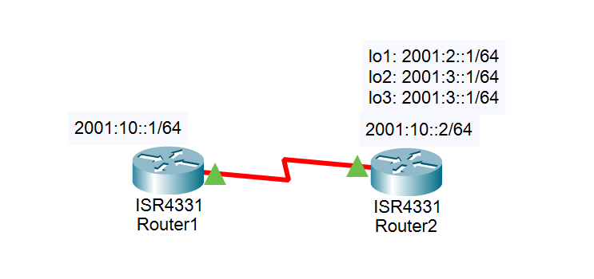

## 实验过程

1. **为路由器R1和R2完成基础配置**

启动 IPv6 并配置 IPv6 地址，具体配置如下所示：

在路由器R1上的配置：

```bash
// 启动IPv6的路由功能，否则静态路由无法完成。
Router1(config)#ipv6 unicast-routing
Router1(config)#interface s0/1/0
Router1(config-if)#ipv6 address 2001:10::1/64
Router1(config-if)#no shut
```

注意，第三行设置的值只是它公开访问的地址。这实际上是一个公网IPv6地址，不应该在私网中这么用，但实验时为了简化实现，都这么操作。IPv6一个连接可以同时有多个地址，设置这个不会影响`fe80`那个地址的存在。

在路由器R2上的配置：

```bash
Router2(config)#ipv6 unicast-routing
Router2(config)#int s0/1/0
Router2(config-if)#ipv6 address 2001:10::2/64
Router2(config-if)#no shut

Router2(config)#int lo1
Router2(config-if)#ipv6 address 2001:2::1/64
Router2(config-if)#int lo2
Router2(config-if)#ipv6 address 2001:3::1/64
Router2(config-if)#int lo3
Router2(config-if)#ipv6 address 2001:4::1/64
```

在路由器R1上去ping路由器R2上的那几个环回IPv6地址，结果应该是ping不通，因为在路由器R1上暂时没有到目标地址的路由，关于这一技术知识点与IPv4的环境相同，要配置IPv6静态路由和默认路由功能类似于IPv4静态路由和默认路由，但是书写形式上还是存在一定区别，而默认路由是一种特殊的静态路由。

配置 ipv6 路由的指令 `ipv6 route <目标IPv6前缀><出站接口><下一跳IPv6地址>`

目标IPv6前缀：指示目标的IPv6网络，这与IPv4的目标子网的意义相同。

出站接口：当前路由器转发数据包的出站接口，如果使用了邻接路由器的IPv6本地链路地址来作为下一跳地址，那么在静态路由的语法中必须包含出站接口关键字。

下一跳 IPv6 地址：要到达目标网络所要历经的下一跳路由器的 IPv6 的地址，这与 IPv4 的环境相同，注意：根据 RFC2461 规定，路由器必须能够确定下一跳路由器的本地链路地址，所以，在配置 IPv6 静态路由时，下一跳地址建议配置为邻接路由器的本地链路 IPv6 地址。在该实验环境中可以在路由器 R2 上使用`show ipv6 interface serial 0/1/0` 来查看路由器 R2 的本地链路 IPv6 地址，如下所示。

```bash
Router2#show ipv6 interface s0/1/0
Serial0/1/0 is up, line protocol is up
  IPv6 is enabled, link-local address is FE80::260:2FFF:FEB7:8201
  No Virtual link-local address(es):
  Global unicast address(es):
    2001:10::2, subnet is 2001:10::/64
  Joined group address(es):
    FF02::1
    FF02::2
    FF02::1:FF00:2
    FF02::1:FFB7:8201
  MTU is 1500 bytes
  ICMP error messages limited to one every 100 milliseconds
  ICMP redirects are enabled
  ICMP unreachables are sent
  ND DAD is enabled, number of DAD attempts: 1
  ND reachable time is 30000 milliseconds
  ND advertised reachable time is 0 (unspecified)
  ND advertised retransmit interval is 0 (unspecified)
  ND router advertisements are sent every 200 seconds
  ND router advertisements live for 1800 seconds
  ND advertised default router preference is Medium
  Hosts use stateless autoconfig for addresses.
```

 

2. **在路由器R1上配置IPv6的静态路由。**

::: tip TIP
请认真看上一段的内容。下方指令**最后的那个IPv6地址不是固定的**，需要根据前面看到的`下一跳路由器实际的本地链路IPv6地址`填入。如果设置错误，在进行下一次设置之前必须把前面的设置取消。在同时配置了两个路由的情况下，路由器会轮流访问这两个路由对应的IP，造成ping的时候一个包通一个包不通的景象。下面所有的指令都是一样的，凡是涉及`fe80`开头的指令，都必须根据实际查看到的值填入。
:::

```bash
Router1(config)#ipv6 route 2001:2::/64 s0/1/0 FE80::260:2FFF:FEB7:8201
Router1(config)#ipv6 route 2001:3::/64 s0/1/0 FE80::260:2FFF:FEB7:8201
Router1(config)#ipv6 route 2001:4::/64 s0/1/0 FE80::260:2FFF:FEB7:8201
```

当完成上述配置后，可以在路由器R1上通过指令 `show ipv6 route` 查看Ipv6的路由表，如下所示，可清晰地看见被添加的三条静态路由。然后在路由器R1上再次测试与目标Ipv6的通信，如果没有故障，应该成功通信，如下所示。

```bash
Router1#show ipv6 route
IPv6 Routing Table - 6 entries
Codes: C - Connected, L - Local, S - Static, R - RIP, B - BGP
       U - Per-user Static route, M - MIPv6
       I1 - ISIS L1, I2 - ISIS L2, IA - ISIS interarea, IS - ISIS summary
       ND - ND Default, NDp - ND Prefix, DCE - Destination, NDr - Redirect
       O - OSPF intra, OI - OSPF inter, OE1 - OSPF ext 1, OE2 - OSPF ext 2
       ON1 - OSPF NSSA ext 1, ON2 - OSPF NSSA ext 2
       D - EIGRP, EX - EIGRP external
S   2001:2::/64 [1/0]
     via FE80::260:2FFF:FEB7:8201, Serial0/1/0
S   2001:3::/64 [1/0]
     via FE80::260:2FFF:FEB7:8201, Serial0/1/0
S   2001:4::/64 [1/0]
     via FE80::260:2FFF:FEB7:8201, Serial0/1/0
C   2001:10::/64 [0/0]
     via Serial0/1/0, directly connected
L   2001:10::1/128 [0/0]
     via Serial0/1/0, receive
L   FF00::/8 [0/0]
     via Null0, receive
```

```bash
Router1#ping 2001:2::1

Type escape sequence to abort.
Sending 5, 100-byte ICMP Echos to 2001:2::1, timeout is 2 seconds:
!!!!!
Success rate is 100 percent (5/5), round-trip min/avg/max = 7/12/16 ms

Router1#ping 2001:3::1

Type escape sequence to abort.
Sending 5, 100-byte ICMP Echos to 2001:3::1, timeout is 2 seconds:
!!!!!
Success rate is 100 percent (5/5), round-trip min/avg/max = 5/11/14 ms

Router1#ping 2001:4::1

Type escape sequence to abort.
Sending 5, 100-byte ICMP Echos to 2001:4::1, timeout is 2 seconds:
!!!!!
Success rate is 100 percent (5/5), round-trip min/avg/max = 9/12/16 ms
```

 

3. **删除三条静态路由，然后配置IPv6的默认路由来完成与目标网络通信**

关于删除三条静态路由和添加默认路由的配置如下所示。

在路由器 R1 上去删除 IPv6 的静态路由：

```bash
Router1(config)#no ipv6 route 2001:2::/64 s0/1/0 FE80::260:2FFF:FEB7:8201
Router1(config)#no ipv6 route 2001:3::/64 s0/1/0 FE80::260:2FFF:FEB7:8201
Router1(config)#no ipv6 route 2001:4::/64 s0/1/0 FE80::260:2FFF:FEB7:8201
```

在路由器 R1 上配置 Ipv6 的默认路由。

```bash
Router1(config)#ipv6 route ::/0 s0/1/0 FE80::260:2FFF:FEB7:8201
```


当完成配置后，可以通过再次查看IPv6的路由表，如下所示，可清晰地看到被添加的IPv6的默认路由，此时，路由器R1应该能成功的ping通三条目标IPv6地址。

```bash
Router1#show ipv6 route
IPv6 Routing Table - 4 entries
Codes: C - Connected, L - Local, S - Static, R - RIP, B - BGP
       U - Per-user Static route, M - MIPv6
       I1 - ISIS L1, I2 - ISIS L2, IA - ISIS interarea, IS - ISIS summary
       ND - ND Default, NDp - ND Prefix, DCE - Destination, NDr - Redirect
       O - OSPF intra, OI - OSPF inter, OE1 - OSPF ext 1, OE2 - OSPF ext 2
       ON1 - OSPF NSSA ext 1, ON2 - OSPF NSSA ext 2
       D - EIGRP, EX - EIGRP external
S   ::/0 [1/0]
     via FE80::260:2FFF:FEB7:8201, Serial0/1/0
C   2001:10::/64 [0/0]
     via Serial0/1/0, directly connected
L   2001:10::1/128 [0/0]
     via Serial0/1/0, receive
L   FF00::/8 [0/0]
     via Null0, receive
```

## 实验命令列表

| 指令               | 用法                 |
| ------------------ | -------------------- |
| 启动IPv6的路由功能 | ipv6 unicast-routing |
| 配置IPv6地址       | ipv6 address <地址>  |

## 实验问题

<div STYLE="page-break-after: always;"></div>
# 14：IPv6环境中的RIPng配置

> [点此下载本次实验的 Cisco Packet Tracer 文件](https://pub.ydjsir.com.cn/document/router_ipv6_ripng.pkt)

## 实验要求

1.配置每台路由器的IPv6地址

2.在R1和R3路由器之间配置RIPng，实现两个IPv6网络互相通信 

## 实验拓扑


## 实验过程

1. **首先完成路由器R1、R2、R3的Ipv6的基础配置**

其中包括启动IPv6和配置IPv6的接口地址，激活接口，具体配置如下：

路由器R1的基础配置

```bash
Router1(config)#ipv6 unicast-routing
Router1(config)#int g0/0/0
Router1(config-if)#ipv6 address 2001:1:1:1::1/64
Router1(config-if)#ipv6 rip cisco enable
Router1(config-if)#no keepalive

Router1(config-if)#int s0/1/0
Router1(config-if)#ipv6 address 2001:A:A:A::2/64
Router1(config-if)#ipv6 rip cisco enable
Router1(config-if)#no shut
Router1(config-if)#ipv6 router rip cisco
```

路由器R2的基础配置

```bash
Router2(config)#ipv6 unicast-routing
Router2(config)#int g0/0/0
Router2(config-if)#ipv6 address 2001:2:2:2::2/64
Router2(config-if)#ipv6 rip cisco enable
Router2(config-if)#no keepalive

Router2(config-if)#int s0/1/0
Router2(config-if)#ipv6 address 2001:A:A:A::1/64
Router2(config-if)#ipv6 rip cisco enable
Router2(config-if)#no shut
Router2(config-if)#int s0/1/1
Router2(config-if)#ipv6 address 2001:B:B:B::1/64
Router2(config-if)#ipv6 rip cisco enable
Router2(config-if)#no shut
Router2(config-if)#ipv6 router rip cisco
```

路由器R3的基础配置

```bash
Router3(config)#ipv6 unicast-routing
Router3(config)#int g0/0/0
Router3(config-if)#ipv6 address 2001:3:3:1::3/64
Router3(config-if)#ipv6 address 2001:3:3:2::3/64
Router3(config-if)#ipv6 address 2001:3:3:3::3/64
Router3(config-if)#ipv6 address 2001:3:3:4::3/64
Router3(config-if)#ipv6 address 2001:3:3:5::3/64
Router3(config-if)#ipv6 address 2001:3:3:6::3/64
Router3(config-if)#ipv6 rip cisco enable
Router3(config-if)#no keepalive
	
Router3(config-if)#int s0/1/0
Router3(config-if)#ipv6 address 2001:B:B:B::2/64
Router3(config-if)#ipv6 rip cisco enable
Router3(config-if)#no shut
Router3(config-if)#ipv6 router rip cisco
```

2. **验证配置**

在R1验证配置，如下所示。

```bash
Router1#show ipv6 rip 
RIP process “cisco”, port 521, multicast-group FF02::9, pid 168
     Administrative distance is 120. Maximum paths is 16
     Updates every 30 seconds, expire after 180
     Holddown lasts 0 seconds, garbage collect after 120
     Split horizon is on; poison reverse is off
     Default routes are not generated
Periodic updates 92, trigger updates16
  Interfaces:
      FastEthernet 0/0
      Serial 0/1/0
  Redistribution:
      None

Router1#show ipv6 route
IPv6 Routing Table - 13 entries
Codes: C - Connected, L - Local, S - Static, R - RIP, B - BGP
       U - Per-user Static route, M - MIPv6
       I1 - ISIS L1, I2 - ISIS L2, IA - ISIS interarea, IS - ISIS summary
       ND - ND Default, NDp - ND Prefix, DCE - Destination, NDr - Redirect
       O - OSPF intra, OI - OSPF inter, OE1 - OSPF ext 1, OE2 - OSPF ext 2
       ON1 - OSPF NSSA ext 1, ON2 - OSPF NSSA ext 2
       D - EIGRP, EX - EIGRP external
C   2001:1:1:1::/64 [0/0]
     via GigabitEthernet0/0/0, directly connected
L   2001:1:1:1::1/128 [0/0]
     via GigabitEthernet0/0/0, receive
R   2001:2:2:2::/64 [120/2]
     via FE80::290:CFF:FE62:5A01, Serial0/1/0
R   2001:3:3:1::/64 [120/3]
     via FE80::290:CFF:FE62:5A01, Serial0/1/0
R   2001:3:3:2::/64 [120/3]
     via FE80::290:CFF:FE62:5A01, Serial0/1/0
R   2001:3:3:3::/64 [120/3]
     via FE80::290:CFF:FE62:5A01, Serial0/1/0
R   2001:3:3:4::/64 [120/3]
     via FE80::290:CFF:FE62:5A01, Serial0/1/0
R   2001:3:3:5::/64 [120/3]
     via FE80::290:CFF:FE62:5A01, Serial0/1/0
R   2001:3:3:6::/64 [120/3]
     via FE80::290:CFF:FE62:5A01, Serial0/1/0
C   2001:A:A:A::/64 [0/0]
     via Serial0/1/0, directly connected
L   2001:A:A:A::2/128 [0/0]
     via Serial0/1/0, receive
R   2001:B:B:B::/64 [120/2]
     via FE80::290:CFF:FE62:5A01, Serial0/1/0
L   FF00::/8 [0/0]
     via Null0, receive

Router1#show ipv6 rip database 
RIP process "cisco" local RIB 
 2001:2:2:2::/64, metric 2, installed
    Serial0/1/0/FE80::290:CFF:FE62:5A01, expires in 154 sec
 2001:3:3:1::/64, metric 3, installed
    Serial0/1/0/FE80::290:CFF:FE62:5A01, expires in 154 sec
 2001:3:3:2::/64, metric 3, installed
    Serial0/1/0/FE80::290:CFF:FE62:5A01, expires in 154 sec
 2001:3:3:3::/64, metric 3, installed
    Serial0/1/0/FE80::290:CFF:FE62:5A01, expires in 154 sec
 2001:3:3:4::/64, metric 3, installed
    Serial0/1/0/FE80::290:CFF:FE62:5A01, expires in 154 sec
 2001:3:3:5::/64, metric 3, installed
    Serial0/1/0/FE80::290:CFF:FE62:5A01, expires in 154 sec
 2001:3:3:6::/64, metric 3, installed
    Serial0/1/0/FE80::290:CFF:FE62:5A01, expires in 154 sec
 2001:A:A:A::/64, metric 2
    Serial0/1/0/FE80::290:CFF:FE62:5A01, expires in 154 sec
 2001:B:B:B::/64, metric 2, installed
    Serial0/1/0/FE80::290:CFF:FE62:5A01, expires in 154 sec
```

此时 Router 1 可以 ping 到上面所有的 IP， RIP 成功。

### 3 在R3上实现聚合路由

```bash
Router3(congfig)#interface serial 0/1/0
Router3(config-if)ipv6 rip cisco summary-address 2001:3:3::/48
```

在R1上查看路由表(聚合后的路由)，如下所示。

```bash
R1#show ipv6 route rip  
IPv6 Routing Table - 9 entries  
Codes:  C - Connected, L - Local, S - Static, R - RIP, B - BGP 
U - Per-user Static route  
I1 - ISIS L1, I2 - ISIS L2, IA - ISIS interarea, IS - ISIS summary  
O - OSPF intra, OI - OSPF inter, OE1 - OSPF ext 1, OE2 - OSPF ext 2 
ON1 - OSPF NSSA ext 1, ON2 - OSPF NSSA ext 2 
R  2001:1:1:1::/64 [120/2]  
via FE80::CE00:3FF:FE68:0, Serial1/0 
R   2001:3:3::/48 [120/3]  
via FE80::CE00:3FF:FE68:0, Serial1/0 
R   2001:B:B:B::/64 [120/2]  
via FE80::CE00:3FF:FE68:0, Serial1/0 
```

### 4 在RIPng中分发默认路由

```bash
R3(config)#interface s0/1/0
R3(config-if)ipv6 rip cisco default-information originate metric 5
```

在R1上查看默认路由，如下所示。

```bash
R1#show ipv6 route rip  
IPv6 Routing Table - 10 entries  
Codes: C - Connected, L - Local, S - Static, R - RIP, B - BGP 
U - Per-user Static route  
I1 - ISIS L1, I2 - ISIS L2, IA - ISIS interarea, IS - ISIS summary  
O - OSPF intra, OI - OSPF inter, OE1 - OSPF ext 1, OE2 - OSPF ext 2 
ON1 - OSPF NSSA ext 1, ON2 - OSPF NSSA ext 2 
R   ::/0 [120/7] 	//ipv6里默认路由表示
via FE80::CE00:3FF:FE68:0, Serial0/1/0
R   2001:1:1:1::/64 [120/2]  
via FE80::CE00:3FF:FE68:0, Serial0/1/0
R  2001:3:3::/48 [120/3]  
via FE80::CE00:3FF:FE68:0, Serial0/1/0
R   2001:B:B:B::/64 [120/2]  
via FE80::CE00:3FF:FE68:0, Serial0/1/0
R1# 
```

## 实验命令列表

| 指令          | 用法                                     |
| ------------- | ---------------------------------------- |
| 启动RIPng     | ipv6 rip cisco enable                    |
| 标识RIPng进程 | ipv6 router rip cisco                    |
| 实现路由聚合  | ipv6 rip cisco summary-address [address] |

## 实验问题

<div STYLE="page-break-after: always;"></div>
# 15：IPv6环境的OSPFv3实验

> [点此下载本次实验的 Cisco Packet Tracer 文件](https://pub.ydjsir.com.cn/document/router_ospfv3.pkt)

## 实验要求

1. 分别在路由器R1、R2、R3上配置三个环回接口，分别配置三个全球单播范围内的IPv6地址，模拟三个不同的IPv6前缀（类似于IPv4的子网）

2. 在三台路由器上启动OSPFv3，最后来观察IPv6的路由学习结果，查看OSPFv3的邻居关系等。

## 实验拓扑


## 实验过程

1. **完成路由器R1、R2、R3的Ipv6的基础配置**

包括启动IPv6和配置IPv6的接口地址，激活接口，具体配置如下

路由器 R1 的基础配置：

```bash
//启动IPv6路由功能
Router1(config)#ipv6 unicast-routing
Router1(config)#int g0/0/0
//在接口下启动IPv6，将自动生成本地链路地址
Router1(config-if)#ipv6 enable
Router1(config-if)#no shut
Router1(config-if)#int lo1
Router1(config-if)#ipv6 address 2001:1::1/64
```

路由器 R2的基础配置：

```bash
Router2(config)#ipv6 unicast-routing 
Router2(config)#int g0/0/0
Router2(config-if)#ipv6 enable 
Router2(config-if)#no shut
Router2(config-if)#int lo1
Router2(config-if)#ipv6 address 2001:2::1/64
```

路由器R3的基础配置：

```bash
Router3(config)#ipv6 unicast-routing 
Router3(config)#int g0/0/0
Router3(config-if)#ipv6 enable
Router3(config-if)#no shut
Router3(config-if)#int lo1
Router3(config-if)#ipv6 address 2001:3::1/64
```

2. **启动OSPFv3路由协议**

在路由器R3的OSPFv3配置：

```bash
//启动OSPFv3的路由进程１
Router3(config)#ipv6 router ospf 1
%OSPFv3-4-NORTRID: OSPFv3 process 1 could not pick a router-id,please configure manually
//为OSPFv3配置路由器ID（RID）
Router3(config-rtr)#router-id 3.3.3.3

Router3(config)#int g0/0/0
//使该接口加入到OSPFv3进程１并申明区域为0
Router3(config-if)#ipv6 ospf 1 area 0

Router3(config)#int lo1
Router3(config-if)#ipv6 ospf 1 area 0
```

注意：在配置OSPFv3时，必须为路由器进程配置路由器ID(RID)这与OSPFv2完全不同，在OSPFv2的环境中，RID是一个可选项配置，但是在OSPFv3的环境中RID是必须配置，否则OSPFv3将无法启动。OSPFv3的RID将仍然以点分十进制的方法显示，比如:1.1.1.1这很像IPv4地址的表达方式。

在路由器R2的OSPFv3配置：

```bash
Router2(config-if)#ipv6 router ospf 1
%OSPFv3-4-NORTRID: OSPFv3 process 1 could not pick a router-id,please configure manually
Router2(config-rtr)#
Router2(config-rtr)#router-id 2.2.2.2
Router2(config-rtr)#int g0/0/0
Router2(config-if)#ipv6 ospf 1 area 0
Router2(config-if)#int lo1
Router2(config-if)#ipv6 ospf 1 area 0
```

在路由器R1的OSPFv3配置：

```bash
Router1(config-if)#ipv6 router ospf 1
%OSPFv3-4-NORTRID: OSPFv3 process 1 could not pick a router-id,please configure manually
Router1(config-rtr)#router-id 1.1.1.1
Router1(config-rtr)#int g0/0/0
Router1(config-if)#ipv6 ospf 1 area 0
Router1(config-if)#int lo1
Router1(config-if)#ipv6 ospf 1 area 0
```

3. **检查OSPFv3邻居关系的状态、路由学习的情况，以及连通性检测**

可以使用 `show ipv6 ospf neighbor` 来查看OSPFv3的邻居关系正常，如下所示，并且可知路由器R3是DR路由器，R2是BDR路由器，关于为什么这样选举，在OSPFv2中有详细描述，这里不再重复描述。然后可以通过 `show ipv6 route` 查看路由器R1的IPv6路由表，如下所示，可看出R1成功的学习到了路由器R2和R3公告出来的OSPF路由，其中的“Ｏ”就表示通过OSPFv3所学到的路由。最后在路由器R1上通过ping指令检测与路由器R2和R3上相关IPv6前缀的连通性，一切正常。

查看OSPF的邻居关系:

```bash
Router1#show ipv6 ospf neighbor

Neighbor ID     Pri   State           Dead Time   Interface ID    Interface
3.3.3.3           1   FULL/DR         00:00:32    1               GigabitEthernet0/0/0
2.2.2.2           1   FULL/BDR        00:00:34    1               GigabitEthernet0/0/0
```

查看IPv6路由表:

```bash
Router1#show ipv6 route
IPv6 Routing Table - 5 entries
Codes: C - Connected, L - Local, S - Static, R - RIP, B - BGP
       U - Per-user Static route, M - MIPv6
       I1 - ISIS L1, I2 - ISIS L2, IA - ISIS interarea, IS - ISIS summary
       ND - ND Default, NDp - ND Prefix, DCE - Destination, NDr - Redirect
       O - OSPF intra, OI - OSPF inter, OE1 - OSPF ext 1, OE2 - OSPF ext 2
       ON1 - OSPF NSSA ext 1, ON2 - OSPF NSSA ext 2
       D - EIGRP, EX - EIGRP external
C   2001:1::/64 [0/0]
     via Loopback1, directly connected
L   2001:1::1/128 [0/0]
     via Loopback1, receive
O   2001:2::1/128 [110/1]
     via FE80::202:16FF:FEE6:1001, GigabitEthernet0/0/0
O   2001:3::1/128 [110/1]
     via FE80::2D0:BCFF:FE49:8101, GigabitEthernet0/0/0
L   FF00::/8 [0/0]
     via Null0, receive
```

在路由器R1上检测连通性:

```bash
Router1#ping 2001:2::1

Type escape sequence to abort.
Sending 5, 100-byte ICMP Echos to 2001:2::1, timeout is 2 seconds:
!!!!!
Success rate is 100 percent (5/5), round-trip min/avg/max = 0/0/0 ms
```

## 实验命令列表

| 指令                        | 用法                    |
| --------------------------- | ----------------------- |
| 启动IPv6                    | ipv6 enable             |
| 为OSPFv3配置路由器ID（RID） | router-id \<ID>         |
| 查看OSPF邻居关系            | show ipv6 ospf neighbor |
| 查看IPv6路由表              | show ipv6 route         |

## 实验问题


