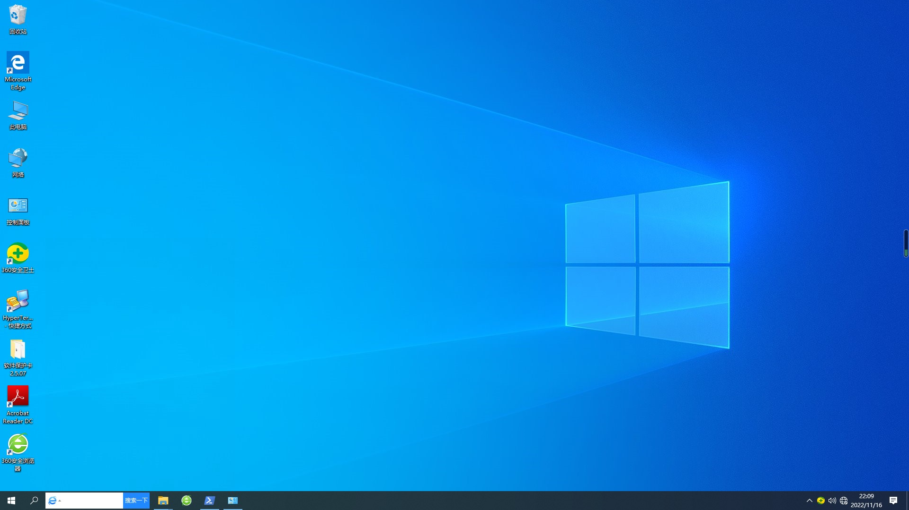
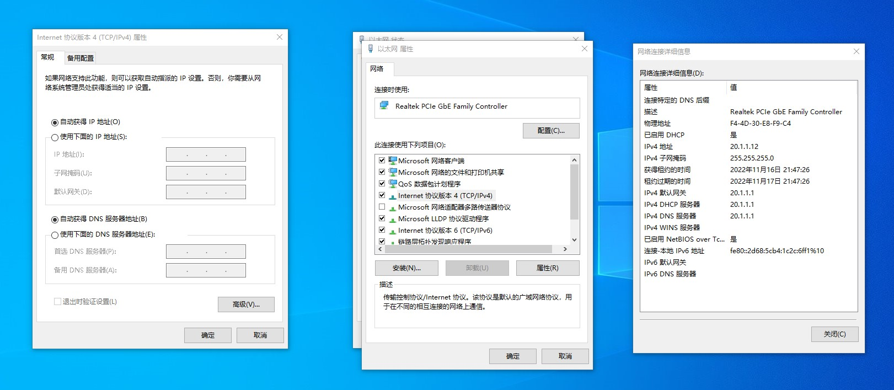

# 快速开始

::: tip TIP
这是所有实验的通用部分内容。这里的内容是共通的。
:::


## 机房环境

### 硬件部分

机房分为5大组设备，每个大组里面有两小组设备。每小组设备1机柜（内含3路由器1交换机）和3台台式机与对应的3张桌子。每个大组的布置如下。


后期很可能会给每个设备按照规则统一编号，方便实验进行。

配置如下（2022年秋季）。

|  项目  |        型号         |
| :----: | :-----------------: |
| 交换机 | Cisco Catalyst 3850 |
| 路由器 |  Cisco 4300 Series  |
| 台式机 |   Acer i5-6300 8G   |


下面放几张图说明一下。

|                           机柜前面                           |                           机柜背面                           |
| :----------------------------------------------------------: | :----------------------------------------------------------: |
|  |  |

最上面的是交换机，接口排列的顺序如下所示（左视角）。

| g1/0/0 | g1/0/2 | ……   | g1/0/20 | g1/0/22 |
| ------ | ------ | ---- | ------- | ------- |
| g1/0/1 | g1/0/3 | ……   | g1/0/21 | g1/0/23 |

下面闪烁的灯从左到右依次是`g1/0/0`到`  g1/0/23`。可以靠灯来确定接口状态。

深蓝色的是`串口线`。这玩意可以拧螺丝固定，最好拧一下降低接口的压力。这个线损坏率比较高，请小心使用。

黄色的是`RJ45 直通线`。不够的话可以去教室角落拿。

紫色的是`RJ45 交叉线`。不够的话可以去教室角落拿。

浅蓝色的是`RS232-RJ45 翻转串口线`。台式机接在RS232上，RJ45端接在路由器/交换机后面的那两两个写明了`Console`的口上。

开机的时候注意，交换机和路由器开机都需要时间，而且风扇噪音有点大，不要急。严禁短时间内反复关闭开启设备，这样很可能导致损坏。路由器有开关，但交换机没有。可以考虑拔线也可以考虑关闭总闸。

地面上有连接校园网的网线，颜色是灰色的，位置在台式机桌子下方。

串口实际上可以用自己买的USB转RJ45翻转的串口线也是可以的。可以搭配`XShell`、`Putty`这样的工具使用。考虑到驱动安装问题，建议选择CH340芯片的版本。因为事实上一边机柜有四个设备，可能需要额外插拔才能兼顾。

::: tip TIP

严禁频繁开关路由器和交换机！

路由器有自己的开关，可以使用开关。交换机只能直接拔电源线。

路由器和交换器风扇非常吵，只能忍耐。

路由器和交换机开机需要时间，请耐心等待。给它的上限大概在三分钟。

:::

### 软件部分

台式机启动的时候，选择`网络实验`系统进入。

这个系统里面安装的360貌似不影响实验。系统防火墙请确保是关闭状态。



实测关掉本机防火墙之后，360不会禁止ping。

实验室的电脑使用 Windows 10 系统，本实验手册主要介绍思科网络设备的配置，PC 的网络设置方式与操作系统有关，不做重点介绍，在此给出 Windows 下配置网口 IP 的方式供参考。

打开 `控制面板\网络和 Internet\网络连接`，双击打开当前活动的网卡，点击`属性`，选择 `Internet 协议版本 4 (TCP/IPv4)`，选择`使用下面的 IP 地址`，填写 `IP 地址`、`子网掩码`、和`默认网关`，`DNS`相关设置可留空，点击确定。


如果是DHCP相关实验，请选择`自动获得IP地址`和`使用下面的DNS服务器地址`。


如果要查看电脑的IP状态，可以在以太网状态里面点击`详细信息`。



也可以在`cmd`或者`Powershell`里面输入`ipconfig`以获取。

实验手册中的`ipconfig`输出格式仅供示意，关键还是看那几个值是否符合期望。

实验中会涉及ping命令。请仔细看文档，

**看清楚到底是要求在电脑上ping还是在路由器上ping！**

**看清楚到底是要求在电脑上ping还是在路由器上ping！**

**看清楚到底是要求在电脑上ping还是在路由器上ping！**

这两种ping的回显区别挺大的！

在Windows中对着左下角开始菜单图标右键，打开 `Windows Powershell` ，可以在其中执行 ping 指令。在`命令提示符`中也同样可以执行ping命令。


## 凭据相关

如有可能，不要给交换机和路由器设置密码。

如果要设置，请保证密码是`cisco`、`ccna`、`ccnp` 三个中的任意一字符串。

交换机开机时问要不要初始化设置时，请选择否（输入no），不然会被要求输入密码。

如果有其他的密码，可以试着按如下教程重置密码。

路由器/交换机断电，然后上电，连续按`Ctrl+Break`打断系统引导，输入`confreg 0x2142`跳过启动配置,键入`reset`重启，重启后默认设置输入`no`，`enable`进入特权模式。

```bash
Router>   
Initializing Hardware ...

Checking for PCIe device presence...done
System integrity status: 0x610
Rom image verified correctly


System Bootstrap, Version 16.2(2r), RELEASE SOFTWARE
Copyright (c) 1994-2016  by cisco Systems, Inc.


Current image running: Boot ROM0

Last reset cause: PowerOn
ISR4331/K9 platform with 4194304 Kbytes of main memory


.

rommon 1 > 
rommon 1 > 
rommon 1 > 
rommon 1 > 
rommon 1 > 
rommon 1 > 
rommon 1 > 
rommon 1 > 
rommon 1 > confreg 0x2142

You must reset or power cycle for new config to take effect
rommon 2 > 

Initializing Hardware ...

Checking for PCIe device presence...done
System integrity status: 0x610
Rom image verified correctly


System Bootstrap, Version 16.2(2r), RELEASE SOFTWARE
Copyright (c) 1994-2016  by cisco Systems, Inc.


Current image running: Boot ROM0

Last reset cause: PowerOn
ISR4331/K9 platform with 4194304 Kbytes of main memory


........

no valid BOOT image found
Final autoboot attempt from default boot device...
Located isr4300-universalk9.03.16.04b.S.155-3.S4b-ext.SPA.bin
#################################################################################################################################################################################################################################################################################################################################################################################################################################################################################################################################################################################################################################################################################################################################################################################################################################################################################################################################################################################################################################################################################################################################################################################################################################################################################################################################################################################################################################################################################################################################################################################################################################################################################################################################################################################################################################################################################################################################################################################################################################################################################################################################################################################################################################################################################################################################################################################################################################################################################################################################################################################################################################################################################################################################################################################################################################################################################################################################################################################################################################################################################################################################################################################################################################################################################################################################################################################################################################################################################################################################################################################################################################################################################################################################################################################################################################################################################################################################################################################################################################################################################################################################################################################################################################################################################################################################################################################################################################################################################################################################################################################################################################################################################################################################################################################################################################################################################################################################################

Package header rev 1 structure detected
IsoSize = 471482368
Calculating SHA-1 hash...Validate package: SHA-1 hash:
        calculated 92A40F6F:F8586BC3:F00F114B:EFB43257:B9728643
        expected   92A40F6F:F8586BC3:F00F114B:EFB43257:B9728643

RSA Signed RELEASE Image Signature Verification Successful.
Image validated
%IOSXEBOOT-4-FILESYS_ERRORS_CORRECTED: (rp/0): bootflash 1 contained errors which were auto-corrected.
%IOSXEBOOT-4-FILESYS_ERRORS_CORRECTED: (rp/0): bootflash 5 contained errors which were auto-corrected.
%IOSXEBOOT-4-FILESYS_ERRORS_CORRECTED: (rp/0): bootflash 6 contained errors which were auto-corrected.
%IOSXEBOOT-4-FILESYS_ERRORS_CORRECTED: (rp/0): bootflash 7 contained errors which were auto-corrected.
%IOSXEBOOT-4-FILESYS_ERRORS_CORRECTED: (rp/0): bootflash 8 contained errors which were auto-corrected.
%IOSXEBOOT-4-FILESYS_ERRORS_CORRECTED: (rp/0): bootflash 9 contained errors which were auto-corrected.
%IOSXEBOOT-4-FILESYS_ERRORS_CORRECTED: (rp/0): bootflash 10 contained errors which were auto-corrected.
%IOSXEBOOT-4-BOOT_SRC: (rp/0): mounting /boot/super.iso to /tmp/sw/isos

              Restricted Rights Legend

Use, duplication, or disclosure by the Government is
subject to restrictions as set forth in subparagraph
(c) of the Commercial Computer Software - Restricted
Rights clause at FAR sec. 52.227-19 and subparagraph
(c) (1) (ii) of the Rights in Technical Data and Computer
Software clause at DFARS sec. 252.227-7013.

           cisco Systems, Inc.
           170 West Tasman Drive
           San Jose, California 95134-1706


Cisco IOS Software, ISR Software (X86_64_LINUX_IOSD-UNIVERSALK9-M), Version 15.5(3)S4b, RELEASE SOFTWARE (fc1)
Technical Support: http://www.cisco.com/techsupport
Copyright (c) 1986-2016 by Cisco Systems, Inc.
Compiled Mon 17-Oct-16 20:23 by mcpre


Cisco IOS-XE software, Copyright (c) 2005-2016 by cisco Systems, Inc.
All rights reserved.  Certain components of Cisco IOS-XE software are
licensed under the GNU General Public License ("GPL") Version 2.0.  The
software code licensed under GPL Version 2.0 is free software that comes
with ABSOLUTELY NO WARRANTY.  You can redistribute and/or modify such
GPL code under the terms of GPL Version 2.0.  For more details, see the
documentation or "License Notice" file accompanying the IOS-XE software,
or the applicable URL provided on the flyer accompanying the IOS-XE
software.


This product contains cryptographic features and is subject to United
States and local country laws governing import, export, transfer and
use. Delivery of Cisco cryptographic products does not imply
third-party authority to import, export, distribute or use encryption.
Importers, exporters, distributors and users are responsible for
compliance with U.S. and local country laws. By using this product you
agree to comply with applicable laws and regulations. If you are unable
to comply with U.S. and local laws, return this product immediately.

A summary of U.S. laws governing Cisco cryptographic products may be found at:
http://www.cisco.com/wwl/export/crypto/tool/stqrg.html

If you require further assistance please contact us by sending email to
export@cisco.com.

cisco ISR4331/K9 (1RU) processor with 1648789K/6147K bytes of memory.
Processor board ID FDO2136A04T
3 Gigabit Ethernet interfaces
2 Serial interfaces
32768K bytes of non-volatile configuration memory.
4194304K bytes of physical memory.
3207167K bytes of flash memory at bootflash:.


Press RETURN to get started!


*Nov 16 19:12:58.259: %SMART_LIC-6-AGENT_READY: Smart Agent for Licensing is initialized
*Nov 16 19:13:00.007: %IOS_LICENSE_IMAGE_APPLICATION-6-LICENSE_LEVEL: Module name = esg Next reboot level = ipbasek9 and License = ipbasek9
*Nov 16 19:13:01.192: %ISR_THROUGHPUT-6-LEVEL: Throughput level has been set to 100000 kbps
*Nov 16 19:13:05.781: dev_pluggable_optics_selftest attribute table internally inconsistent @ 0x144

*Nov 16 19:13:09.741: %SPANTREE-5-EXTENDED_SYSID: Extended SysId enabled for type vlan
*Nov 16 19:13:10.755: %LINK-3-UPDOWN: Interface Lsmpi0, changed s
Router>
Router>tate to up
*Nov 16 19:13:10.755: %LINK-3-UPDOWN: Interface EOBC0, changed state to up
*Nov 16 19:13:10.755: %LINK-3-UPDOWN: Interface GigabitEthernet0, changed state to down
*Nov 16 19:13:10.764: %LINK-3-UPDOWN: Interface LIIN0, changed state to up
*Nov 16 19:13:12.091: %IOSXE_MGMTVRF-6-CREATE_SUCCESS_INFO: Management vrf Mgmt-intf created with ID 1, ipv4 table-id 0x1, ipv6 table-id 0x1E000001
*Nov 16 19:13:12.142: %LINEPROTO-5-UPDOWN: Line protocol on Interface Vlan1, changed state to down
*Nov 16 19:13:12.142: %LINEPROTO-5-UPDOWN: Line protocol on Interface Lsmpi0, changed state to up
*Nov 16 19:13:12.143: %LINEPROTO-5-UPDOWN: Line protocol on Interface EOBC0, changed state to up
*Nov 16 19:13:12.143: %LINEPROTO-5-UPDOWN: Line protocol on Interface GigabitEthernet0, changed state to down
*Nov 16 19:13:12.143: %LINEPROTO-5-UPDOWN: Line protocol on Interface LIIN0, changed state to up
*Nov 16 19:13:13.424: %SYS-6-STARTUP_CONFIG_IGNORED: System startup configuration is ignored based on the configuration register setting.
*Nov 16 19:13:13.466: %IOSXE_OIR-6-REMSPA: SPA removed from subslot 0/0, interfaces disabled
*Nov 16 19:13:13.467: %IOSXE_OIR-6-REMSPA: SPA removed from subslot 0/1, interfaces disabled
*Nov 16 19:13:13.472: %SPA_OIR-6-OFFLINECARD: SPA (ISR4331-3x1GE) offline in subslot 0/0
*Nov 16 19:13:13.474: %SPA_OIR-6-OFFLINECARD: SPA (NIM-2T) offline in subslot 0/1
*Nov 16 19:13:13.479: %IOSXE_OIR-6-INSCARD: Card (fp) inserted in slot F0
*Nov 16 19:13:13.479: %IOSXE_OIR-6-ONLINECARD: Card (fp) online in slot F0
*Nov 16 19:13:13.480: %IOSXE_OIR-6-INSCARD: Card (cc) inserted in slot 0
*Nov 16 19:13:13.480: %IOSXE_OIR-6-ONLINECARD: Card (cc) online in slot 0
*Nov 16 19:13:13.484: %IOSXE_OIR-6-INSCARD: Card (cc) inserted in slot 1
*Nov 16 19:13:13.484: %IOSXE_OIR-6-ONLINECARD: Card (cc) online in slot 1
*Nov 16 19:13:13.531: %SPA-3-ENVMON_NOT_MONITORED: SIP0: iomd:  Environmental monitoring is not enabled for ISR4331-3x1GE[0/0]
*Nov 16 19:13:18.918: %SPA_OIR-6-ONLINECARD: SPA (ISR4331-3x1GE) online in subslot 0/0
*Nov 16 19:13:20.894: %LINK-3-UPDOWN: Interface GigabitEthernet0/0/0, changed state to down
*Nov 16 19:13:20.912: %LINK-3-UPDOWN: Interface GigabitEthernet0/0/1, changed state to down
*Nov 16 19:13:20.914: %LINK-3-UPDOWN: Interface GigabitEthernet0/0/2, changed state to down
Router>
Router#
```

其实做到这一步可以了。之后的步骤可以不做。

`show start` 查看密码，`copy start run`，将`nvram`中配置复制到内存，修改密码，然后`copy run start`保存配置到启动文件，输入`conf t`进入配置模式，输入`confreg 0x2102`，输入`exit`返回，输入`reset`重启即可。

