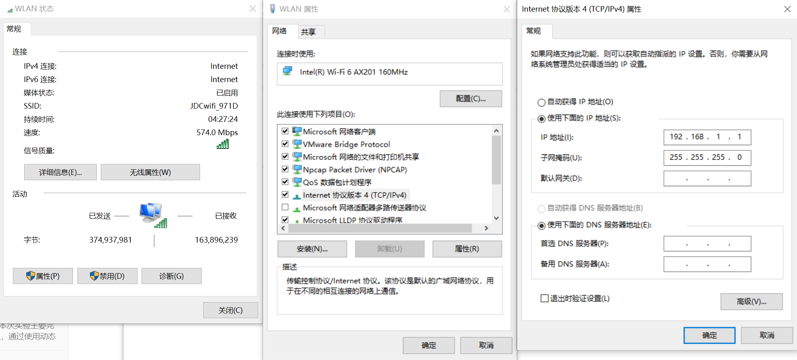
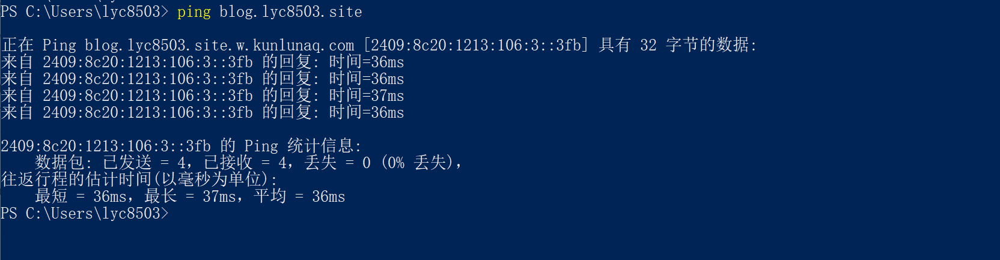

# 快速开始

::: tip TIP
这是所有实验的通用部分内容。这里的内容是共通的。
:::

## 机房环境说明

### 硬件部分

机房分为5大组设备，每个大组里面有两小组设备。每小组设备1机柜（内含3路由器1交换机）和3台台式机与对应的3张桌子。每个大组的布置如下。

后期很可能会给每个设备按照规则统一编号，方便实验进行。

配置如下（2022年秋季）。

|  项目  |        型号         |
| :----: | :-----------------: |
| 交换机 | Cisco Catalyst 3850 |
| 路由器 |  Cisco 4300 Series  |
| 台式机 |   Acer i5-6300 8G   |

台式机启动的时候，选择`网络实验`系统进入。

这个系统里面安装的360貌似不影响实验。

下面放几张图说明一下。

|                           机柜前面                           |                           机柜背面                           |
| :----------------------------------------------------------: | :----------------------------------------------------------: |
|  |  |

最上面的是交换机，接口排列的顺序如下所示（左视角）。

| g1/0/0 | g1/0/2 | ……   | g1/0/20 | g1/0/22 |
| ------ | ------ | ---- | ------- | ------- |
| g1/0/1 | g1/0/3 | ……   | g1/0/21 | g1/0/23 |

深蓝色的是`串口线`。这玩意可以拧螺丝固定，最好拧一下降低接口的压力。这个线损坏率比较高。

黄色的是`RJ45 直通线`。不够的话可以去教室角落拿。

紫色的是`RJ45 交叉线`。不够的话可以去教室角落拿。

浅蓝色的是`RS232-RJ45 翻转串口线`。台式机接在RS232上，RJ45端接在路由器/交换机后面的那两两个写明了`Console`的口上。

开机的时候注意，交换机和路由器开机都需要时间，而且风扇噪音有点大，不要急。严禁短时间内反复关闭开启设备，这样很可能导致损坏。路由器有开关，但交换机没有。可以考虑拔线也可以考虑关闭总闸。

地面上有连接校园网的网线，颜色是灰色的，位置在台式机桌子下方。

串口实际上可以用自己买的USB转RJ45翻转的串口线也是可以的。可以搭配XShell、Putty这样的工具使用。考虑到驱动安装问题，建议选择CH340芯片的版本。因为事实上一边机柜有四个设备，可能需要额外插拔才能兼顾。

## 软件部分

实测关掉本机防火墙之后，360不会禁止ping。

实验室的电脑使用 Windows 系统，本实验手册主要介绍思科网络设备的配置，PC 的网络设置方式与操作系统有关，不做重点介绍，在此给出 Windows 下配置网口 IP 的方式供参考。

打开 `控制面板\网络和 Internet\网络连接`，双击打开当前活动的网卡，点击`属性`，选择 `Internet 协议版本 4 (TCP/IPv4)`，选择`使用下面的 IP 地址`，填写 `IP 地址`、`子网掩码`、和`默认网关`，`DNS`相关设置可留空，点击确定。

在 Windows 上使用 ping 指令：

对着左下角开始菜单图标邮件，打开 `Windows Powershell` ，可以在其中执行 ping 指令。

