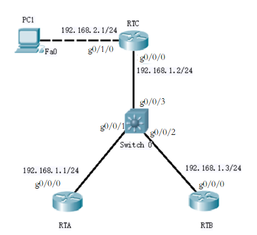

# 08：配置单域OSPF

## 实验要求

本次实验主要完成以下几个基本命令的操作：

1. 根据拓扑组建和配置网络。配置好网络后，先不要配置OSPF，先用“ping”命令来核验工作，并测试以太网接口之间的连通性。

2. 为每台路由器配置一个环回接口。将环回接口（而不是物理接口）的地址用作路由器ID时，OSPF将更稳定，因为不同于物理接口，这种接口总是处于活动状态，为不会出现故障，因此再所有重要路由上，都应使用环回接口。

3. 配置OSPF。可结合使用命令`router ospf`和`network area`命令。

4. 查看OSPF运行情况。使用`show ip protocols`命令显示IP路由协议参数，包括定时器、过滤器、度量值、网络及路由器的其他信息。使用`show ip ospf interface`命令查看接口是否被加入到正确的区域中；该命令还显示各种定时器和邻接关系。

5. 调节OSPF的计时器。调节OSPF的计时器，以使这些核心路由器能更快地检测出失效的情况，但这会导致额外的数据流量增加。

6. 设置OSPF认证。使用接口配置命令`ip ospf message-digest-key key-id md5 key`给采用OSPF MD5身份验证的路由器指定要使用的密钥ID和密钥。

## 实验拓扑

拓扑如图所示，此外需要为各台路由器配置环回地址RTA：10.0.0.1/32，RTB：10.0.0.2/32，RTC:10.0.0.3/32。以此为基础配置单区域的OSPF网络，即Area 0里OSPF的配置。



## 实验过程

1. **请按照前面几次实验练习的配置方法，根据给出的图示组建和配置网络。**

2. **在每台路由器上，用一个唯一的IP地址配置一个环回接口。**
```bash
RTA(config)#interface lo0
RTA(config-if)#ip address 10.0.0.1 255.255.255.255
RTB(config)#interface lo0
RTB(config-if)#ip address 10.0.0.2 255.255.255.255
RTC(config)#interface lo0
RTC(config-if)#ip address 10.0.0.3 255.255.255.255
```
3. **配置OSPF**
```bash
RTA(config)#router ospf 1
RTA(config-router)#network 192.168.1.0 0.0.0.255 area 0
RTB(config)#router ospf 1
RTB(config-router)#network 192.168.1.0 0.0.0.255 area 0

RTC(config)#router ospf 1
RTC(config-router)#network 192.168.1.0 0.0.0.255 area 0
RTC(config-router)#network 192.168.2.0 0.0.0.255 area 0
```
4. **用 `show` 命令来检查它的操作运行。**
```bash
RTC#show ip protocols
```
注意，更新计时器被设置为0。路由更新不是在固定时间间隔上被发送的，它们是事件驱动的。下一步，用“show ip ospf”命令来获得有关OSPF进程的消息信息。
```bash
Routing protocol is "ospf 1"
  Outgoing update filter list for all interface is not set
  Incoming update filter list for all interface is not set  
  Router ID 10.0.0.3
  Number of areas in this router is 1.1 normal 0 stub 0 nssa
  Maximum path: 4
  Routing for Networks:
    192.168.1.0 .0.0.0.255 area 0
    192.168.2.0 .0.0.0.255 area 0
 Reference bandwidth unit is 100 mbps
  Routing Information Sources:
Gateway      Distance      Last Update
  Distance: (default is 110)
```
查看DR/BDR：
```
RTB#show ip ospf interface
FastEthernet0/0 is uop, line protocol is up
  Internet Address 192.168.1.3/24,Area 0
  Process ID 1, Router ID 10.0.0.2, Network Type BROADCAST, Cost: 1
  Transmit Delay is 1 sec, State BDR, Priority 1
  Designated Router (ID) 10.0.0.2, Interface address 192.168.1.2
  Backup Designated router (ID) 10.0.0.2, Interface address 192.168.1.3
  Timer intervals configured, Hello 10, Dead 40, Wait 40, Retransmit 5
oob-resync timeout 40
Hello due in 00:00:02
  Supports Link-local Signaling (LLS)
  Cisco NSF helper support enabled
  IETF NSF helper support enabled
  Index1/1, flood queue length 0
  Next 0x0(0)/0x0(0)
  Last flood scan length is 0, maximum is 1
  Last flood scan time is 0 ,sec, maximum is 0 msec
  Neighbor Count is 2,Adjust neighbor count is 2
Adjust with neighbor 10.0.0.1
Adjust with neighbor 10.0.0.3 (Designated Router)
```
可以看到DR为RTC，BDR为RTB
```bash
RTA(config)#interface f0/0
RTA(config-if)#ip ospf hello-interval 5
```
5. 调节OSPF的计时器

```bash
RTA(config-if)#ip ospf dead-interval 20
```
6. 设置OSPF认证

```bash
RTA(config-if)#ip ospf message-digest-key 1 md5 7 itsasecret
RTA(config-if)#router ospf 1
RTA(config-router)#area 0 authentication message-digest
```
## 实验命令列表

| 指令 | 用法 |
| ------------------ | --------------------------------------------------- |
| 全局配置命令       | router ospf [router-id]                             |
| 接口配置命令       | network [ipaddress] [wildcard-mask]  area [area-id] |
| 显示ip路由协议参数 | show ip protocols                                   |
| 显示接口的ospf状态 | show ip ospf interface                              |
| 修改hello间隔      | ip ospf hello-interval [time]                       |
| 修改dead时间       | ip ospf dead-interval [time]                        |
| 配置ospf MD5身份   | ip ospf message-digest-key [key-id]  md5 [key]      |

## 实验问题

哪个路由器成为了DR？哪个路由器成为了BDR？为什么？