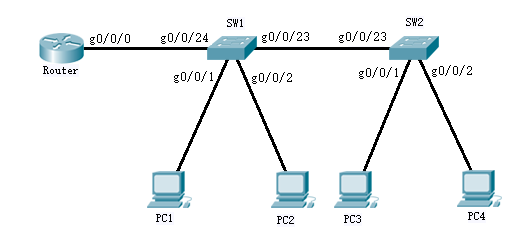

# 09：VLAN间路由

## 实验前准备

目前，很多中小型企业内部网络都是通过交换机互联而成，为了实现广播域的分割和广播包传播范围的控制，划分Vlan已成为网络架构中不可缺少的操作，通过划分Vlan，可以使得同一台交换机下的不同Vlan里的端口下连接的设备不能直接互相访问，这样有效的隔离了网络。虽然划分Vlan有效的地控制了广播包的传播范围，但是对于某些既希望隔离网络，也希望有些不同的Vlan能够通信的企业来讲，Vlan间路由就成为必要的技术，常常在中小型企业网中部署。为了完成Vlan间路由的实验，必须事先掌握Vlan的划分，VTP同步，把接口划分进相应的Vlan等交换机的基本操作，以及一个相对比较新的概念——子接口。 

## 实验要求 

首先需要明确一点，不同的Vlan相互隔离广播域，因此，传统的以太网ARP 方式的通信机制在这里是不可用的，需要在网络中添加三层设备，这里的三层设备可以是路由器，也可以是Cisco三层交换机（例如Cisco 3550，Cisco3560）。

本次实验的目的，是让处于不同Vlan下的主机能够通信，因此用路由器充当上述的三层设备，需要用到的知识点有： 

1. Vlan的划分

2. VTP同步

3. 将接口划分进Vlan

4. Trunk链路的封装类型

5. 子接口的配置

## 实验拓扑



图11.1 实验拓扑

PC1和PC3属于Vlan 10，PC2和PC4属于Vlan 20，如果上述知识点能够配置正常，期望的现象应该是PC1和PC3能够 ping 通PC2和PC4，同样，PC2和PC4也能够 ping 通PC1和PC3。

## 实验过程 

### 1 将SW1和SW2之间的链路设置为Trunk链路

```bash
sw1(config)#interface fa 0/23 
sw1(config-if)#switchport trunk encapsulation dot1q  
sw1(config-if)#switchport mode trunk  
sw2(config)#interface fa 0/23 
sw2(config-if)#switchport trunk encapsulation dot1q  
sw2(config-if)#switchport mode trunk 
```

### 2 划分两个Vlan，Vlan 10和Vlan 20 

```bash
sw1(config)#vlan 10
sw2(config)#vlan 20
```

### 3 分别将SW1和SW2的fa0/1口划分入 Vlan 10，fa0/2 口划分入 Vlan 20

```bash
sw1(config)#interface fa 0/1 
sw1(config-if)#switchport mode access 
sw1(config-if)#swichport access vlan 10  
sw1(config-if)#exit 
sw1(config)#interface fa 0/2 
sw1(config-if)#switchport mode access 
sw1(config-if)#switchport access vlan 20
```

sw2上进行同样的操作，操作完成后，在 sw1和sw2上分别使用 show vlan brief 命令，查看对应接口是否在正确的vlan中。

### 4 将SW1 的fa0/24 接口设置为Trunk接口，与 Router互联。

```bash
sw1(config)#interface fa 0/24 
sw1(config)#switchport trunk encapsulation dot1q 
sw1(config-if)#switchport mode trunk
```

### 5 Router 的 fa0/0 口需要划分两个子接口，分别对应 Vlan10 和 Vlan20，作为它们的网关。

```bash
Router(config)#interface fa 0/0
Router(config-if)#no ip address 
Router(config-if)#no shutdown 
Router(config)#int fa 0/0.10  
Router(config-if)#encapsulation dot1q 10  
Router(config-if)#ip address 192.168.10.1 255.255.255.0  
Router(config)#int fa 0/0.20 
Router(config-if)#encapsulation dot1q 20 
```

图11.6 划分router的两个子接口

### 6 测试

PC1的IP地址为 192.168.10.2，网关为192.168.10.1，PC2的IP地址为 192.168.20.2，网关为192.168.20.1。

配置正确，PC1 能够 ping 通 PC2。

```bash
Reply from 192.168.20.2: bytes=32 time=5ms TTL=127 
Reply from 192.168.20.2: bytes=32 time=2ms TTL=127 
Reply from 192.168.20.2: bytes=32 time=3ms TTL=127 
Reply from 192.168.20.2: bytes=32 time=2ms TTL=127
```

图11.7 PC1 ping通PC2

如果没有看到上述现象，证明 PC1和PC2无法正常通信，请对照检查配置。 

## 实验命令列表

| 设置Trunk封装类型 | switchport trunk encapsulation [type] |
| ----------------- | ------------------------------------- |
| 设置Trunk链路     | switchport mode trunk                 |
| 划分vlan          | vlan [vlan name]                      |
| 将接口划分入vlan  | swichport access vlan [vlan name]     |
| 显示vlan简要信息  | show vlan brief                       |

## 实验问题

将主机移动至其他 VLAN 上并且尝试 ping命令， 观察 ping 运行的结果。