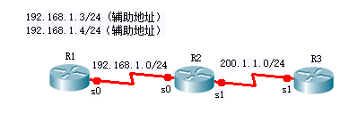

# 10：NAT网络地址转换

## 实验前准备 

任何位于内部网络和外部网络之间的设备都可以使用NAT（RFC3022对NAT 进行定义、讲解）。转换的地址不一定必须是私有地址，它可以是任何地址。 

### 1 需要使用地址转换常见的原因

1) 由于ISP没有分配足够的共有IPv4地址，不得不使用私有地址； 

2) 使用了公有地址，但是更换了ISP，新的ISP不再支持这些公有地址； 

3) 两家公司进行合并，他们使用了相同的地址空间； 

4) 要将同一个IP地址分配给多台机器； 

### 2 NAT 术语：

1) 内部本地地址：分配给位于内部网络主机的IPv4地址。内部本地地址可能不是由网络信息中心（NIC）或者服务提供商分配的IPv4地址。 

2) 内部全局地址：由网络信息中心（NIC）或者服务提供商分配的合法IPv4 地址，他对外代表着一个或者多个内部本地IPv4地址。 

3) 外部本地地址：外部主机显示给内网的IPv4地址。外部本地地址不一定是合法的地址，它是从可路由地址空间分配到内部网络的地址。 

4) 外部全局地址：主机所有者分配给外部网络上某一主机的IPv4地址。外部全局地址从全局课路由地址或者空间中分配。 

### 3 地址转换的类型：

1) 静态NAT：将未注册的IPv4地址映射到注册的IPv4地址（一对一）。在必须从网络外部访问设备时静态 NAT特别有用。 

2) 动态NAT：将未注册的IPv4地址与某个注册的IPv4地址组中的注册的IPv4进行映射。 

3) 过载NAT：使用不同的端口号将多个未注册IPv4地址映射到单个注册的 IPv4 地址（多对一）。过载也称PAT，是动态NAT的一种形式。 

### 4 NAT 优势

1) 不需要重新分配所有需要访问外部网络的主机的地址，从而节约时间和金钱。

2) 通过应用端口级的多路复用节约了地址。

3) 保护网络安全。

## 实验要求

本次实验，希望通过地址转换，使拓扑图中左边内部网络中的内部本地地址分别通过三种方式转换成外部全局地址并成功的访问右边网络中的R3。

## 实验拓扑

实验拓扑如图所示，R1和R2之间是192.168.1.0/24网段，R2 和R3之间是200.1.1.0/24网段。



## 实验过程 

### 1 配置每个设备的名称和接口ip地址，确保彼此之间的三层连通性。 

```bash
R1(config)#interface s0/0/0
R1(config-if)#ip address 192.168.1.1 255.255.255.0
R1(config-if)#ip address 192.168.1.3 255.255.255.0 secondary
R1(config-if)#ip address 192.168.1.4 255.255.255.0 secondary
R1(config-if)#no shutdown 

R2(config)#interface s0/0/0
R2(config-if)#ip address 192.168.1.2 255.255.255.0
R2(config-if)#no shutdown
R2(config)#interface s0/0/1
R2(config-if)#ip address 200.1.1.1 255.255.255.0
R2(config-if)#no shutdown

R3(config)#interface s0/0/1
R3(config-if)#ip address 200.1.1.2 255.255.255.0
R3(config-if)#no shutdown
```

### 2 在R2上完成静态NAT的配置。 

```bash
R2(config)#ip nat inside source static 192.168.1.1 200.1.1.254 
*Oct 27 09:04:33.599: %LINEPROTO-5-UPDOWN: Line protocol on Interface NVI0, changed state to
R2(config)#interface s0/0/0
R2(config-if)#ip nat inside 
R2(config)#interface s0/0/1
R2(config-if)#ip nat outside 
R2(config-if)#end 
*Oct 27 09:05:32.947: %SYS-5-CONFIG_I: Configured from console by console
R2#debug ip nat 
IP NAT debugging is on
R2#_
```


然后在R1上用本地地址192.168.1.1 Ping 200.1.1.2,结果没有ping通，为什么?

```bash
R1#ping 200.1.1.2 
Type escape sequence to abort. 
Sending 5, 100-byte ICMP Echos to 200.1.1.2, timeout is 2 seconds: 
..... 
Success rate is 0 percent (0/5)
R1#_
```

查看R1上是否有地址转换的NAT表，转换表为空，说明没有发生地址转换，分析原因， R1去往200.1.1.0 网段，需要一条静态路由。

```bash
R1#show ip nat translations

R1#_
```

为R1加上去往R3的静态路由，现在R1可以ping通R3。

```bash
R1(config)#ip route 200.1.1.0 255.255.255.0 serial 0/0/0 
R1(config)#end 
R1#ping 200.1.1.2 
Type escape sequence to abort. 
Sending 5, 100-byte ICMP Echos to 200.1.1.2, timeout is 2 seconds: 
!!!!! 
Success rate is 100 percent (5/5), round-trip min/avg/max = 40/42/44 ms
R1#_
```

在R1上使用扩展ping，发送50个数据包，默认情况下为5个数据包。

```bash
R1#ping 
Protocol [ip]: 
Target IP address: 200.1.1.2 
Repeat count [5]: 50 
Datagram size [100]: 
Timeout in seconds [2]: 
Extended commands [n]:  
Sweep range of sizes [n]: 
Type escape sequence to abort. 
Sending 50, 100-byte ICMP Echos to 200.1.1.2, timeout is 2 seconds: 
!!!!!!!!!!!!!!!!!!!!!!!!!!!!!!!!!!!!!!!!!!!!!!!!!!!!!!!!!!!!!!!
Success rate is 100 percent (50/50), round-trip min/avg/max = 40/43/44 ms
R1#_
```

快速切换到R2上，来查看具体的转换过程。

```bash
*Oct 27 09:11:34.791: NAT*: s=192.168.1.1->200.1.1.254, d=200.1.1.2 [5] 
*Oct 27 09:11:34.819: NAT*: s=200.1.1.2, d=200.1.1.254->192.168.1.1 [5]
```

查看R2的NAT转换表，R2建立NAT表，当有流量符合这个匹配规则时就会两个地址进行转换。

```
R2#show ip nat translations
Pro Inside global      Inside local      Outside local      Outside global
--- 200.1.1.254        192.168.1.1     ---               ---
R2#_
```

### 3 在R2上完成动态NAT的配置。

将原来的静态NAT的条目删除，通过使用用户访问控制列表来定义本地地址池。

```bash
R2(config)#no ip nat inside source static 192.168.1.1 200.1.1.254 
*Oct 27 09:17:07.491: ipnat_remove_static_cfg: id 1,  flag
R2(config)#access-list 1 permit 192.168.1.0  0.0.0.255 
R2(config)#ip nat pool nju 200.1.1.253 200.1.1.254 p 24 
R2(config)#ip nat inside source list 1 pool nju

R2(config)#
*Oct 27 09:19:45.703: ipnat_add_dynamic_cfg_common: id 1, flag 5, range 1
*Oct 27 09:19:45.707: id 1, flags 0, domain 0, lookup 0, aclnum 1, aclname1,mapn
ame idb 0x00000000
*Oct 27 09:19:45.707: poolstart 200.1.1.253   poolend 200.1.1.254
R2(config)#
```

### 4 用 192.168.1.1 ping 200.1.1.2

```bash
R1#ping 
Protocol [ip]: 
Target IP address: 200.1.1.2 
Repeat count [5]: 50 
Datagram size [100]: 
Timeout in seconds [2]: 
Extended commands [n]:  
Sweep range of sizes [n]: 
Type escape sequence to abort. 
Sending 50, 100-byte ICMP Echos to 200.1.1.2, timeout is 2 seconds: 
!!!!!!!!!!!!!!!!!!!!!!!!!!!!!!!!!!!!!!!!!!!!!!!!!!!!!!!!!!!!!!!
Success rate is 100 percent (50/50), round-trip min/avg/max = 40/43/44 ms
R1#_
```

Ping通说明路由添加正确，查看R2的终端信息。

```bash
*Oct 27 09:20:54.591: NAT*: s=192.168.1.1->200.1.1.253, d=200.1.1.2 [60] 
*Oct 27 09:20:54.619: NAT*: s=200.1.1.2, d=200.1.1.253->192.168.1.1 [60]
```

### 5 在R1上用 192.168.1.3 ping 200.1.1.2

```bash
R1#ping 
Protocol [ip]: 
Target IP address: 200.1.1.2 
Repeat count [5]: 20 
Datagram size [100]: 
Timeout in seconds [2]: 
Extended commands [n]: y
Source address or interface: 192.168.1.3
Type of service [0]:
Set DF bit in IP header? [no]:
Validate reply data? [no]:
Data pattern [0xABCD]:
Loose, Strict, Record, Timestamp, Verbose[none]:
Sweep range of sizes [n]: 
Type escape sequence to abort. 
Sending 20, 100-byte ICMP Echos to 200.1.1.2, timeout is 2 seconds: 
Packet sent with a source address of 192.168.1.3
!!!!!!!!!!!!!!!!!!!!!!!!!!!!!!!!!!!!!!!!!!!!!!!
Success rate is 100 percent (20/20), round-trip min/avg/max = 40/43/44 ms
R1#_
```

查看R2的终端信息以及NAT转换表，源地址192.168.1.2转换成200.1.1.254，很明显调用了第2公有地址。 

```bash
*Oct 27 09:26:10.339: NAT*: s=192.168.1.3->200.1.1.254, d=200.1.1.2 [139]
*Oct 27 09:26:10.367: NAT*: s=200.1.1.2, d=200.1.1.254->192.168.1.3 [139]
```

查看R2的NAT转换表

```bash
R2#show ip nat translations
Pro Inside global      Inside local      Outside local      Outside global
--- 200.1.1.253        192.168.1.1     ---               ---
--- 200.1.1.254        192.168.1.3     ---               ---
R2#_
```

### 6 在R1上用 192.168.1.4 ping 200.1.1.2

```bash
R1#ping 
Protocol [ip]: 
Target IP address: 200.1.1.2 
Repeat count [5]: 20 
Datagram size [100]: 
Timeout in seconds [2]: 
Extended commands [n]: y
Source address or interface: 192.168.1.4
Type of service [0]:
Set DF bit in IP header? [no]:
Validate reply data? [no]:
Data pattern [0xABCD]:
Loose, Strict, Record, Timestamp, Verbose[none]:
Sweep range of sizes [n]: 
Type escape sequence to abort. 
Sending 20, 100-byte ICMP Echos to 200.1.1.2, timeout is 2 seconds: 
Packet sent with a source address of 192.168.1.4
……………………………...
Success rate is 0 percent (0/20)
R1#_
```

结果发现不能ping通到目的。查看R2的NAT转换表，发现没有192.168.1.4的条目。

```bash
R2#show ip nat translations
Pro Inside global      Inside local      Outside local      Outside global
--- 200.1.1.253        192.168.1.1     ---               ---
--- 200.1.1.254        192.168.1.3     ---               ---
R2#_
```

解决的方法：清除R2的NAT表中的条目，将公有地址池中的公有地址释放出来。

```bash
R2#clear ip nat translation * 
R2#show ip nat translations
R2#_
```

在R1上重试。

```bash
R1#ping 
Protocol [ip]: 
Target IP address: 200.1.1.2 
Repeat count [5]: 
Datagram size [100]: 
Timeout in seconds [2]: 
Extended commands [n]: y
Source address or interface: 192.168.1.4
Type of service [0]:
Set DF bit in IP header? [no]:
Validate reply data? [no]:
Data pattern [0xABCD]:
Loose, Strict, Record, Timestamp, Verbose[none]:
Sweep range of sizes [n]: 
Type escape sequence to abort. 
Sending 20, 100-byte ICMP Echos to 200.1.1.2, timeout is 2 seconds: 
Packet sent with a source address of 192.168.1.4
!!!!!!!!!!!
Success rate is 100 percent (5/5), round-trip min/avg/max = 44/44/44 ms
R1#_
```

R2终端上所显示的转换过程。

```bash
*Oct 27 09:37:24.699: NAT*: s=192.168.1.4->200.1.1.253, d=200.1.1.2 [170]
*Oct 27 09:37:24.727: NAT*: s=200.1.1.2, d=200.1.1.253->192.168.1.4 [170]
```

再查看R2的NAT转换表。

```bash
R2#show ip nat translations
Pro Inside global      Inside local      Outside local      Outside global
icmp 200.1.1.253:7    192.168.1.4:7    200.1.1.2:7       200.1.1.2:7
--- 200.1.1.253        192.168.1.4     ---               ---
R2#_
```

### 7 配置 PAT

先删除转换语句，再删除之前建立的 pool，注意删除的顺序。

```bash
R2(config)#no ip nat inside source list 1 pool nju

Dynamic mapping in use, do you want to delete all entires? [no]: yes
R2(config)#no ip nat pool nju 200.1.1.253 200.1.1.254 prefix-length 24 
R2(config)#ip nat pool nju 200.1.1.253 200.1.1.253 prefix-length 24    
R2(config)#ip nat inside source list 1 pool nju overload  

R2(config)#
*Oct 27 09:42:38.571: ipnat_add_dynamic_cfg_common: id 2,flag 5, range 1
*Oct 27 09:42:38.571: id 2, flags 0, domain 0, lookup 0, aclnum 1, aclname 1, map
name idb 0x00000000
*Oct 27 09:42:38.571: poolstart 200.1.1.253 poolend 200.1.1.253 _    
```

### 8 在 R1 用 192.168.1.1 上 ping 200.1.1.2

```bash
R1#ping 200.1.1.2 

Type escape sequence to abort. 
Sending 5,  100-byte ICMP Echos to 200.1.1.2,  timeout is 2 seconds: 
!!!!! 
Success rate is 100 percent (5/5), round-trip min/avg/max =44/44/44 ms
R1#_
```

查看R2的终端信息以及NAT转换表，随机产生端口号6。

```bash
*Oct 27 09:44:05.283: NAT*: s=192.168.1.1->200.1.1.253, d=200.1.1.2 [175]
*Oct 27 09:44:05.311: NAT*: s=200.1.1.2, d=200.1.1.253->192.168.1.1 [175]
```

```bash
R2#show ip nat translations
Pro    Inside global     Inside local      Outside local   Outside global 
icmp   200.1.1.253:6    192.168.1.1:6    200.1.1.2:6    200.1.1.2:6
R2#_
```

R2约1分钟的时间释放地址转换的空间，此时查找NAT表中没有任何的转换条目。

```bash
R2#show ip nat translations

R2#_
```


### 9 在 R1用 192.168.1.3 ping 200.1.1.2

```bash
R1#ping 
Protocol [ip]: 
Target IP address: 200.1.1.2 
Repeat count [5]: 
Datagram size [100]: 
Timeout in seconds [2]: 
Extended commands [n]: y
Source address or interface: 192.168.1.3
Type of service [0]:
Set DF bit in IP header? [no]:
Validate reply data? [no]:
Data pattern [0xABCD]:
Loose, Strict, Record, Timestamp, Verbose[none]:
Sweep range of sizes [n]: 
Type escape sequence to abort. 
Sending 20, 100-byte ICMP Echos to 200.1.1.2, timeout is 2 seconds: 
Packet sent with a source address of 192.168.1.3
……………………………...
Success rate is 0 percent (5/5), round-trip min/avg/max = 40/43/44 ms
R1#_
```

查看R2的终端信息。

```bash
*Oct 27 09:47:40.827: NAT*: s=192.168.1.1->200.1.1.253, d=200.1.1.2 [180]
*Oct 27 09:47:40.855: NAT*: s=200.1.1.2, d=200.1.1.253->192.168.1.3 [180]
```

端口号已改为9。

```bash
R2#show ip nat translations
Pro    Inside global     Inside local      Outside local   Outside global 
icmp   200.1.1.253:9    192.168.1.1:9    200.1.1.2:9    200.1.1.2:9
R2#
*Oct 27 09:48:41.467:  NAT: expiring 200.1.1.253(192.168.1.3) icmp 9 (9)
R2#
```

## 实验命令列表

| 配置静态NAT        | ip nat inside source static [inside  local ip address] [inside global ip address] |
| ------------------ | ------------------------------------------------------------ |
| 删除静态 NAT条目   | no ip nat inside source static  [inside local ip address] [inside global ip address] |
| 指定内部ip地址接口 | ip nat inside                                                |
| 指定外部ip地址接口 | ip nat outside                                               |
| 查看NAT转换表      | show ip nat translations                                     |
| 清空NAT转换表      | clear ip nat translation *                                   |

## 实验问题