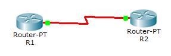

# 11：ACL实验

## 实验前准备

​    ACL访问控制列表是路由器和交换机接口的指令列表，用来控制端口进出的数据包。ACL适用于所有的被路由协议。配置ACL后，可以限制网络流量，允许特定设备访问，指定转发特定端口数据包等。目前有两种主要的ACL：标准ACL和扩展ACL。扩展ACL相比标准ACL提供了更广泛的控制范围。

## 实验要求

本次试验，两台路由器通过 s0/0/0口互联，hostname 分别为R1和R2，两设备采用192.168.1.0/24 网段。实现标准 ACL 和扩展 ACL 的实验，并对两种ACL进行比较。

## 实验拓扑



## 实验过程

### 1 初始化：保证 3 层连通性

首先为了区分两台路由器，分别将设备的hostname 改为 R1，R2，在相应接口下配置 IP 地址以及时钟速率，以保证 3 层连通性，具体配置如下：
```bash
Router>enable
Router#conf terminal
Router(config)#hostname R1
R1(config)#interface serial 0/0/0
R1(config-if)#ip address 192.168.1.1 255.255.255.0
R1(config-if)#no shutdown
R1(config-if)#clock rate 64000

Router(config)#hostname R2
R2(config)#interface serial 0/0/0
R2(config-if)#ip address 192.168.1.2 255.255.255.0
R2(config-if)#no shutdown
```


### 2 使用扩展的ACL封杀R1到R2的PING命令

####  2.1 验证3层连通性

```bash
R2#ping 192.168.1.1

Type escape sequence to abort.
Sending 5,100-byte ICMP Echos to 192.168.1.1, timeout is 2 seconds:
!!!!!
Success rate is 100 percent(5/5), round-trip min/avg/max = 28/28/28 ms
```

#### 2.2 创建 ACL

```bash
R1(config)#access-list 100 deny icmp 192.168.1.1 0.0.0.0 192.168.1.2 0.0.0.0
R1(config)#access-list 100 permit ip any any
R1#show ip access-lists
Extended IP access list 100
deny icmp host 192.168.1.1 host 192.168.1.2
permit ip any any
```

#### 2.3 应用ACL到接口

```bash
R1(config)#interface serial 0/0/0
R1(config-if)#ip access-group 100 out
```

#### 2.4 验证效果

```bash
Enter configuration commands, one per line. End with CNTL/Z.
R1(config)#interface s0/0/0
R1(config-if)#ip access-group 100 out
R1(config-if)#^Z
R1#p

*Oct 27 09:53:14.979:%SYS-5-CONFIG_I: Configured from console by consoleing
.168.1.2

Type escape sequence to abort.
Sending 5,100-byte ICMP Echos to 192.168.1.2, timeout is 2 seconds:
!!!!!
Success rate is 100 percent(5/5), round-trip min/avg/max = 28/28/32 ms
R1#ping 192.168.1.2

Type escape sequence to abort.
Sending 5,100-byte ICMP Echos to 192.168.1.2, timeout is 2 seconds:
!!!!!
Success rate is 100 percent(5/5), round-trip min/avg/max = 28/28/32 ms
```

对于ACL的放置位置，有以下的原则：扩展ACL放置在靠近源的位置，标准ACL 放置在靠近目的位置。那按照上述的原则，创建一个扩展的ACL，并放置在源端，并没有错误。

#### 2.5 排错

```bash
R1#show ip access-lists
Extended IP access list 100
deny icmp host 192.168.1.1 host 192.168.1.2
permit ip any any (15 matches)
```

问题分析：最后一条语句匹配到15个数据包。对于 ACL，有个非常重要的特性，他不能过滤本地数据流！也就是说，对于 R1 上发送的数据，设置在 R1 接口上的 ACL 并不能对它进行过滤。为了能对数据流进行过滤，需要把ACL 设置在对端的 R2 上 。

#### 2.6 在R2上设置并应用ACL

```bash
R2(config)#access-l 100 deny icmp host 192.168.1.1 host 192.168.1.2
R2(config)#access-l 100 permit icmp any any
R2(config)#interface serial 0/0/0
R2(config-if)#ip access-group 100 in
```

#### 2.7 检测效果

```bash
R1#ping 192.168.1.2

Type escape sequence to abort.
Sending 5,100-byte ICMP Echos to 192.168.1.2, timeout is 2 seconds:
U.U.U
Success rate is 0 percent(0/5)
show ip access-lists
Extended IP access list 100
     10 deny icmp host 192.168.1.1 host 192.168.1.2 (15matches)
     20 permit icmp any any
```

实验成功，ICMP包被拒绝，如图13.4所示。

 

### 3 使用 ACL禁止R1到R2的TELNET应用

注意：在进行第二部分实验前请将第一部分配置清除

路由器名为:R1、R2。R1的S0/0/0端口与R2的S0/0/0 端口相连，IP地址和第一部分相同,在R2上设置特权密码为nju，线路密码为cisco。从R1使用 PING命令测试到R2的连通性，结果可达，但却不可以TELNET到R2 。

有两种方法可以实现这样的操作。

#### 3.1 方法一：使用扩展 ACL

##### 3.1.1 检测基本配置

```bash
R2(config)#enable secret nju
R2(config)#line vty 0 4
R2(config-line)#password cisco
R2(config-line)#login
```

```bash
R1#ping 192.168.1.2

Type escape sequence to abort.
Sending 5,100-byte ICMP Echos to 192.168.1.2, timeout is 2 seconds:
!!!!!
Success rate is 100 percent(5/5), round-trip min/avg/max = 28/28/28 ms
R1#telnet 192.168.1.2
Trying 192.168.1.2 ... Open

User Access Verification
Password:
R2>enable
Password:
R2#exit
```

##### 3.1.2 创建 ACL

```bash
R2(config)#access-list 101 deny tcp host 192.168.1.1 any eq 23
R2(config)#access-list 101 permit ip any any
R2(config)#int s0/0/0
R2(config-if)#ip access-group 101 in
```

```bash
R1#telnet 192.168.1.2
Trying 192.168.1.2 ... 
% Destination unreachanle; gateway or host down

R1#ping 192.168.1.2

Type escape sequence to abort.
Sending 5,100-byte ICMP Echos to 192.168.1.2, timeout is 2 seconds:
!!!!!
Success rate is 100 percent(5/5), round-trip min/avg/max = 28/28/32 ms
```

telnet被拒绝但ping成功。

#### 3.2 方法二：使用标准 ACL

##### 3.2.1 删除先前的配置

```bash
R2(config)#int s0/0/0
R2(config-if)#no ip access-group 101 in
```

##### 3.2.2 创建 ACL

```bash
R2(config)#access-list 1 deny host 192.168.1.1
R2(config)#access-list 1 permit any
```

##### 3.2.3 应用 ACL

```bash
R2(config)#line vty 0 4
R2(config-line)# access-class 1 in
```

实验结果：

```bash
R1#telnet 192.168.1.2
Trying 192.168.1.2 ... 
% Connection refused by remote host
```

问题分析：设置了2种ACL，但是得到的效果却不一样。如果是使用了扩展的ACL，那么它的提示是“% Destination unreachable; gateway or host down”,说明23号端口根本不可达。如果是使用了标准的 ACL 放置在VTY线路中，则提示“% Connection refused by remote host”，说明的确是到达了23号端口，只不过被拒绝了。在实际使用中最好使用扩展的ACL，减少23号端口的负担。

## 实验命令列表

| 配置access list                                   | access-list  [list number] [permit\|deny] [source address] [address] [wildcard mask] [log] |
| ------------------------------------------------- | ------------------------------------------------------------ |
| 将指定访问列表应用到相关接口，并指定ACL作用的方向 | ip access-group  {[access-list-number]\|[name]} [int\|out]   |
| 显示已设置的访问控制列表内容                      | show ip  access-lists                                        |

## 实验问题