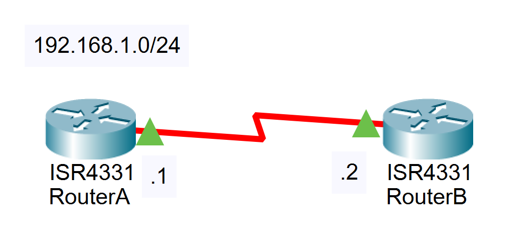

# 09：ACL实验

[点此下载本次实验的 Cisco Packet Tracer 文件](./router_acl.pkt)

## 实验要求

本次试验，两设备实现标准 ACL 和扩展 ACL 的实验，并对两种ACL进行比较。

## 实验拓扑



## 实验过程

1. **搭建网络拓扑，保证三层连通性**

```bash
RouterA(config)#interface serial 0/1/0
RouterA(config-if)#ip address 192.168.1.1 255.255.255.0
RouterA(config-if)#no shutdown

RouterB(config)#interface serial 0/1/0
RouterB(config-if)#ip address 192.168.1.2 255.255.255.0
RouterB(config-if)#no shutdown
```


### 2 使用扩展的ACL封杀RouterA到RouterB的PING命令

####  2.1 验证3层连通性

```bash
RouterB#ping 192.168.1.1

Type escape sequence to abort.
Sending 5,100-byte ICMP Echos to 192.168.1.1, timeout is 2 seconds:
!!!!!
Success rate is 100 percent(5/5), round-trip min/avg/max = 28/28/28 ms
```

#### 2.2 创建 ACL

```bash
RouterA(config)#access-list 100 deny icmp 192.168.1.1 0.0.0.0 192.168.1.2 0.0.0.0
RouterA(config)#access-list 100 permit ip any any
RouterA#show ip access-lists
Extended IP access list 100
    10 deny icmp host 192.168.1.1 host 192.168.1.2
    20 permit ip any any
```

#### 2.3 应用ACL到接口

```bash
RouterA(config)#interface serial 0/0/0
RouterA(config-if)#ip access-group 100 out
```

#### 2.4 验证效果

发现配置的 ACL 没有生效。

```bash
RouterA(config)#interface s0/1/0
RouterA(config-if)#ip access-group 100 out
RouterA#ping 192.168.1.2

Type escape sequence to abort.
Sending 5, 100-byte ICMP Echos to 192.168.1.2, timeout is 2 seconds:
!!!!!
Success rate is 100 percent (5/5), round-trip min/avg/max = 6/13/17 ms
```

对于ACL的放置位置，有以下的原则：扩展ACL放置在靠近源的位置，标准ACL 放置在靠近目的位置。那按照上述的原则，创建一个扩展的ACL，并放置在源端，并没有错误。

#### 2.5 排错

```bash
RouterA#show ip access-lists
Extended IP access list 100
deny icmp host 192.168.1.1 host 192.168.1.2
permit ip any any (15 matches)
```

问题分析：最后一条语句匹配到15个数据包。对于 ACL，有个非常重要的特性，他不能过滤本地数据流！也就是说，对于 RouterA 上发送的数据，设置在 RouterA 接口上的 ACL 并不能对它进行过滤。为了能对数据流进行过滤，需要把ACL 设置在对端的 RouterB 上 。

#### 2.6 在RouterB上设置并应用ACL

```bash
RouterB(config)#access-l 100 deny icmp host 192.168.1.1 host 192.168.1.2
RouterB(config)#access-l 100 permit icmp any any
RouterB(config)#interface serial 0/1/0
RouterB(config-if)#ip access-group 100 in
```

#### 2.7 检测效果

```bash
RouterA#ping 192.168.1.2

Type escape sequence to abort.
Sending 5, 100-byte ICMP Echos to 192.168.1.2, timeout is 2 seconds:
UUUUU
Success rate is 0 percent (0/5)
```

实验成功，ICMP包被拒绝。

### 3 使用 ACL禁止RouterA到RouterB的TELNET应用

注意：在进行第二部分实验前请将第一部分配置清除

```bash
RouterB(config)#int s0/1/0
RouterB(config-if)#no ip access-group 100 in
```

在RouterB上设置特权密码为nju，线路密码为cisco。从RouterA使用 PING命令测试到RouterB的连通性，结果可达，但却不可以TELNET到RouterB 。

有两种方法可以实现这样的操作。

#### 3.1 方法一：使用扩展 ACL

##### 3.1.1 检测基本配置

```bash
RouterB(config)#enable secret nju
RouterB(config)#line vty 0 4
RouterB(config-line)#password cisco
RouterB(config-line)#login
```

```bash
RouterA#ping 192.168.1.2
Type escape sequence to abort.
Sending 5, 100-byte ICMP Echos to 192.168.1.2, timeout is 2 seconds:
!!!!!
Success rate is 100 percent (5/5), round-trip min/avg/max = 8/13/18 ms

RouterA#telnet 192.168.1.2
Trying 192.168.1.2 ...Open
User Access Verification
Password: 
RouterB>
// 这里从 RouterA 上通过 telnet 连接到了 RouterB 的控制台
```

##### 3.1.2 创建 ACL

```bash
RouterB(config)#access-list 101 deny tcp host 192.168.1.1 any eq 23
RouterB(config)#access-list 101 permit ip any any
RouterB(config)#int s0/1/0
RouterB(config-if)#ip access-group 101 in
```

```bash
RouterA#telnet 192.168.1.2
Trying 192.168.1.2 ...
% Connection timed out; remote host not responding

RouterA#ping 192.168.1.2
Type escape sequence to abort.
Sending 5, 100-byte ICMP Echos to 192.168.1.2, timeout is 2 seconds:
!!!!!
Success rate is 100 percent (5/5), round-trip min/avg/max = 11/15/19 ms
```

telnet 被拒绝但 ping 成功，实验成功。

#### 3.2 方法二：使用标准 ACL

##### 3.2.1 删除先前的配置

```bash
RouterB(config)#int s0/1/0
RouterB(config-if)#no ip access-group 101 in
```

##### 3.2.2 创建 ACL

```bash
RouterB(config)#access-list 1 deny host 192.168.1.1
RouterB(config)#access-list 1 permit any
```

##### 3.2.3 应用 ACL

```bash
RouterB(config)#line vty 0 4
RouterB(config-line)# access-class 1 in
```

此时尝试从 RouterA telnet 连接 RouterB

```bash
RouterA#telnet 192.168.1.2
Trying 192.168.1.2 ...
% Connection refused by remote host
```

问题分析：设置了2种ACL，但是得到的效果却不一样。如果是使用了扩展的ACL，那么它的提示是“% Destination unreachable; gateway or host down”,说明23号端口根本不可达。如果是使用了标准的 ACL 放置在VTY线路中，则提示“% Connection refused by remote host”，说明的确是到达了23号端口，只不过被拒绝了。在实际使用中最好使用扩展的ACL，减少23号端口的负担。

## 实验命令列表

| 指令 | 用法 |
| ------------------------------------------------- | ------------------------------------------------------------ |
| 配置access list                                   | access-list  [list number] [permit\|deny] [source address] [address] [wildcard mask] [log] |
| 将指定访问列表应用到相关接口，并指定ACL作用的方向 | ip access-group  {[access-list-number]\|[name]} [int\|out]   |
| 显示已设置的访问控制列表内容                      | show ip  access-lists                                        |

## 实验问题