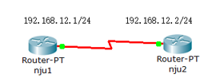

# 12：PPP 验证实验

## 实验前准备

在现实生活中，上网需要先向电信和联通这种运营商去缴费申请一个用户名和密码，然后通过登录连接到互联网。本章实验描述了如何通过PPP的验证使链路能够通畅。

## 实验要求

本次实验主要完成以下两项操作:

PAP验证

1. 为路由器指定唯一主机名，为了辨别设备，需要设置不同的主机名。

2. 列出认证路由器时所使用的远程主机名称和口令，PAP为单项验证，所以被验证方需要正确的主机名和口令，方能使链路通畅。
3. WAN接口上完成PPP协议的封装。PAP验证基于PPP协议，必须封装后才能启用。
4.   nju1为服务端，nju2为客户端，客户端主动向服务端发出认证请求，密码设置为ccna。

CHAP 验证

1. 为路由器指定唯一主机名，为了辨别设备，需要设置不同的主机名

2. 列出认证路由器时所使用的远端主机名称和口令，密码为ccna。CHAP 为双向验证，通过将对方发送的用户名和口令与本地的用户列表来对比确认。一致通过，不一致链路阻塞。WAN接口上完成PPP 协议的封装和CHAP 认证的配置PAP 验证基于PPP 协议，必须封装后才能启用。

## 实验拓扑



## 实验过程

### PAP验证

#### 1  配置nju1的服务端设置

```bash
Router(config)#hostname nju1
nju1(config)#username nju password ccna
nju1(config)#interface serial 0/0/0
nju1(config-if)#ip address 192.168.12.1 255.255.255.0
nju1(config-if)#encapsulation ppp
nju1(config-if)#ppp authentication pap
nju1(config-if)#no shutdown
```

#### 2 配置nju2的客户端设置

```bash
Router(config)#hostname nju2
nju2(config)#interface serial 0/0
nju2(config-if)#ip address 192.168.12.2 255.255.255.0
nju2(config-if)#clock rate 64000
nju2(config-if)#encapsulation ppp
nju2(config-if)#no shutdown
```

#### 3 client 端发送用户名和密码

```bash
nju2(config-if)#ppp pap sent-username adsf password adsf
```

注：当用户名和口令中的任意一个和验证方的本地用户列表不同时，无法通信。

```bash
nju2#ping 192.168.12.1
```

测试结果如图：

```bash
Type escape sequence to abort.
Sending 5, 100-byte ICMP Echos to 192.168.12.1, timeout is 2 seconds:
.....
Success rate is 0 percent (0/5)
```

#### 4 设置正确的用户名和密码

```bash
nju2(config-if)#ppp pap sent-username nju password ccna
nju2(config-if)#end
nju2#ping 192.168.12.1
```

测试结果如图：

```bash
Type escape sequence to abort.
Sending 5, 100-byte ICMP Echos to 192.168.12.1, timeout is 2 seconds:
!!!!!
Success rate is 100 percent (5/5), round-trip min/avg/max = 28/28/32 ms
```

### CHAP 验证

#### 1 配置nju1

```bash
Router(config)#hostname nju1
nju1(config)#username nju2 password ccna
nju1(config)#interface serial 0/0
nju1(config-if)#ip address 192.168.12.1 255.255.255.0
nju1(config-if)#encapsulation ppp
nju1(config-if)#ppp authentication chap
nju1(config-if)#no shutdown
```

#### 2 配置nju2

```bash
Router(config)#hostname nju2
nju2(config)#inter serial 0/0
nju2(config-if)#ip address 192.168.12.2 255.255.255.0
nju2(config-if)#clock rate 64000
nju2(config-if)#encapsulation ppp
nju2(config-if)#ppp authentication chap
nju2(config-if)#no shutdown
```

注：对端需要配置相同，因为chap 是双向认证，由于一端没有发送本地用户名和列表，导致链路不通。

#### 3 设置nju2 上的用户名和密码

```bash
nju2(config)#username nju1 password ccnp
nju2#ping 192.168.12.1
```

测试结果如图：

```bash
Type escape sequence to abort.
Sending 5, 100-byte ICMP Echos to 192.168.12.1, timeout is 2 seconds:
.....
Success rate is 0 percent (0/5)
```

#### 4 设置正确的用户名和密码

```bash
nju2(config)#username nju1 password ccna
nju2#ping 192.168.12.1
```

测试结果如图：

```bash
Type escape sequence to abort.
Sending 5, 100-byte ICMP Echos to 192.168.12.1, timeout is 2 seconds:
!!!!!
Success rate is 100 percent (5/5), round-trip min/avg/max = 28/28/32 ms
```

在验证通过的情况下，将任意一边的口令随意设置成一个非ccna 的口令，再测试连通性。

```bash
nju2(config)#username nju1 password ccnp
nju2#ping 192.168.12.1
```

测试结果如图：

```bash
Type escape sequence to abort.
Sending 5, 100-byte ICMP Echos to 192.168.12.1, timeout is 2 seconds:
!!!!!
Success rate is 100 percent (5/5), round-trip min/avg/max = 28/28/32 ms
```

注：因为当验证通过后会一直保存已经建立好的连接，解决方法是将接口关闭在启动。

## 实验命令列表

| 启用PPP封装协议              | encapsulation  ppp                              |
| ---------------------------- | ----------------------------------------------- |
| 启用PAP身份验证              | ppp  authentication pap                         |
| 设置被验证发送的用户名和口令 | ppp pap  sent-username [用户名] password [密码] |
| 启用CHAP认证协议             | ppp  authentication chap                        |

## 实验问题