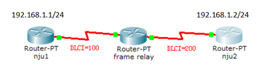

# 11：帧中继实验

> 本实验暂未在Packet Tracer中复现

## 实验前准备

帧中继是由ITU-T标准化的高性能WAN协议，并在美国广泛应用。帧中继是一种面向连接的数据链路层技术，它定义了路由器与服务提供商的本地接入交换设备之间的互联过程。

连接到帧中继WAN的设备分为以下两类：

DTE：DTE设备通常位于客户所在地并且可能为客户所有，帧中继接入设备、路由器、网桥都属于 DTE设备。

DCE：运营商所拥有的网间设备，DCE设备的作用是在网络中提供时钟服务和交换服务，并通过WAN传输数据。

## 实验要求

本次实验主要完成以下几个要求：

1．  配置帧中继交换机。帧中继是一种面向连接的数据链路层技术，它定义了路由器与服务提供商的本地接入交换设备之间的互联过程。

2．  按照拓扑组建和配置路由器。

3．  进行验证实验。通过命令查看在帧中继交换机上虚电路交换的过程；通过手动配置DLCI 号与IP 地址的映射，在路由器上分别禁用逆向ARP 查询。

## 实验拓扑

拓扑如图所示：



## 实验过程

### 1 配置中间的帧中继交换机

```bash
Fr-sw(config)#frame-relay switching
Fr-sw(config)#interface serial 0/0/0
Fr-sw(config-if)#encapsulation frame-relay
Fr-sw(config-if)#frame-relay intf-type dce
Fr-sw(config-if)#clock rate 64000
Fr-sw(config-if)#frame-relay route 100 interface serial 0/0/1 200
Fr-sw(config-if)#no shutdown
Fr-sw(config-if)#exit

Fr-sw(config)#interface serial 0/0/1
Fr-sw(config-if)#encapsulaiton frame-relay
Fr-sw(config-if)#frame-relay intf-type dce
Fr-sw(config-if)#clock rate 64000
Fr-sw(config-if)#frame-relay route 200 interface serial 0/0/0 100
Fr-sw(config-if)#no shutdown
```

### 2 配置 nju1

```bash
nju1(config)#interface serial 0/0/1
nju1(config-if)#ip address 192.168.1.1 255.255.255.0
nju1(config-if)#encapsulation frame-relay
nju1(config-if)#no shutdown
```

### 3 配置 nju2

```bash
nju2(config)#interface serial 0/0/0
nju2(config-if)#ip address 192.168.1.2 255.255.255.0
nju2(config-if)#encapsulation frame-relay
nju2(config-if)#no shutdown
```

 

### 4 验证实验

```bash
nju2#show frame-relay map
Serial0/0/1 (up): ip 192.168.1.1 dlci 100(0*64,0*1840), dynamic,
```

通过命令可以查看在帧中继交换机上虚电路交换的过程。从接口s0/0/1的200虚电路交换到s0/0/0的100的虚电路。

```bash
Fr-sw#show frame-relay route
Input Intf      Input Dlci       Output Intf      Output Dlci        Status
Serial0/0/0     100           Serial0/0/1      200               active
Serial0/0/1     200           Serial0/0/0      100               active
```

路由器的虚电路200在交换机s0/0/1上，这样从交换机s0/0/1过来的数据就会发送给路由器的s0/0/0上。

```bash
nju1#show frame-relay pvc
PVC Statistics for interface Serial0/0/0 (Frame Relay DTE)
             Active       Inactive       Deleted        Static
Local           1            0            0            0
Switched        0            0            0            0
Unused          0            0            0            0

DLCI = 200,  DLCI USAGE = LOCAL, PVC STATUS = ACTIVE, INTERFACE = Serial0/0/0
   input pkts 16         output pkts 16           in bytes 1594
   out bytes 1594       dropped pkts 0           in pkts dropped 0
   out pkts dropped 0            out bytes dropped 0
   in FECN pkts 0        in BECN pkts 0           out FECN pkts 0
   out BECN pkts 0       in DE pkts 0             out DE pkts 0
   out va=casj=t okts 1    out bcast bytes 34        
   5 minute input rate 0 bits/sec, 0 packets/sec
   5 minute output rate 0 bits/sec, 0 packets/sec
   pvc create time 00:08:30, last time pvc status changed 00:08:20
```

也可以在nju1和nju2上分别禁用逆向ARP查询，手动配置DLCI号与IP地址的映射。

nju1的配置：

```bash
nju1(config-if)#no frame-relay inverse-arp
nju1(config-if)#frame-relay map ip 192.168.1.1 100 broadcast
```

nju2的配置：

```bash
nju2(config-if)#no frame-relay inverse-arp
nju2(config-if)#frame-relay map ip 192.168.1.2 200 broadcast
```

实验结果：

```bash
nju1#show frame-relay map
Serial0/0/0 (up) : ip 192.168.1.2 dlci 200 (0*C8,0*2080), static,
           broadcast,
           CISCO, status defined, active
```


## 实验命令列表

| 把路由器当成帧中继交换机     | frame-relay switching      |
| ---------------------------- | -------------------------- |
| 接口封装成帧中继             | encapsulation frame-relay  |
| 配置接口是帧中继的DCE还是DTE | frame-relay intf-type dce  |
| 配置帧中继交换表             | frame-relay route          |
| 显示帧中继交换表             | show frame-relay route     |
| 显示帧中继PVC状态            | show frame pvc             |
| 查看帧中继映射               | show frame-relay map       |
| 关闭帧中继自动映射           | no frame-relay inverse-arp |

 

## 实验问题