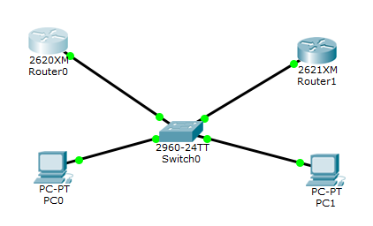

# 12：DHCP欺诈保护

> 因实验室机器指令与模拟器不同, 本实验暂未在Packet Tracer中复现.
>
> 以下实验过程已在实验室复现.

## 实验前准备

​    DHCP的主要作用是给网络中的其他设备动态分配IP地址，从而节约IP资源。

​    DHCP欺骗：攻击者可以通过伪造大量的IP请求包，消耗掉现有DHCP服务器的IP资源。当有计算机请求IP时，DHCP服务器就无法分配IP。此时，攻击者可以伪造一个DHCP服务器为计算机分配IP，并指定一个虚假的DNS服务器地址。这时，当用户访问网站的时候，就被虚假DNS服务器引导到错误的网站。

​    在交换机上开启DHCP snooping功能，绑定并过滤不信任的DHCP信息可以防止DHCP欺骗。对于信任端口收到的DHCP服务器报文，交换机不会丢弃而直接转发，来自非信任端口的DHCP报文则无法通过，从而有效的防止了DHCP欺骗。

## 实验要求

本次实验要求在路由器上启用DHCP服务为两台计算机动态分配IP。此外，还需配置交换机的DHCP snooping功能防止DHCP欺骗。

## 实验拓扑



## 实验过程

### 1 配置路由器Router1的DHCP功能。

注意，你需要将Router1（`g0/0/0`）与交换机（`g1/0/1`）连接的接口打开，而后再进行下一步设置。

```bash
Router1(config)# int g0/0/0
Router1(config)# ip address 10.1.1.1 255.255.255.0
Router1(config)# no shutdown
```

接下来，你要配置Router1的DHCP功能。

```bash
Router1(config)#service dhcp
Router1(config)#ip dhcp pool nju1
Router1(dhcp-config)#network 10.1.1.0 255.255.255.0
Router1(dhcp-config)#default-router 10.1.1.1
Router1(dhcp-config)#dns-server 10.1.1.1
Router1(config)#ip dhcp excluded-address 10.1.1.1 10.1.1.10
Router1(config)#no ip dhcp conflict logging
Router1(config)#ip dhcp relay information trust-all
```

 不加最后一行命令会导致在开启`DHCP snooping`的默认情况下，交换机必须同时信任电脑连接的端口和路由器连接的端口才能打通DHCP工作的流程。因为现在电脑不是直接接在路由器上的，DHCP的请求要经过交换机中继一道，默认情况下路由器是不信任交换机的工作的，但交换机在开启`snooping`后默认是使用`relay`的方式接管了所有的DHCP请求的。在不开启`DHCP snooping`的情况下则完全没有这些问题。下面对Router2的设置也是同理的。

### 2 设置计算机ip获取为DHCP

设置电脑为自动获取IP（DHCP）。具体设置过程请参考文档中的 `快速开始` 章节。

::: tip TIP
本实验中，每次设置路由器DHCP和设置交换机snooping设置后，一定要记得把电脑的本地连接先禁用再启用，以保证电脑的IP地址是修改后DHCP分配的。
:::

检查计算机IP并在Router1上查看地址分配。

```bash
Router#show ip dhcp binding
IP address        Client-ID/            Lease expiration   Type
                Hardware address
10.1.1.21         00E0.A3A5.4929      - -              Automatic
10.1.1.22         00D0.BAD4.D490      - -              Automatic
```

### 3 防止DHCP欺骗

按照步骤1配置Router0，但其中Router0的DHCP地址池设置为`20.1.1.0`，其余配置不变。

注意，你需要将Router0（`g0/0/0`）与交换机（`g1/0/2`）连接的接口打开，而后再进行下一步设置。

```bash
Router0(config)# int g0/0/0
Router0(config)# ip address 20.1.1.1 255.255.255.0
Router0(config)# no shutdown
```

接下来，你要配置Router0的DHCP功能。

```bash
Router0(config)#service dhcp
Router0(config)#ip dhcp pool nju1
Router0(dhcp-config)#network 20.1.1.0 255.255.255.0
Router0(dhcp-config)#default-router 20.1.1.1
Router0(dhcp-config)#dns-server 20.1.1.1
Router0(config)#ip dhcp excluded-address 20.1.1.1 20.1.1.10
Router0(config)#no ip dhcp conflict logging
Router0(config)#ip dhcp relay information trust-all
```

配置交换机snooping功能，将与Router1相连的`g1/0/1`端口设置为信任端口。

```bash
Switch(config)#ip dhcp snooping
Switch(config)#ip dhcp snooping vlan 1
Switch(config)#int g1/0/1
Switch(config-if)#ip dhcp snooping trust
```

查看配置结果。

```bash
Switch#show ip dhcp snooping
Switch DHCP snooping is enabled
Switch DHCP gleaning is disabled
DHCP snooping is configured on following VLANs:
1
DHCP snooping is operational on following VLANs:
1
DHCP snooping is configured on the following L3 Interfaces:

Insertion of option 82 is enabled
   circuit-id default format: vlan-mod-port
   remote-id: f87b.20ef.1100 (MAC)
Option 82 on untrusted port is not allowed
Verification of hwaddr field is enabled
Verification of giaddr field is enabled
DHCP snooping trust/rate is configured on the following Interfaces:

Interface                  Trusted    Allow option    Rate limit (pps)
-----------------------    -------    ------------    ----------------   
GigabitEthernet1/0/1       yes        yes             unlimited
  Custom circuit-ids:
```


此时，两台计算机IP地址均由Router1分配，IP地址如下所示。

```bash
C:\>ipconfig

GigabitEthernet0 Connection:(default port)

   Link-local IPv6 Address.........: FE80::2D0:BAFF:FED4:D490
   IP Address......................: 10.1.1.22
   Subnet Mask.....................: 255.255.255.0
   Default Gateway.................: 10.1.1.1
```
```bash
C:\>ipconfig

GigabitEthernet0 Connection:(default port)

   Link-local IPv6 Address.........: FE80::2E0:A3FF:FEA5:4929
   IP Address......................: 10.1.1.21
   Subnet Mask.....................: 255.255.255.0
   Default Gateway.................: 10.1.1.1
```

将与Router0相连的交换机`g1/0/2`设置为信任端口，`g1/0/1`设置为非信任端口。

```bash
Switch(config)#int g1/0/1
Switch(config-if)#no ip dhcp snooping
Switch(config-if)#no ip dhcp snooping trust
Switch(config)#int g1/0/2
Switch(config-if)#ip dhcp snooping trust
Switch(config-if)#end
```

禁用并启用两台电脑的本地连接，再次检查两台计算机的IP地址，结果如下所示。IP改为由Router0分配。

```bash
C:\>ipconfig

GigabitEthernet0 Connection:(default port)

   Link-local IPv6 Address.........: FE80::2E0:A3FF:FEA5:4929
   IP Address......................: 20.1.1.17
   Subnet Mask.....................: 255.255.255.0
   Default Gateway.................: 20.1.1.1
```

```bash
C:\>ipconfig

GigabitEthernet0 Connection:(default port)

   Link-local IPv6 Address.........: FE80::2D0:BAFF:FED4:D490
   IP Address......................: 20.1.1.18
   Subnet Mask.....................: 255.255.255.0
   Default Gateway.................: 20.1.1.1
```

可以看到，通过交换机snooping的配置，能够阻止非信任端口的DHCP报文传输，从而避免DHCP欺骗。

 

## 实验命令列表

| 打开dhcp功能                                             | service dhcp                                   |
| -------------------------------------------------------- | ---------------------------------------------- |
| 配置dhcp地址池名称                                       | dhcp dhcp pool [pool name]                     |
| 配置要分配的网段                                         | network [address] netmask                      |
| 配置默认网关                                             | default-router [address]                       |
| 配置dns服务器                                            | dns-server [address]                           |
| 配置不分配地址                                           | ip dhcp excluded-address [address1] [address2] |
| 打开dhcp snooping功能                                    | ip dhcp snooping                               |
| 设置作用的vlan                                           | ip dhcp snooping vlan *n*                      |
| 配置信任端口                                             | ip dhcp snooping trust                         |
| 配置dhcp中继代理的所有接口都作为dhcp中继信息选项的信任源 | ip dhcp relay information trust-all            |

## 实验问题