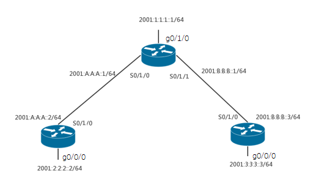

# 16：IPv6环境中的RIPng配置

> 本实验暂未能在Packet Tracer中复现

## 实验前的准备

IETF在1997年为了解决RIP协议与IPv6的兼容性问题RIP协议进行了改进，制定了基于IPv6的RIPng(RIP next generation)标准。

RIPng 是一种[距离向量](https://baike.baidu.com/item/距离向量)（Distance Vector）算法。此协议所用的算法早在 1969 年， ARPANET 就用其来计算[路由](https://baike.baidu.com/item/路由)。然而该协议最初属于 XEROX [网络协议](https://baike.baidu.com/item/网络协议)。 PUP 协议通过[网关](https://baike.baidu.com/item/网关)信息协议交换路由选择信息，而 XNS 则采用该协议的更新版本，命名为[路由选择信息协议](https://baike.baidu.com/item/路由选择信息协议)（RIP）实现路由选择信息交换。 Berkeley 的[路由协议](https://baike.baidu.com/item/路由协议)很大程度上与 RIP 相同，即能够处理 IPV4 及其它地址类型的通用地址格式取代了 XNS 地址，同时[路由选择](https://baike.baidu.com/item/路由选择)每隔 30 秒更新一次。正是因为这种相似性， RIP 既适用于 XNS 协议，也适用于路由类协议。

## 实验要求

1.配置每台路由器的IPv6地址

2.在R1和R3路由器之间配置RIPng，实现两个IPv6网络互相通信 

## 实验拓扑



## 实验过程

### 1 首先完成路由器R1、R2、R3的Ipv6的基础配置

其中包括启动IPv6和配置IPv6的接口地址，激活接口，具体配置如下：

路由器R1的基础配置

```bash
R1(config)#ipv6 unicast-routing   
R1(config)#interface f 0/0
R1(config-if)#ipv6 address 2001:2:2:2::2/64
R1(config-if)#ipv6 rip cisco enable
R1(config-if)#no keepalive

R1(config)#interface Serial 0/0/0
R1(config-if)#ipv6 address 2001:A:A:A::2/64
R1(config-if)#ipv6 rip cisco enable
R1(config)#ipv6 router rip cisco
```

 

路由器R2的基础配置

```bash
R2(config)#ipv6 unicast-routing　
R2(config)#interface f 0/0
R2(config-if)#ipv6 address 2001:1:1:1::1/64
R2(config-if)#ipv6 rip cisco enable
R2(config-if)#no keepalive
R2(config)#interface Serial 0/0/0
R2(config-if)#ipv6 address 2001:A:A:A::1/64
R2(config-if)#ipv6 rip cisco enable
R2(config)#interface Serial 0/0/1
R2(config-if)#ipv6 address 2001:B:B:B::1/64
R2(config-if)#ipv6 rip cisco enable
R2(config)#ipv6 router rip cisco
```

 

路由器R3的基础配置

```bash
R3(config)#ipv6 unicast-routing　
R3(config)#interface f 0/0
R3(config-if)#ipv6 address 2001:3:3:1::3/64
R3(config-if)#ipv6 address 2001:3:3:2::3/64
R3(config-if)#ipv6 address 2001:3:3:3::3/64
R3(config-if)#ipv6 address 2001:3:3:4::3/64
R3(config-if)#ipv6 address 2001:3:3:5::3/64
R3(config-if)#ipv6 address 2001:3:3:6::3/64
R3(config-if)#ipv6 rip cisco enable
R3(config)#no keepalive
R3(config)#interface Serial 0/0/0
R3(config-if)#ipv6 address 2001:B:B:B::3/64
R3(config-if)#ipv6 rip cisco enable
R3(config)#ipv6 router rip cisco
```

### 2 验证配置

在R1验证配置,如下图18.2所示

```bash
R1#show ipv6 rip 
RIP process “cisco”, port 521, multicast-group FF02::9, pid 168
     Administrative distance is 120. Maximum paths is 16
     Updates every 30 seconds, expire after 180
     Holddown lasts 0 seconds, garbage collect after 120
     Split horizon is on; poison reverse is off
     Default routes are not generated
Periodic updates 92, trigger updates16
  Interfaces:
      FastEthernet 0/0
      Serial 0/0/0
  Redistribution:
      None
R1#show ipv6 route
IPv6 Routing Table – Default – 5 entries
Codes: C – Connected, L – Local, S – Static, U – Per–user Static route
      B – BGP, M – MIpv6, R – RIP, I1 – ISIS L1
      I2 – ISIS L2, IA – ISIS interarea, IS – ISIS summary, D – EIGRP
      EX – EIGRP external
      O – OSPF Intra, OI – OSPF Inter, OE1 – OSPF ext 1, OE2 – OSPF ext 2
      ON1 – OSPF NSSA ext 1, ON2 – OSPF NSSA ext 2
R  2001:1:1:1::/64  [120/2]
     via FE80::CE00:3FF:FE68:0, Serial 0/0/0
C  2001:2:2:2::/64  [0/0]
     via ::, FastEthernet 0/0
L  2001:2:2:2::2/128  [0/0]
     via ::, FastEthernet 0/0
R  2001:3:3:1::/64  [120/3]
     via FE80::CE00:3FF:FE68:0, Serial 0/0/0
R  2001:3:3:2::/64  [120/3]
     via FE80::CE00:3FF:FE68:0, Serial 0/0/0
R  2001:3:3:3::/64  [120/3]
     via FE80::CE00:3FF:FE68:0, Serial 0/0/0
R  2001:3:3:4::/64  [120/3]
     via FE80::CE00:3FF:FE68:0, Serial 0/0/0
R  2001:3:3:5::/64  [120/3]
     via FE80::CE00:3FF:FE68:0, Serial 0/0/0
R  2001:3:3:6::/64  [120/3]
     via FE80::CE00:3FF:FE68:0, Serial 0/0/0
C  2001:A:A:A::/64  [0/0]
     via ::. Serial 0/0/0
L  2001:A:A:A::2/128[0/0]
     via ::, Serial 0/0/0
R  2001:B:B:B::/64  [120/2]
     via FE80::CE00:3FF:FE68:0, Serial 0/0/0 
L  FE80::/10  [0/0]

R1#show ipv6 router rip
IPv6 Routing Table - 14 entries  
Codes: C - Connected, L - Local, S - Static, R - RIP, B - BGP 
U - Per-user Static route  
I1 - ISIS L1, I2 - ISIS L2, IA - ISIS interarea, IS - ISIS summary  
O - OSPF intra, OI - OSPF inter, OE1 - OSPF ext 1, OE2 - OSPF ext 2  
ON1 - OSPF NSSA ext 1, ON2 - OSPF NSSA ext 2 
R   2001:1:1:1::/64  [120/2]  
via FE80::CE00:3FF:FE68:0, Serial0/0/0
R   2001:3:3:1::/64  [120/3]  
via FE80::CE00:3FF:FE68:0, Serial0/0/0
R   2001:3:3:2::/64  [120/3]  
via FE80::CE00:3FF:FE68:0, Serial0/0/0
R   2001:3:3:3::/64  [120/3]  
via FE80::CE00:3FF:FE68:0, Serial0/0/0
R   2001:3:3:4::/64  [120/3]  
via FE80::CE00:3FF:FE68:0, Serial0/0/0 
R   2001:3:3:5::/64  [120/3]   
via FE80::CE00:3FF:FE68:0, Serial0/0/0 
R   2001:3:3:6::/64  [120/3]  
via FE80::CE00:3FF:FE68:0, Serial0/0/0 
R   2001:B:B:B::/64  [120/2]  
via FE80::CE00:3FF:FE68:0, Serial0/0/0 
R1#show ipv6 rip database 
RIP process "cisco", local RIB 
2001:1:1:1::/64, metric 2, installed  
Serial0/0/0/ FE80::CE00:3FF:FE68:0, expires in 157 secs 
2001:3:3:1::/64, metric 3, installed  
Serial0/0/0/ FE80::CE00:3FF:FE68:0, expires in 157 secs 
2001:3:3:2::/64, metric 3, installed  
Serial0/0/0/ FE80::CE00:3FF:FE68:0, expires in 157 secs 
2001:3:3:3::/64, metric 3, installed  
Serial0/0/0/ FE80::CE00:3FF:FE68:0, expires in 157 secs 
2001:3:3:4::/64, metric 3, installed  
Serial0/0/0/ FE80::CE00:3FF:FE68:0, expires in 157 secs 
2001:3:3:5::/64, metric 3, installed  
Serial0/0/0/ FE80::CE00:3FF:FE68:0, expires in 157 secs 
2001:3:3:6::/64, metric 3, installed  
Serial0/0/0/ FE80::CE00:3FF:FE68:0, expires in 157 secs 
2001:A:A:A::/64, metric 2  
Serial0/0/0/ FE80::CE00:3FF:FE68:0, expires in 157 secs 
  2001:B:B:B::/64, metric 2, installed  
Serial0/0/0/ FE80::CE00:3FF:FE68:0, expires in 157 secs 
R1#show ipv6 rip next-hops  
RIP  process "cisco", Next Hops  
FE80::CE00:3FF:FE68:0/Serial0/0/0  [9 paths] 
R1#
```

### 3 在R3上实现聚合路由

```bash
R3(congfig)#interface serial 0/0/0
R3(config-if)ipv6 rip cisco summary-address 2001:3:3::/48
```

在R1上查看路由表(聚合后的路由)，如下图18.3所示

```bash
R1#show ipv6 route rip  
IPv6 Routing Table - 9 entries  
Codes:  C - Connected, L - Local, S - Static, R - RIP, B - BGP 
U - Per-user Static route  
I1 - ISIS L1, I2 - ISIS L2, IA - ISIS interarea, IS - ISIS summary  
O - OSPF intra, OI - OSPF inter, OE1 - OSPF ext 1, OE2 - OSPF ext 2 
ON1 - OSPF NSSA ext 1, ON2 - OSPF NSSA ext 2 
R  2001:1:1:1::/64 [120/2]  
via FE80::CE00:3FF:FE68:0, Serial1/0 
R   2001:3:3::/48 [120/3]  
via FE80::CE00:3FF:FE68:0, Serial1/0 
R   2001:B:B:B::/64 [120/2]  
via FE80::CE00:3FF:FE68:0, Serial1/0 
```

### 4 在RIPng中分发默认路由

```bash
R3(config)#interface Serial 0/0/0
R3(config-if)ipv6 rip cisco default-information originate metric 5
```

在R1上查看默认路由，如下图18.4所示

```bash
R1#show ipv6 route rip  
IPv6 Routing Table - 10 entries  
Codes: C - Connected, L - Local, S - Static, R - RIP, B - BGP 
U - Per-user Static route  
I1 - ISIS L1, I2 - ISIS L2, IA - ISIS interarea, IS - ISIS summary  
O - OSPF intra, OI - OSPF inter, OE1 - OSPF ext 1, OE2 - OSPF ext 2 
ON1 - OSPF NSSA ext 1, ON2 - OSPF NSSA ext 2 
R   ::/0 [120/7] 	//ipv6里默认路由表示
via FE80::CE00:3FF:FE68:0, Serial0/0/0
R   2001:1:1:1::/64 [120/2]  
via FE80::CE00:3FF:FE68:0, Serial0/0/0
R  2001:3:3::/48 [120/3]  
via FE80::CE00:3FF:FE68:0, Serial0/0/0
R   2001:B:B:B::/64 [120/2]  
via FE80::CE00:3FF:FE68:0, Serial0/0/0
R1# 
```

## 实验命令列表

| 启动RIPng     | ipv6 rip cisco enable                    |
| ------------- | ---------------------------------------- |
| 标识RIPng进程 | ipv6 router rip cisco                    |
| 实现路由聚合  | ipv6 rip cisco summary-address [address] |

 

## 实验问题

