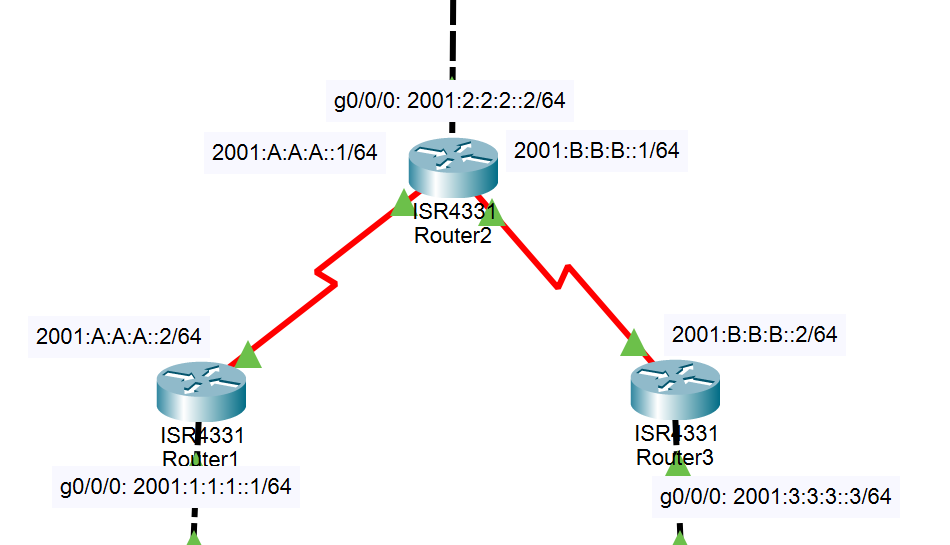

# 14：IPv6环境中的RIPng配置

> [点此下载本次实验的 Cisco Packet Tracer 文件](./router_ipv6_ripng.pkt)

## 实验要求

1.配置每台路由器的IPv6地址

2.在R1和R3路由器之间配置RIPng，实现两个IPv6网络互相通信 

## 实验拓扑



## 实验过程

1. **首先完成路由器R1、R2、R3的Ipv6的基础配置**

其中包括启动IPv6和配置IPv6的接口地址，激活接口，具体配置如下：

路由器R1的基础配置

```bash
Router1(config)#ipv6 unicast-routing
Router1(config)#int g0/0/0
Router1(config-if)#ipv6 address 2001:1:1:1::1/64
Router1(config-if)#ipv6 rip cisco enable
Router1(config-if)#no keepalive

Router1(config-if)#int s0/1/0
Router1(config-if)#ipv6 address 2001:A:A:A::2/64
Router1(config-if)#ipv6 rip cisco enable
Router1(config-if)#no shut
Router1(config-if)#ipv6 router rip cisco
```

路由器R2的基础配置

```bash
Router2(config)#ipv6 unicast-routing
Router2(config)#int g0/0/0
Router2(config-if)#ipv6 address 2001:2:2:2::2/64
Router2(config-if)#ipv6 rip cisco enable
Router2(config-if)#no keepalive

Router2(config-if)#int s0/1/0
Router2(config-if)#ipv6 address 2001:A:A:A::1/64
Router2(config-if)#ipv6 rip cisco enable
Router2(config-if)#no shut
Router2(config-if)#int s0/1/1
Router2(config-if)#ipv6 address 2001:B:B:B::1/64
Router2(config-if)#ipv6 rip cisco enable
Router2(config-if)#no shut
Router2(config-if)#ipv6 router rip cisco
```

路由器R3的基础配置

```bash
Router3(config)#ipv6 unicast-routing
Router3(config)#int g0/0/0
Router3(config-if)#ipv6 address 2001:3:3:1::3/64
Router3(config-if)#ipv6 address 2001:3:3:2::3/64
Router3(config-if)#ipv6 address 2001:3:3:3::3/64
Router3(config-if)#ipv6 address 2001:3:3:4::3/64
Router3(config-if)#ipv6 address 2001:3:3:5::3/64
Router3(config-if)#ipv6 address 2001:3:3:6::3/64
Router3(config-if)#ipv6 rip cisco enable
Router3(config-if)#no keepalive
	
Router3(config-if)#int s0/1/0
Router3(config-if)#ipv6 address 2001:B:B:B::2/64
Router3(config-if)#ipv6 rip cisco enable
Router3(config-if)#no shut
Router3(config-if)#ipv6 router rip cisco
```

2. **验证配置**

在R1验证配置，如下所示。

```bash
Router1#show ipv6 rip 
RIP process “cisco”, port 521, multicast-group FF02::9, pid 168
     Administrative distance is 120. Maximum paths is 16
     Updates every 30 seconds, expire after 180
     Holddown lasts 0 seconds, garbage collect after 120
     Split horizon is on; poison reverse is off
     Default routes are not generated
Periodic updates 92, trigger updates16
  Interfaces:
      FastEthernet 0/0
      Serial 0/1/0
  Redistribution:
      None

Router1#show ipv6 route
IPv6 Routing Table - 13 entries
Codes: C - Connected, L - Local, S - Static, R - RIP, B - BGP
       U - Per-user Static route, M - MIPv6
       I1 - ISIS L1, I2 - ISIS L2, IA - ISIS interarea, IS - ISIS summary
       ND - ND Default, NDp - ND Prefix, DCE - Destination, NDr - Redirect
       O - OSPF intra, OI - OSPF inter, OE1 - OSPF ext 1, OE2 - OSPF ext 2
       ON1 - OSPF NSSA ext 1, ON2 - OSPF NSSA ext 2
       D - EIGRP, EX - EIGRP external
C   2001:1:1:1::/64 [0/0]
     via GigabitEthernet0/0/0, directly connected
L   2001:1:1:1::1/128 [0/0]
     via GigabitEthernet0/0/0, receive
R   2001:2:2:2::/64 [120/2]
     via FE80::290:CFF:FE62:5A01, Serial0/1/0
R   2001:3:3:1::/64 [120/3]
     via FE80::290:CFF:FE62:5A01, Serial0/1/0
R   2001:3:3:2::/64 [120/3]
     via FE80::290:CFF:FE62:5A01, Serial0/1/0
R   2001:3:3:3::/64 [120/3]
     via FE80::290:CFF:FE62:5A01, Serial0/1/0
R   2001:3:3:4::/64 [120/3]
     via FE80::290:CFF:FE62:5A01, Serial0/1/0
R   2001:3:3:5::/64 [120/3]
     via FE80::290:CFF:FE62:5A01, Serial0/1/0
R   2001:3:3:6::/64 [120/3]
     via FE80::290:CFF:FE62:5A01, Serial0/1/0
C   2001:A:A:A::/64 [0/0]
     via Serial0/1/0, directly connected
L   2001:A:A:A::2/128 [0/0]
     via Serial0/1/0, receive
R   2001:B:B:B::/64 [120/2]
     via FE80::290:CFF:FE62:5A01, Serial0/1/0
L   FF00::/8 [0/0]
     via Null0, receive

Router1#show ipv6 rip database 
RIP process "cisco" local RIB 
 2001:2:2:2::/64, metric 2, installed
    Serial0/1/0/FE80::290:CFF:FE62:5A01, expires in 154 sec
 2001:3:3:1::/64, metric 3, installed
    Serial0/1/0/FE80::290:CFF:FE62:5A01, expires in 154 sec
 2001:3:3:2::/64, metric 3, installed
    Serial0/1/0/FE80::290:CFF:FE62:5A01, expires in 154 sec
 2001:3:3:3::/64, metric 3, installed
    Serial0/1/0/FE80::290:CFF:FE62:5A01, expires in 154 sec
 2001:3:3:4::/64, metric 3, installed
    Serial0/1/0/FE80::290:CFF:FE62:5A01, expires in 154 sec
 2001:3:3:5::/64, metric 3, installed
    Serial0/1/0/FE80::290:CFF:FE62:5A01, expires in 154 sec
 2001:3:3:6::/64, metric 3, installed
    Serial0/1/0/FE80::290:CFF:FE62:5A01, expires in 154 sec
 2001:A:A:A::/64, metric 2
    Serial0/1/0/FE80::290:CFF:FE62:5A01, expires in 154 sec
 2001:B:B:B::/64, metric 2, installed
    Serial0/1/0/FE80::290:CFF:FE62:5A01, expires in 154 sec
```

此时 Router 1 可以 ping 到上面所有的 IP， RIP 成功。

### 3 在R3上实现聚合路由

```bash
Router3(congfig)#interface serial 0/1/0
Router3(config-if)ipv6 rip cisco summary-address 2001:3:3::/48
```

在R1上查看路由表(聚合后的路由)，如下所示。

```bash
R1#show ipv6 route rip  
IPv6 Routing Table - 9 entries  
Codes:  C - Connected, L - Local, S - Static, R - RIP, B - BGP 
U - Per-user Static route  
I1 - ISIS L1, I2 - ISIS L2, IA - ISIS interarea, IS - ISIS summary  
O - OSPF intra, OI - OSPF inter, OE1 - OSPF ext 1, OE2 - OSPF ext 2 
ON1 - OSPF NSSA ext 1, ON2 - OSPF NSSA ext 2 
R  2001:1:1:1::/64 [120/2]  
via FE80::CE00:3FF:FE68:0, Serial1/0 
R   2001:3:3::/48 [120/3]  
via FE80::CE00:3FF:FE68:0, Serial1/0 
R   2001:B:B:B::/64 [120/2]  
via FE80::CE00:3FF:FE68:0, Serial1/0 
```

### 4 在RIPng中分发默认路由

```bash
R3(config)#interface s0/1/0
R3(config-if)ipv6 rip cisco default-information originate metric 5
```

在R1上查看默认路由，如下所示。

```bash
R1#show ipv6 route rip  
IPv6 Routing Table - 10 entries  
Codes: C - Connected, L - Local, S - Static, R - RIP, B - BGP 
U - Per-user Static route  
I1 - ISIS L1, I2 - ISIS L2, IA - ISIS interarea, IS - ISIS summary  
O - OSPF intra, OI - OSPF inter, OE1 - OSPF ext 1, OE2 - OSPF ext 2 
ON1 - OSPF NSSA ext 1, ON2 - OSPF NSSA ext 2 
R   ::/0 [120/7] 	//ipv6里默认路由表示
via FE80::CE00:3FF:FE68:0, Serial0/1/0
R   2001:1:1:1::/64 [120/2]  
via FE80::CE00:3FF:FE68:0, Serial0/1/0
R  2001:3:3::/48 [120/3]  
via FE80::CE00:3FF:FE68:0, Serial0/1/0
R   2001:B:B:B::/64 [120/2]  
via FE80::CE00:3FF:FE68:0, Serial0/1/0
R1# 
```

## 实验命令列表

| 指令 | 用法 |
| ------------- | ---------------------------------------- |
| 启动RIPng     | ipv6 rip cisco enable                    |
| 标识RIPng进程 | ipv6 router rip cisco                    |
| 实现路由聚合  | ipv6 rip cisco summary-address [address] |

## 实验问题

