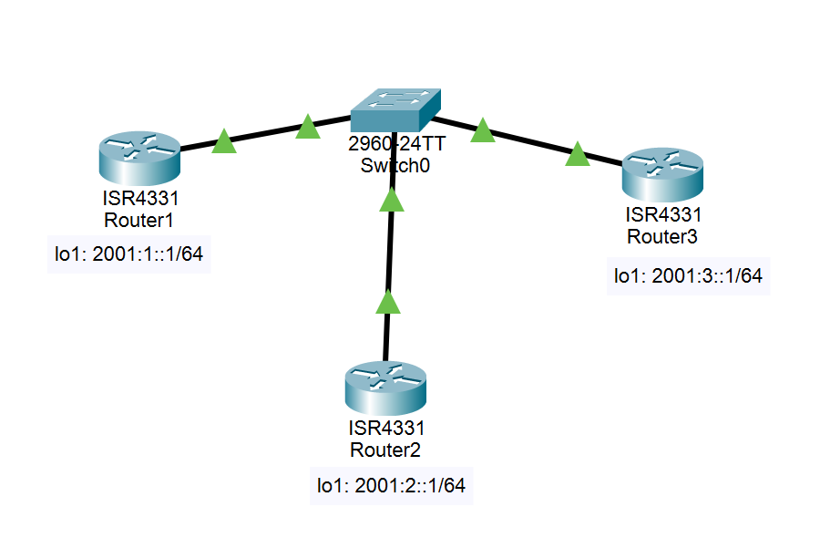

# 15：IPv6环境的OSPFv3实验

> [点此下载本次实验的 Cisco Packet Tracer 文件](./router_ospfv3.pkt)

## 实验要求

1. 分别在路由器R1、R2、R3上配置三个环回接口，分别配置三个全球单播范围内的IPv6地址，模拟三个不同的IPv6前缀（类似于IPv4的子网）

2. 在三台路由器上启动OSPFv3，最后来观察IPv6的路由学习结果，查看OSPFv3的邻居关系等。

## 实验拓扑



## 实验过程

1. **完成路由器R1、R2、R3的Ipv6的基础配置**

包括启动IPv6和配置IPv6的接口地址，激活接口，具体配置如下

路由器 R1 的基础配置：

```bash
//启动IPv6路由功能
Router1(config)#ipv6 unicast-routing
Router1(config)#int g0/0/0
//在接口下启动IPv6，将自动生成本地链路地址
Router1(config-if)#ipv6 enable
Router1(config-if)#no shut
Router1(config-if)#int lo1
Router1(config-if)#ipv6 address 2001:1::1/64
```

路由器 R2的基础配置：

```bash
Router2(config)#ipv6 unicast-routing 
Router2(config)#int g0/0/0
Router2(config-if)#ipv6 enable 
Router2(config-if)#no shut
Router2(config-if)#int lo1
Router2(config-if)#ipv6 address 2001:2::1/64
```

路由器R3的基础配置：

```bash
Router3(config)#ipv6 unicast-routing 
Router3(config)#int g0/0/0
Router3(config-if)#ipv6 enable
Router3(config-if)#no shut
Router3(config-if)#int lo1
Router3(config-if)#ipv6 address 2001:3::1/64
```

2. **启动OSPFv3路由协议**

在路由器R3的OSPFv3配置：

```bash
//启动OSPFv3的路由进程１
Router3(config)#ipv6 router ospf 1
%OSPFv3-4-NORTRID: OSPFv3 process 1 could not pick a router-id,please configure manually
//为OSPFv3配置路由器ID（RID）
Router3(config-rtr)#router-id 3.3.3.3

Router3(config)#int g0/0/0
//使该接口加入到OSPFv3进程１并申明区域为0
Router3(config-if)#ipv6 ospf 1 area 0

Router3(config)#int lo1
Router3(config-if)#ipv6 ospf 1 area 0
```

注意：在配置OSPFv3时，必须为路由器进程配置路由器ID(RID)这与OSPFv2完全不同，在OSPFv2的环境中，RID是一个可选项配置，但是在OSPFv3的环境中RID是必须配置，否则OSPFv3将无法启动。OSPFv3的RID将仍然以点分十进制的方法显示，比如:1.1.1.1这很像IPv4地址的表达方式。

在路由器R2的OSPFv3配置：

```bash
Router2(config-if)#ipv6 router ospf 1
%OSPFv3-4-NORTRID: OSPFv3 process 1 could not pick a router-id,please configure manually
Router2(config-rtr)#
Router2(config-rtr)#router-id 2.2.2.2
Router2(config-rtr)#int g0/0/0
Router2(config-if)#ipv6 ospf 1 area 0
Router2(config-if)#int lo1
Router2(config-if)#ipv6 ospf 1 area 0
```

在路由器R1的OSPFv3配置：

```bash
Router1(config-if)#ipv6 router ospf 1
%OSPFv3-4-NORTRID: OSPFv3 process 1 could not pick a router-id,please configure manually
Router1(config-rtr)#router-id 1.1.1.1
Router1(config-rtr)#int g0/0/0
Router1(config-if)#ipv6 ospf 1 area 0
Router1(config-if)#int lo1
Router1(config-if)#ipv6 ospf 1 area 0
```

3. **检查OSPFv3邻居关系的状态、路由学习的情况，以及连通性检测**

可以使用 `show ipv6 ospf neighbor` 来查看OSPFv3的邻居关系正常，如下所示，并且可知路由器R3是DR路由器，R2是BDR路由器，关于为什么这样选举，在OSPFv2中有详细描述，这里不再重复描述。然后可以通过 `show ipv6 route` 查看路由器R1的IPv6路由表，如下所示，可看出R1成功的学习到了路由器R2和R3公告出来的OSPF路由，其中的“Ｏ”就表示通过OSPFv3所学到的路由。最后在路由器R1上通过ping指令检测与路由器R2和R3上相关IPv6前缀的连通性，一切正常。

查看OSPF的邻居关系:

```bash
Router1#show ipv6 ospf neighbor

Neighbor ID     Pri   State           Dead Time   Interface ID    Interface
3.3.3.3           1   FULL/DR         00:00:32    1               GigabitEthernet0/0/0
2.2.2.2           1   FULL/BDR        00:00:34    1               GigabitEthernet0/0/0
```

查看IPv6路由表:

```bash
Router1#show ipv6 route
IPv6 Routing Table - 5 entries
Codes: C - Connected, L - Local, S - Static, R - RIP, B - BGP
       U - Per-user Static route, M - MIPv6
       I1 - ISIS L1, I2 - ISIS L2, IA - ISIS interarea, IS - ISIS summary
       ND - ND Default, NDp - ND Prefix, DCE - Destination, NDr - Redirect
       O - OSPF intra, OI - OSPF inter, OE1 - OSPF ext 1, OE2 - OSPF ext 2
       ON1 - OSPF NSSA ext 1, ON2 - OSPF NSSA ext 2
       D - EIGRP, EX - EIGRP external
C   2001:1::/64 [0/0]
     via Loopback1, directly connected
L   2001:1::1/128 [0/0]
     via Loopback1, receive
O   2001:2::1/128 [110/1]
     via FE80::202:16FF:FEE6:1001, GigabitEthernet0/0/0
O   2001:3::1/128 [110/1]
     via FE80::2D0:BCFF:FE49:8101, GigabitEthernet0/0/0
L   FF00::/8 [0/0]
     via Null0, receive
```

在路由器R1上检测连通性:

```bash
Router1#ping 2001:2::1

Type escape sequence to abort.
Sending 5, 100-byte ICMP Echos to 2001:2::1, timeout is 2 seconds:
!!!!!
Success rate is 100 percent (5/5), round-trip min/avg/max = 0/0/0 ms
```

## 实验命令列表

| 指令 | 用法 |
| --------------------------- | ----------------------- |
| 启动IPv6                    | ipv6 enable             |
| 为OSPFv3配置路由器ID（RID） | router-id \<ID>         |
| 查看OSPF邻居关系            | show ipv6 ospf neighbor |
| 查看IPv6路由表              | show ipv6 route         |

## 实验问题