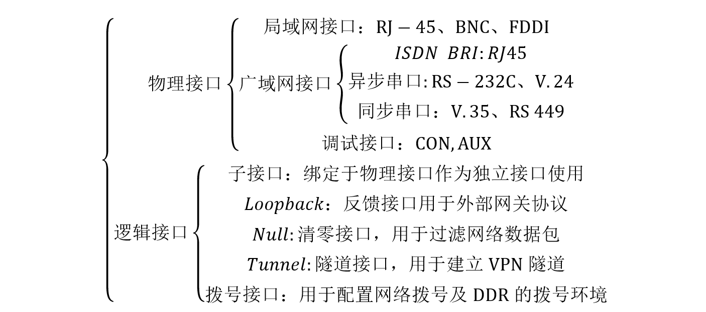

# 路由器

## 1 概述

### 1.1 功能

路由器是在网络层实现互联的设备。路由器实现网络层上数据包的存储转发，它具有路径选择功能，可依据网络当前的拓扑结构，选择“最佳”路径，把接收的数据包转发出去，从而实现网络负载平衡，减少网络拥塞路由器工作在网络层，用于连接不同的局域网和广域网，故称为“LAN网间互联设备”。一个路由器可以连接两个局域网、一个局域网和一个广域网，或两个广域网。

路由器的具体功能如下：

1. 路由功能（寻径功能）——寻找并记录到达目的网段的最佳路径，体现在路由器上则包括路由表的建立、维护和查找

2. 交换功能——路由器的交换功能与以太网交换机执行的交换功能不同，路由器的交换功能是指在网络之间转发分组数据的过程，涉及到从接收接口收到数据帧，解封装，对数据包做相应处理，根据目的网络查找路由表，决定转发接口，做新的数据链路层封装等过程

3. 隔离广播、指定访问规则——路由器阻止广播的通过，并且可以设置访问控制列表(ACL)对流量进行控制

4. 异种网络互连——支持不同的数据链路层协议，可以连接异种网络

5. 子网间的速率匹配——路由器有多个接口，不同接口具有不同的速率，路由器需要利用缓存及流控协议进行速率适配

### 1.2 任务

路由器的主要任务是把通信引导到目的地网络，然后到达特定的节点站地址。后一个功能是通过网络地址分解完成的。例如，把网络地址部分的分配指定成网络、子网和区域的一组节点，其余的用来指明子网中的特别站。分层寻址允许路由器对有很多个节站的网络存储寻址信息。在广域网范围内的路由器按其转发报文的性能可以分为两种类型，即中间节点路由器和边界路由器。尽管在不断改进的各种路由协议中，对这两类路由器所使用的名称可能有很大的差别，但所发挥的作用却是一样的。中间节点路由器在网络中传输时，提供报文的存储和转发。同时根据当前的路由表所保持的路由信息情况，选择最好的路径传送报文。由多个互连的LAN组成的公司或企业网络一侧和外界广域网相连接的路由器，就是这个企业网络的连界路由器。它从外部广域网收集向本企业网络寻址的信息，转发到企业网络中有关的网络段；另一方面集中企业网络中各个LAN段向外部广域网发送的报文，对相关的报文确定最好的传输路径。

## 2 路由器内部结构

### 2.1 路由器的功能结构

路由器结构从功能上可以分成两个部分：分组转发部分和路由选择部分。分组转发主要由三个部分组成：输入端口，输出端口，交换结构。路由选择部分也可以称作控制部分，其核心是路由选择处理机。


> 图1 路由器的功能结构示意图

##### 2.1.1 输入端口

输入端口是物理链路和输入包的进口处。端口通常由线卡提供，一块线卡一般支持4、8或16个端口，一个输入端口具有许多功能。第一个功能是进行数据链路层的封装和解封装。第二个功能是在转发表中查找输入包目的地址从而决定目的端口（称为路由查找），路由查找可以使用一般的硬件来实现，或者通过在每块线卡上嵌入一个微处理器来完成。第三，为了提供QoS（服务质量），端口要对收到的包分成几个预定义的服务级别。第四，端口可能需要运行诸如SLIP（串行线网际协议）和PPP（点对点协议）这样的数据链路级协议或者诸如PPTP（点对点隧道协议）这样的网络级协议。一旦路由查找完成，必须用交换开关将包送到其输出端口。如果路由器是输入端加队列的，则有几个输入端共享同一个交换开关。这样输入端口的最后一项功能是参加对公共资源（如交换开关）的仲裁协议。

##### 2.1.2 交换结构

交换结构可以使用多种不同的技术来实现。迄今为止使用最多的交换结构技术是总线、交叉开关和共享存贮器。最简单的开关使用一条总线来连接所有输入和输出端口，交换结构的缺点是其交换容量受限于总线的容量以及为共享总线仲裁所带来的额外开销。交叉开关通过开关提供多条数据通路，具有N×N个交叉点的交叉开关可以被认为具有2N条总线。如果一个交叉是闭合，输入总线上的数据在输出总线上可用，否则不可用。交叉点的闭合与打开由调度器来控制，因此，调度器限制了交换开关的速度。在共享存贮器路由器中，进来的包被存贮在共享存贮器中，所交换的仅是包的指针，这提高了交换容量，但是，开关的速度受限于存贮器的存取速度。尽管存贮器容量每18个月能够翻一番，但存贮器的存取时间每年仅降低5%，这是共享存贮器交换开关的一个固有限制。 

##### 2.1.3 输出端口

输出端口在包被发送到输出链路之前对包存贮，可以实现复杂的调度算法以支持优先级等要求。与输入端口一样，输出端口同样要能支持数据链路层的封装和解封装，以及许多较高级协议。

##### 2.1.4 路由处理器

路由处理器计算转发表实现路由协议，并运行对路由器进行配置和管理的软件。同时，它还处理那些目的地址不在线卡转发表中的包。

### 2.2 路由器的系统组成

以cisco路由器系统组成为例。


#### **1.**   **CPU**

与计算机一样，路由器也包含了一个中央处理器（CPU）。不同系列和型号的路由器，其中的CPU也不尽相同。Cisco路由器一般采用Motorola 68030和Orion/R4600两种处理器。

路由器的CPU负责路由器的配置管理和数据包的转发工作，如维护路由器所需的各种表格以及路由运算等。路由器对数据包的处理速度很大程度上取决于CPU的类型和性能。

#### **2.**   **存储器**

ROM:存储开机诊断程序，用于引导操作系统，类似于计算机的BIOS

RAM:路由器的主存储器，存放Running-config，路由器，ARP表，类似于计算机的内存。

FLASH:路由器的快闪存储器，用于存放路由器的IOS，类似于计算机硬盘。

NVRAM:非易失存储器，用于放置启动配置文件Startup-Config文件

#### **3.**   **接口**



 所有路由器都有接口（Interface），每个接口都有自己的名字和编号。一个接口的全名称由它的类型标志与数字编号构成，编号自0开始。

对于接口固定的路由器（如Cisco 2500系列）或采用模块化接口的路由器（如Cisco 4700系列），在接口的全名称中，只采用一个数字，并根据它们在路由器的物理顺序进行编号，例如Ethernet0表示第1个以太网接口，Serial1表示第2个串口。

对于支持“在线插拔和删除”或具有动态更改物理接口配置的路由器，其接口全名称中至少包含两个数字，中间用斜杠“/”分割。其中，第1个数字代表插槽编号，第2个数字代表接口卡内的端口编号。如Cisco 3600路由器中，serial3/0代表位于3号插槽上的第1个串口。

对于支持“万用接口处理器（VIP）”的路由器，其接口编号形式为“插槽/端口适配器/端口号”，如Cisco 7500系列路由器中，Ethernet4/0/1是指4号插槽上第1个端口适配器的第2个以太网接口。

##### 1)   控制台端口

几乎所有路由器都在路由器背后安装了一个控制台端口。控制台端口提供了一个EIA/TIA—232(以前叫作RS—232)异步串行接口、使能与路由器通信。至于同控制台端口建立哪种形式的物理连接，则取决于路由器的型号。有些路由器采用一个DB25母连接(DB25F)，有些则用RJ45连接器。通常，较小的路由器采用RJ45控制台连接器，而较大路由器采用DB25控制台连接器。

##### 2)   辅助端口

大多数Cisco路由器都配备了一个“辅助端口”(Auxiliary Port)。它和控制台端口类似，提供了一个EIA／TIA—232异步串行连接，能与路由器通信。辅助端口通常用来连接Modem，以实现对路由器的远程管理。远程通信链路通常并不用来传输平时的路由数据包，它的主要的作用是在网络路径或回路失效后访问一个路由器。

#### **4.**   **IOS**

IOS为CISCO的专有操作系统，功能有连接多种网络，用于不同协议的路由和转换，实现流量控制、QoS服务质量控制、网络安全服务，网络拨号及VPN等。

 

有两种类型的IOS配置。

##### 1) 运行配置

有时也称作“活动配置”，驻留于RAM，包含了目前在路由器中“活动”的IOS配置命令。配置IOS时，就相当于更改路由器的运行配置。

##### 2)启动配置

启动配置驻留在NVRAM中，包含了希望在路由器启动时执行的配置命令。有时也把启动配置称作“备份配置”。这是由于修改并认可了运行配置后，通常应将运行配置复制到NVRAM里，将作出的改动“备份”下来，以便路由器下次启动时调用。启动完成后，启动配置中的命令就变成了“运行配置”。

两者均以ASCII文本格式显示。所以，能够很方便地阅读与操作。一个路由器只能从这两种类型中选择一种。

## 3 路由器配置

### 3.1 路由器配置途径

##### **1.** **控制台**

将PC机的串口直接通过Rollover线与路由器控制台端口Console相连，在PC计算机上运行终端仿真软件，与路由器进行通信，完成路由器的配置。也可将PC与路由器辅助端口AUX直接相连，进行路由器的配置。

##### **2.** **虚拟终端** **(Telnet)**

如果路由器已有一些基本配置，至少有一个端口有效(如Ethernet口)，就可通过运行Telnet程序的计算机作为路由器的虚拟终端与路由器建立通信，完成路由器的配置。

##### **3.** **网络管理工作站**

路由器可通过运行网络管理软件的工作站配置，如Cisco的CiscoWorks、HP的OpenView等。

##### **4. CISCO ConfigMaker**

ConfigMaker是一个由CISCO开发的免费的路由器配置工具。ConfigMaker采用图形化的方式对路由器进行配置，然后将所做的配置通过网络下载到路由器上。ConfigMaker要求路由器运行在IOS 11.2以上版本，可用Show Version命令查看路由器的版本信息。

##### **5. TFTP (Trivial File Transfer Protocol)** **服务器**

TFTP是一个TCP/IP简单文件传输协议，可将配置文件从路由器传送到TFTP服务器上，也可将配置文件从TFTP服务器传送到路由器上。TFTP不需要用户名和口令，使用非常简单。

注意：路由器的第一次设置必须通过第一种方式进行；这时终端的硬件设置为波特率：9600，数据位：8，停止位：1，无校验。

### 3.2 路由器状态以及配置模式

路由器的配置模式是通过控制台连接路由器进入的模式，该模式下路由器有以下几个状态。

##### **1.**   **用户命令状态**

前置符类似“Router>”，此时路由器处于用户命令状态，这时用户可以看路由器的连接状态，访问其它网络和主机，但不能看到和更改路由器的设置内容。

##### **2.**   **特权命令状态**

前置符类似“Router#”，用户命令状态下输入“enable”即可进入，此时路由器处于特权命令状态，这时不但可以执行所有的用户命令，还可以看到和更改路由器的设置内容。

##### **3.**   **全局设置状态**

前置符类似“Router(config)#”，特权命令状态下输入“configure terminal”即可进入，此时路由器处于全局设置状态，这时可以进行路由器端口以外的一些设置，如：路由协议，nat等。

##### **4.**   **局部设置状态**

从全局设置状态进入，对某个功能的详细设置，这时可以设置路由器某个局部的参数。

##### **5.**   **RXBOOT** **状态**

前置符为“>”，在开机后60秒内按ctrl-break可进入此状态，这时路由器不能完成正常的功能，只能进行软件升级和手工引导。

##### **6.**   **设置对话状态**

  这是一台新路由器开机时自动进入的状态，在特权命令状态使用SETUP命令也可进入此状态。这时可通过对话方式对路由器进行设置。

### 3.3 路由器常用配置

> 以机房的Cisco路由器为例

**[** **路由器使用注意事项** **]**

**1.**   须确认线路连接正确后才能打开路由器电源。

**2.**   绝对不允许热插拔flash卡（用于装载IOS），否则易造成flash卡烧毁。

**3.**   不允许频繁开关路由器。

首先你需要连接到路由器。

本实验手册不介绍使用Web UI连接配置路由器的教程，对于Telnet连接也是点到即止。

> 详细内容请看 `实验指南/快速开始`。

1)   用console线（反转线，注意与网线的比较）把计算机的串口（com1， RS232形态）与路由器的console口（RJ45形态）直接相连。

> 你自己有USB转RJ45串口的话，那就是USB连电脑，RJ45连路由器。

2)   打开`超级终端`建立连接，在连接设置的波特率选择`9600`，其余为默认选项。

#### **2.**   **状态命令**

| show version                  | 这个命令可以查看IOS版本号，已启动时间，flash中的IOS的文件名，router里面共有什么的端口，寄存器的值等等。 |
| ----------------------------- | ------------------------------------------------------------ |
| show protocol                 | 显示与IP有关的路由协议信息。各个端口的情况。                 |
| show flash                    | 查看flash中的内容，IOS的长度，文件名，剩余空间，总共空间。   |
| show running-config           | 查看路由器当前的配置信息。                                   |
| show startup-config           | 查看nvram中的路由器配置信息。                                |
| show interface                | 查看路由器上的各个端口的状态信息。（很多重要信息）。         |
| show controller               | 查看接口控制器的状态，可看到连接的是DTE还是DCE。             |
| show history                  | 查看history buffer 里面的命令列表。                          |
| show controller s0            | 查看s0是DCE口还是DTE口。                                     |
| show ip route                 | 查看路由器的路由配置情况。                                   |
| show hosts                    | 查看IP host 表。                                             |
| terminal history size \<size> | 设置history buffer 里面保存命令的个数，最大允许为256。       |

#### **3.**   **修改系统时钟**

> **可以按步骤体验一下？的作用。并顺带提一提** **tab** **键的功能**。

1)   `clock`

2)  ` clock ?`

3)  `clock set ?`

4)  `clock set 10:30:30 ?`

5)   `clock set 10:30:30 20 oct ?`

6)   `clock set 10:30:30 20 oct 2001 ?`

7)   `enter`

8)   `show clock`

#### **4.**   **使用组合键编辑**

输入一行命令（不执行它），然后操作下列组合键。

| Ctrl+A | 光标回到命令行的最开头 |
| :----: | :--------------------: |
| Ctrl+E |  光标回到命令行的最后  |
| Ctrl+B |  光标向左移一字符位置  |
| Ctrl+F |  光标向右移一字符位置  |

执行刚刚输入的命令，然后操作下列组合键。

| Ctrl+P / ↑ |           使用上一条用过的命令           |
| :--------: | :--------------------------------------: |
| Ctrl+N / ↓ |           使用下一条用过的命令           |
|   Ctrl+Z   | （非特权模式下）保存设置并退出到特权模式 |

可以使用`terminal no editing` 命令来使组合键失效，要使组合键重新生效，可用`terminal editing` 命令。

#### **5.**   **路由器中各种配置模式的转换**

路由器有如下的几种配置模式。可以看命令开头的提示符进行判断。

|                    模式                     |       提示符       |                             说明                             |
| :-----------------------------------------: | :----------------: | :----------------------------------------------------------: |
|           用户模式（`User Mode`）           |     `router>`      | 该模式下只能查看路由器基本状态和普通命令，不能更改路由器配置。 |
|        特权模式（`Privileged Mode`）        |     `router#`      | 该模式下可查看各种路由器信息及修改路由器配置。在用户模式下以enable命令登陆，此时“>”将变成“#”，表明是在privileged mode。 |
| 全局配置模式（`Global Configuration Mode`） | `router (config)#` | 该模式下可进行更高级的配置，并可由此模式进入各种配置子模式。例如，调整接口设置时，进入接口设置模式， `router(config-if)#` |
|         `Setup`模式（`Setup Mode`）         |                    | 该模式通常是在配置文件（configuration file）丢失或者初始化的情况下进入的，以进行手动配置。在此模式下只保存着配置文件的最小子集，再以问答的形式由管理员选择配置。 |
|  `ROM Monitor` 模式（`ROM Monitor Mode`）   |  `>` 或`rommon>`   |        当路由器启动时没有找到IOS时，自动进入该模式。         |
|        `RXBoot`模式（`RXBoot Mode`）        |  `Router <boot>`   |         该模式通常用于密码丢失时，要进行破密时进入。         |

> 本实验基本上只需要用到前三种。

下面给一组转换的实例。

```bash
Router>
Router>enable
Router#
Router#configure terminal
Router(config)#
Router(config)#int f0/0
Router(config-if)#
// 输入Ctrl+Z
Router#
```

#### **6.**   **给路由器命名**

进入全局配置模式，用hostname  \<name>命令来设定路由器的名称。

#### **7.**   **编辑路由器登录信息**

```bash
banner motd  <message>
```

#### **8.**   **给端口配** **IP** **地址**

在全局配置模式下，进入各端口配置模式配置IP地址。

##### 以太网口的配置

```bash
Router(config) # int g0/0/0
Router（config-if）# ip address  \<ipaddress> \<subnet marsk>
Router(config-if) # no shutdown
```

##### 串行线

根据串口是DTE还是DCE选择下面的配置。（其实只是哪边来管理的区别，用起来都一样。

```bash
Router(config)# int s0/1/1
Router(config-if) # ip address  \<ip address> \<subnet mask>
Router(config-if)# no shutdown
```

#### **9.**   **Ping** **命令**

```bash
ping  <ip address>
```

可以用`?`获得更多提示。

#### **10.**  **配置文件的复制与保存**

1)   `copy running-config startup-config`

2)  `copy startup-config running-config`

3)  `erase startup-config`

4)   `show startup-config`

#### **11.**  **设置** **Telnet** **登陆用密码**

能进行telnet的前提：

1）主机能ping通路由器；

2）路由器设置了telnet密码；

3）路由器允许通过telnet登录；

4）如果需要进入特权模式，还需要配置enable密码。

配置配置命令如下。

```bash
Router# telnet  <ip address>
Router# telnet  <hostname>
```

启动telnet命令如下。

```bash
Router# config t
Router(config)# line vty 0 4     // 同时允许0-4共5个连接
Router(config-line)# login      //登录
Router(config-line)# password cisco  // 设置登录密码为cisco
Router(config)#enable password cisco // 设定enable密码
Router(config-line)#password cisco
```

接下来就可以用主机使用telnet连接到路由器了。

`Windows键` + `X键`，选择`Windows Powershell`，`telnet 192.168.1.1`，接着按照下面给出的命令来验证。


telnet 登陆后，分别输入相应的 `vty` 密码和特权密码，即可管理路由器。